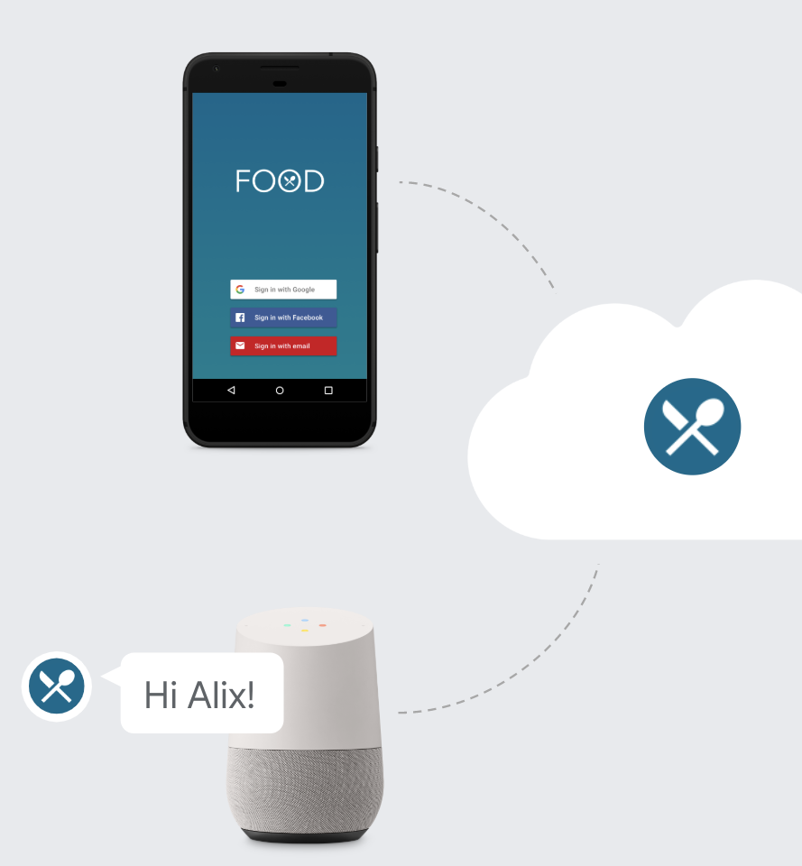
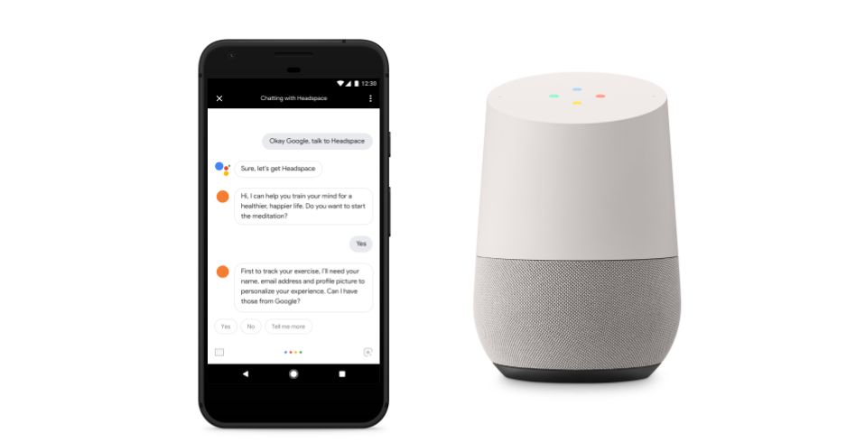
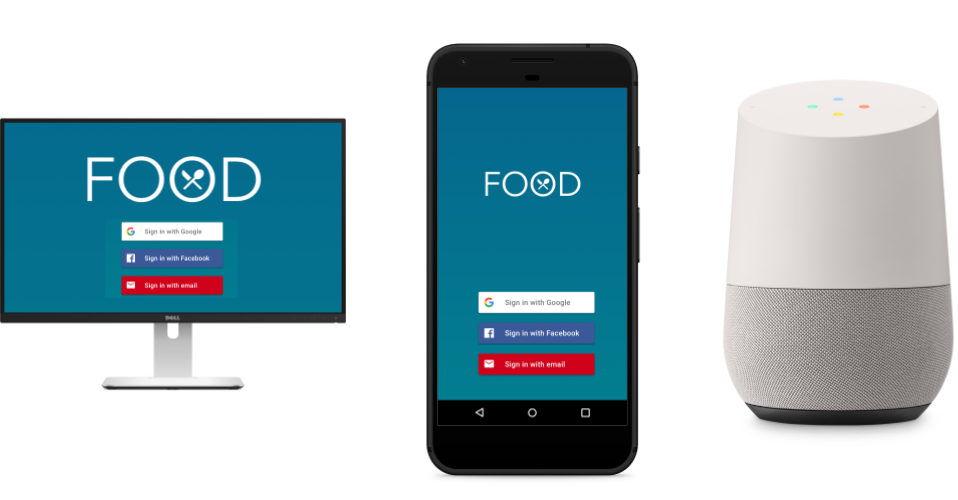

# Account linking

Use account linking to ask users if they want to connect their Google Account to
your Action. This allows you to build richer, more personalized experiences for
your users.

{ align=right width="300" }

## Overview

If your Action is a companion of existing apps on different platforms (e.g., the
web or Android), you can use account linking to securely make users' preferences
available to all platforms, which ensures a consistent cross-platform
experience.

Account linking for Actions on Google uses Google Sign-In, Google's secure
authentication system, and optionally, OAuth 2.0 (an industry-standard protocol
for authorization).

Visit our [developer site](https://developers.google.com/assistant/identity) for
more technical guidance.

## Linking flow

When the Assistant matches a Google Account to a user, you can use account
linking to ask for the user's permission to access that Google Account.

You can use the account data to:

- Find a match for the account in your authentication system (if the user has
  already used your Action or one of your apps on other platforms)
- Create a new account in your authentication system for a new user

## The 3 linking methods

There are 3 methods for account linking:

- Google Sign-In
- OAuth and Google Sign-In
- OAuth

## Google Sign-In

With Google Sign-In for the Assistant, your Action can request access to your
user's Google profile during a conversation (which includes the user's name,
email address, and profile picture). The user can complete the whole flow via
voice, which provides a frictionless sign-in experience.

{ align=right width="400" }

Use Google Sign-In if:

- Your Action(s) target only the Assistant
- You don't have an existing authentication system
- You have an existing authentication system and only want to link to users who
  signed up to your existing apps using their @gmail.com address

## OAuth and Google Sign-In

The OAuth and Google Sign-In linking type adds Google Sign-In on top of OAuth
based account linking. This provides seamless voice-based linking for Google
users while also enabling account linking for users who registered to your
service with a non-Google identity.

To use this flow, you need to extend one of the supported OAuth 2 standard flows
to add support for Google proprietary extensions of the protocol.

{ align=right width="400" }

Use OAuth and Google Sign-In if:

- You have multi-platform Actions
- You have an existing authentication system and you want to allow users to
  connect to non @gmail.com addresses
- You want to link accounts using Google profile information
- You need to create new accounts using the Google profile information
  (optional)

## OAuth

The OAuth account linking type supports two industry standard OAuth 2.0 flows:

1. Implicit code flows
1. Authorization code flows

Using this flow is **discouraged** because it requires transferring the user
interaction from voice to screen.

Consider using OAuth if:

You have an existing implementation of an OAuth 2 server, and you cannot extend
the token exchange endpoint to add support for Google's protocols for automatic
linking and account creation from an ID token. To learn more, see the [OAuth
developer guide](https://developers.google.com/assistant/identity/oauth2).
