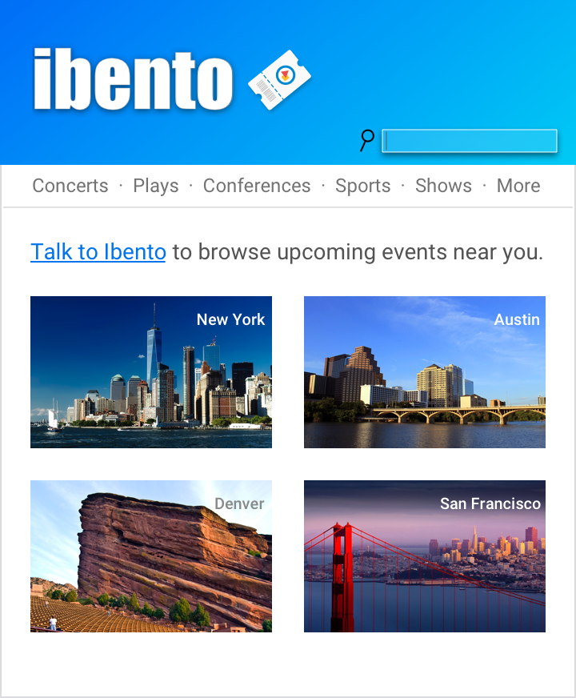
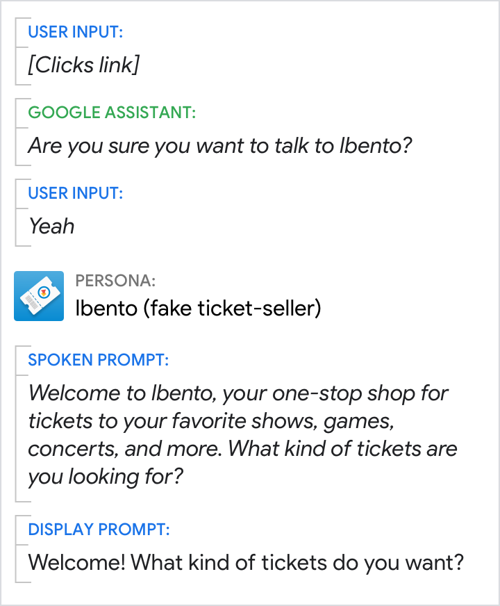
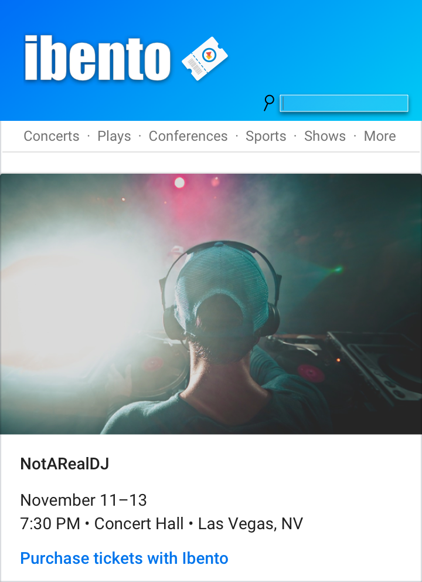
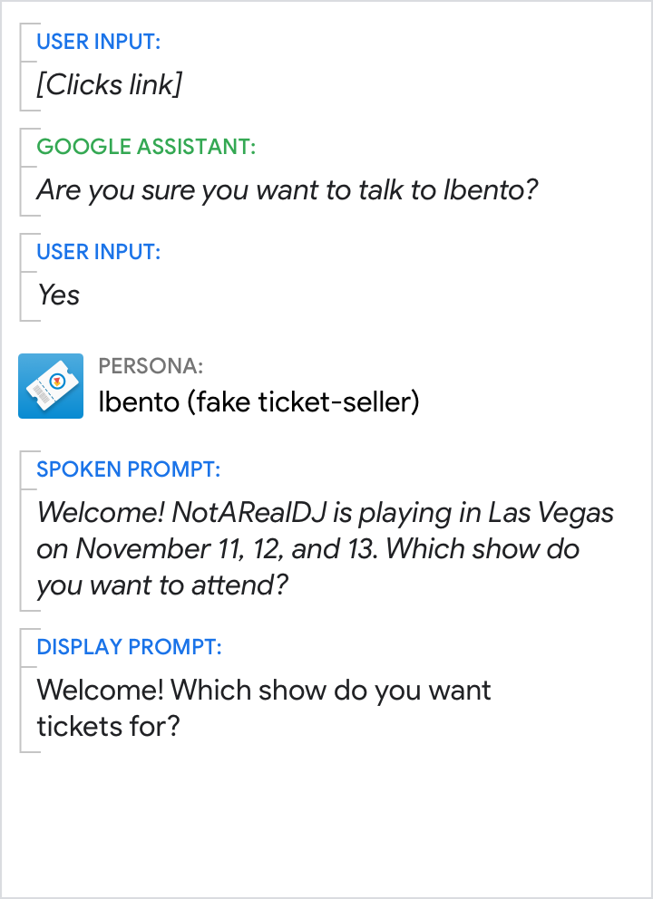

# Discovery

Before anyone can use your Action, they need to be able to find it. Make the
discovery process easier by designing for all the ways users can call on, or
invoke, your Action.

For information about | So that users can find it by | See these articles
---|---|---
Designing to promote discovery of your Action | Naming your Action specifically | [Explicit invocations](../building-blocks/discovery.md)
 | Naming your Action and something it can do | [Invocation phrases](../conversation-design-process/help-users-find-your-action.md)
 | Asking for a task your Action can perform | [Implicit invocations and built-in intents](../conversation-design-process/help-users-find-your-action.md)
 | Following a link from a webpage or other location | [Action links](../conversation-design-process/help-users-find-your-action.md)

## Explicit invocations

For explicit invocations, the phrases users can say are already specified, so
all you have to do is choose an invocation name for your Action.

- "Ok Google. Talk to **Google I/O 18**"
- "Ok Google. Speak to **Google I/O 18**"
- "Ok Google. I want to speak to **Google I/O 18**"
- "Ok Google. Ask **Google I/O 18**..."

Think of a name that reflects your
[persona](../conversation-design-process/create-a-persona.md); it could even be
your persona’s name. Either way, avoid names that are hard to pronounce, sound
like other words, or aren’t easily recognizable, because then users will have a
hard time invoking your Action.

See
[name requirements](https://developers.google.com/assistant/console/policies/general-policies#name_requirements)
for more information.

Speaker | User utterance/Spoken prompt
---|---
User | Hey Google, talk to Google I/O 18
Google Assistant | Alright, here's Google I/O 18. &lt;[earcon](../conversational-components/earcons.md)&gt;
I/O 18 | Welcome to your launchpad for all things Google I/O. As the Keeper of I/O-Specific Knowledge, consider me your guide. I can help you plan for I/O by telling you about when it's happening or how to watch remotely. I can also search for talks. So, what do you want to know?
User | When's it happening?
I/O 18 | This year’s developer festival will be held May 8th through 10th at the Shoreline Amphitheatre. That's in Mountain View, California, next to Google's main campus. Now, you can search for talks, manage your viewing schedule, or ask me anything else you want to know about I/O.
User | No thanks, that's all I needed
I/O 18 | Come back if there's anything else I/O you’d like to know.
Google Assistant | &lt;earcon&gt;

## Invocation phrases

Define invocation phrases that specifically describe how users might ask for
things your Action can do. These phrases let users deep-link directly into a
specific portion of your Action’s functionality.

Users can either 1) add an invocation phrase to the end of an explicit
invocation, or 2) use one on its own as an implicit invocation.

- "Ok Google. Talk to Google I/O 18 **about the keynote**"
- "Ok Google. Speak to Google I/O 18 **about finding a session**"
- "Ok Google. I want to speak to Google I/O 18 **to learn how to watch remotely**"
- "Ok Google. Ask Google I/O 18 **when is I/O**"

Design
[invocation phrases](https://developers.google.com/assistant/conversational/build/main-invocation)
that are useful and specific to your Action’s purpose. Generic phrases won’t
help users and are detrimental to your Action’s visibility and discovery.

Let your users know what phrases they can use to start a conversation with your
Action by including them in the "Ask Your Assistant" section of your Action's
directory listing.

Speaker | User utterance/Spoken prompt
---|---
User | Hey Google, ask Google I/O 18 when is I/O
Google Assistant | Alright, here's Google I/O 18. &lt;earcon&gt;
I/O 18 | Welcome to your launchpad for all things Google I/O. This year’s developer festival will be held May 8th through 10th at the Shoreline Amphitheatre. That's in Mountain View, California, next to Google's main campus. Now, you can search for talks, manage your viewing schedule, or ask me anything else you want to know about I/O.
User | No thanks, that's all I needed
I/O 18 | Come back if there's anything else I/O you’d like to know.
Google Assistant | &lt;earcon&gt;

## Implicit invocations and built-in intents

If you design your Action to accomplish specific, helpful tasks, the Assistant
may recommend it to users if they haven’t used it before and it's the best
Action for their query.

There are two ways your Action can deal with this type of request:

a) [Implicit invocations](https://developers.google.com/assistant/conversational/build/invocation#create_implicit_invocations)

Users tell the Assistant they want to accomplish a certain task (by saying an
[invocation phrase](https://developers.google.com/assistant/conversational/build/main-invocation)),
and the Assistant may suggest your Action to complete that task.

- "Ok Google. **Tell me about the I/O 18 keynote**"
- "Ok Google. **Find a session at I/O 18**"
- "Ok Google. **How do I watch I/O 18 remotely?**"
- "Ok Google. **When is I/O?**”

b) [Built-in intents](https://developers.google.com/assistant/conversational/build/built-in-intents)

A built-in intent is a unique identifier that tells the Assistant that your
Action is suitable to fulfill a specific category of user requests, such as
playing games or ordering tickets.

- "Ok Google. Play a memory game" **[Intent: Play game]**
- "Ok Google. Get my horoscope" **[Intent: Get horoscope]**
- "Ok Google. I want to hear a joke" **[Intent: Get joke]**

Just like implicit invocations, these intents make your Action eligible for
discovery, except you don’t have to specify training phrases. Just pick a
built-in intent from the
[list](https://developers.google.com/assistant/conversational/build/built-in-intents)
of the ones we currently support, and assign it to your Action. The Assistant
will then scan user queries for parameters and may surface your Action if its
assigned intents match those parameters.

Speaker | User utterance/Spoken prompt
---|---
User | Hey Google, when is I/O?
Google Assistant | Sure, for that, you might like talking to Google I/O 18. Wanna give it a try?
User | Sure
Google Assistant | Great. Here you go! &lt;earcon&gt;
I/O 18 | Welcome to your launchpad for all things Google I/O. This year’s developer festival will be held May 8th through 10th at the Shoreline Amphitheatre. That's in Mountain View, California, next to Google's main campus. Now, you can search for talks, manage your viewing schedule, or ask me anything else you want to know about I/O.
User | No thanks, that's all I needed
I/O 18 | Come back if there's anything else I/O you’d like to know.
Google Assistant | &lt;earcon&gt;

## Action links

Allow users to discover your Action anywhere on the internet by [linking to it
on a web
page](https://developers.google.com/assistant/engagement/assistant-links). You
can direct them to the initial greeting, or you can deep link into a specific
intent (like “Play a game”).

### Use plain language, and be clear about the link’s destination

Avoid jargon and other robotic-sounding language. Transparency and simplicity
are key to designing good Action links.

<figure markdown>
  { width="300" align="right" }
  { width="300" align="right" }
  <figcaption>
    Clear language helps you avoid confusion and build trust with your users.
  </figcaption>
</figure>

### Use appropriately varied greetings

[Greetings](../conversational-components/greetings.md) should differ based on
the invocation—in this case, the link’s destination. For instance, a link
without intents should lead to an initial greeting (like the example above),
whereas deep links should lead to more specific greetings (depending on the
promised function).

<figure markdown>
  { width="300" align="right" }
  { width="300" align="right" }
  <figcaption>
    A deep link with an intent assigned, like "Purchase tickets", should result in a
    short greeting that immediately introduces the function the user has asked for.
  </figcaption>
</figure>
