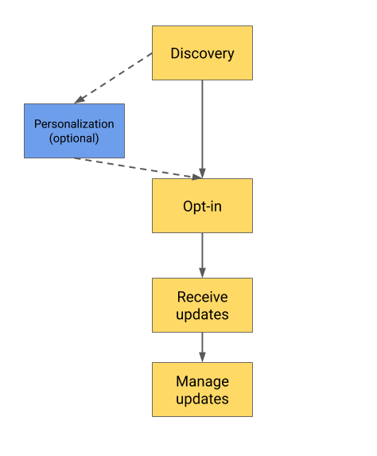
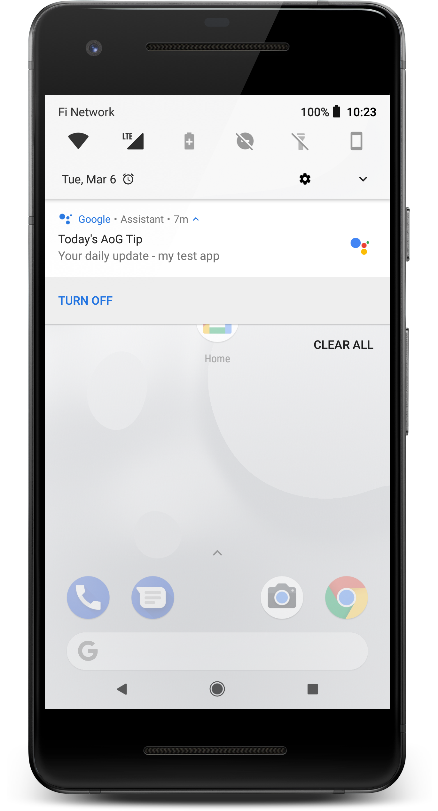

# Notifications

Notifications allow your Actions to re-engage with users through scheduled daily
updates and push notifications. During normal interactions with your Action, you
can ask users to opt in to receive updates.

## Overview

[Updates](https://developers.google.com/assistant/engagement/daily) and
[notifications](https://developers.google.com/assistant/engagement/notifications)
allow your Actions to re-engage with users through scheduled daily updates and
push notifications.

The updates and notifications are composed of the following steps:

## Flowchart

{ width="400" align="left" style="float: none;" }
{ width="400" align="right" style="float: none;" }

Action | Description
---|---
1) Discovery | The user must first find out that your Action can offer proactive updates and notifications. You can provide discovery for your updates during normal conversations with users. For example, after showing the user a piece of content they requested, you might show a suggestion chip offering to send similar content daily.
2) Personalization (optional) | For certain types of updates and notifications, you may need to collect some additional information from the user before requesting them to opt-in. For example, a weather alert update likely requires the user to specify a zip code before opting in, so that the content can be targeted to the appropriate location.
3) Opt-in | After the user has discovered your proactive experience and you've collected all the optional personalization information, the Action needs to get consent from the user to "push" updates at any time or set-up a scheduled update at a fixed time.  Google provides a built-in experience to opt the user in for daily updates. Your Action can provide opt-in for multiple types of updates. For example, a news Action could provide a daily notification for a news briefing and a push notification for breaking news alerts.
4) Receive updates | After the user opts in, they start receiving scheduled updates and/or app-initiated notifications from your Action.  Users see daily updates and push notifications as system notifications from the Assistant Action on their Assistant-enabled phones. If they tap one of these notifications, the Assistant starts a conversation with your fulfillment, triggering the intent requested by the notification.
5) Manage updates | Users can stop receiving updates from your Action in two ways: <ul><li>Tap the `TURN OFF` button on a notification received on the phone. After the user taps this button, Google asks for confirmation that they wish to stop receiving updates from the Action that sent the notification.</li><li>Ask the Assistant to "stop sending updates from action_name," where action_name is a placeholder for the name of the target Action.</li></ul>

## The 2 notification methods

Updates and notifications allow your Actions to re-engage with users through
scheduled daily updates and push notifications. During normal interactions with
your Action, you can ask users to opt-in to receive updates using two
subscription models:

Method | Description
---|---
Daily updates | <ul><li>Google pulls an update at a time specified by the user.</li><li>If you want to add daily updates to your Action, see the [daily updates guide](https://developers.google.com/assistant/engagement/daily).</li></ul>
Push notifications | <ul><li>The Action can push updates when deemed appropriate.</li><li>If you want to add push notifications to your Action, see the [push notifications guide](https://developers.google.com/assistant/engagement/notifications).</li></ul>

### Routine suggestions

With Routine Suggestions, after someone engages with your Action, you can prompt
them to add your Action to their Routines with just a couple of taps, becoming
part of the user's daily routines. If you want to add routine suggestions to
your Action, see the
[routine suggestions guide](https://developers.google.com/assistant/engagement/routines).
