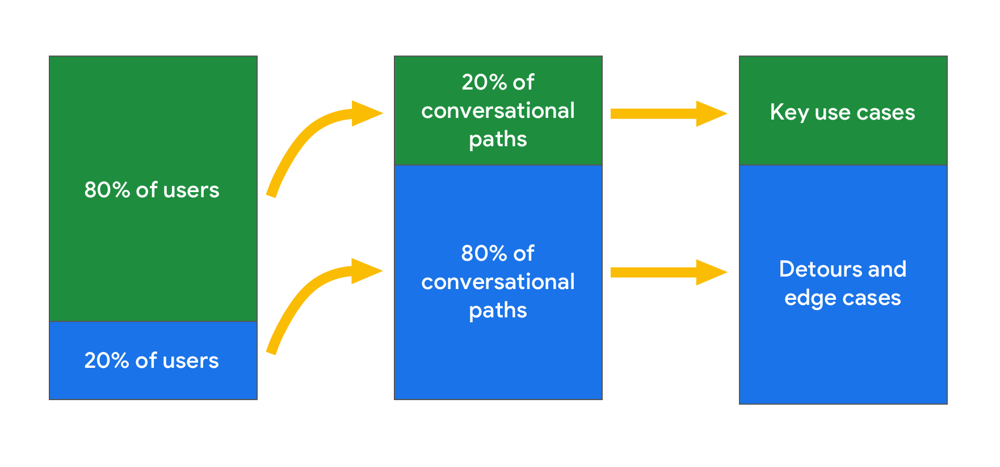
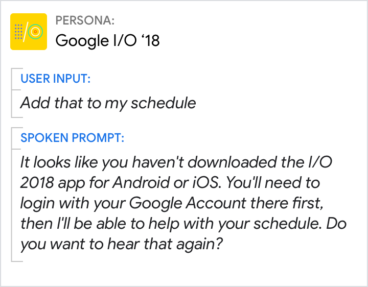
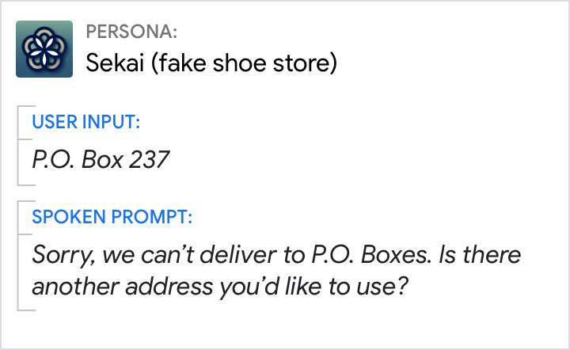
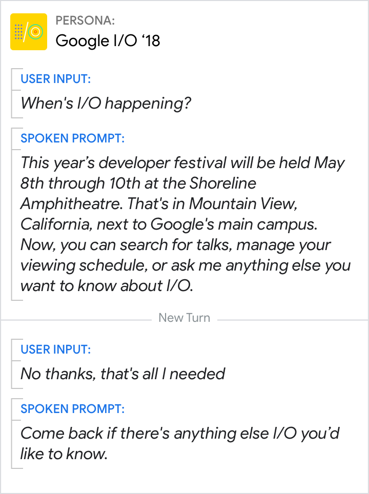
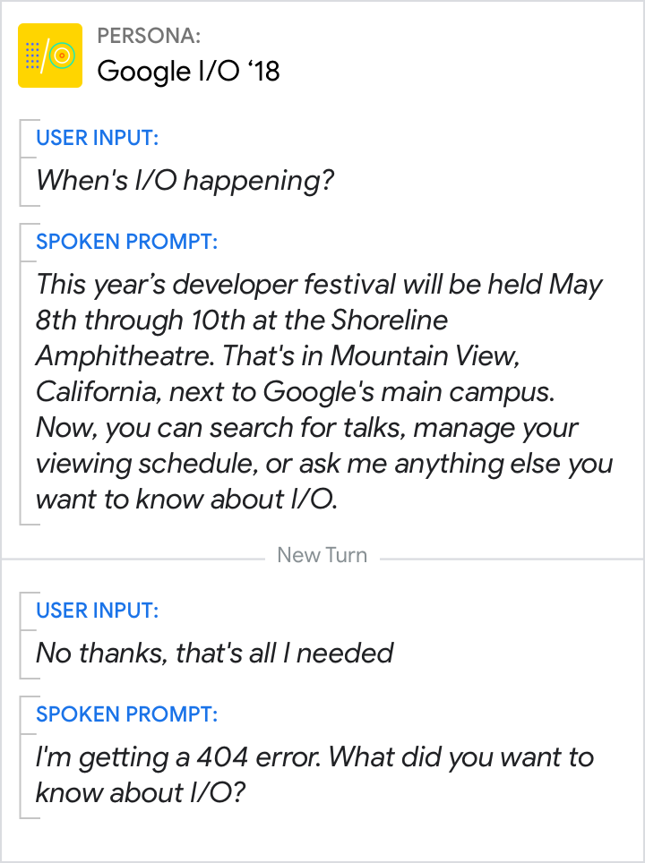

# Design for the long tail

By now you should have a design that covers the well-worn paths most users will
follow. Now it’s time to focus on the **long tail** of paths that remain. Think
about all the things that can go wrong in your conversation and all the
unexpected or unsupported paths users might take.

## Don't overdesign

In the [requirements](../conversation-design-process/gather-requirements.md)
phase, you defined a clear set of key use cases. Keep these priorities in mind
and avoid adding edge cases to this list. As you get into the details of the
design, new scenarios will come up that you hadn’t considered. Before expanding
the scope of the design to handle these new scenarios, carefully consider the
impact.

The head | The body | The long tail
---|---|---
**Key use cases**  These are the most important and most common conversational paths that users will take through your feature. Focus the majority of your effort on making these paths a great user experience. | **Detours**  These are less common, and often less direct or less successful, conversational paths through your feature. Take the time to adequately support them, but avoid spending too much time and effort designing them. | **Edge cases**  These are highly uncommon paths. Consider whether generic prompts like “Sorry I’m not sure how to help” are good enough, or if you can be a little more specific with a similar minimally viable solution.

### Use the 80/20 rule, or Pareto Principle, to avoid overdesigning

{ align=right width="500" }

For conversation design, this rule is a way of saying that not all paths are
created equal. 80% of users follow the most common 20% of possible paths in a
dialog. Therefore, invest resources accordingly for the biggest impact.

Similarly, there are trade-offs in terms of perfection or completeness. It may
take 80% of the work to really polish the last 20% of the project. In these
cases, the unpolished effort may be "good enough."

## Common detours

In between key use cases and edge cases are a number of somewhat common detours.
Usually, these are new scenarios that you hadn’t considered until they were
revealed during testing or discovered during development. And most of the time,
they require longer, less direct handling down an alternative path.

Here's a couple of common detours to consider:

### Unlinked accounts

Users may have to link accounts or devices (e.g. home automation) before they
can use certain features.

<figure markdown>
  { width="400" }
  <figcaption>
    In this case, the user has not linked their account.
  </figcaption>
</figure>

### Unsupported actions

Your Action might not be able to support some common user requests.

<figure markdown>
  { width="400" }
  <figcaption>
    Users may ask for actions that your Action can't support.
  </figcaption>
</figure>

## Intent coverage

Conversation design involves scripting one half of a dialog, hoping it's robust
enough that anyone can step in and act out the other half. When designing for
the long tail, focus on what the user could say at every step in your dialog to
define your intents (also called grammars).

An intent represents a mapping between what a user says and what your Action
should do as a result. For example, the prompt "Do you like pizza?" requires
intents for "yes" and "no". Each intent should have a variety of training
phrases associated with it, including synonyms like "yeah" and "nope" as well as
variations like "I love it" or "It’s gross." These may be weighted by how
frequently they occur. Intents can also include annotation, for example,
categorizing "fresh mozzarella" as a pizza topping in the user response “only if
it’s made with fresh mozzarella."

If you’re using Dialogflow, go
[here](https://cloud.google.com/dialogflow/cx/docs/concept/intent) to read more
about intents.

### Preventing errors from occurring is better than handling errors after they occur

Your persona won't always be able to handle cooperative responses. In these
cases, rely on lightweight and conversational error handling to get the dialog
back on track in a way that doesn't draw attention to the error.

Do | Don't
---|---
{ width="300" } | { width="300" }
Include a “done” intent with training phrases like “I’m done” or “that’s all." | If the Action is only expecting questions about I/O, the user’s response will trigger a No Match error.

## Error handling

Even with robust intents, there is still room for error. Users may go off script
by remaining silent (a No Input error) or saying something unexpected (a No
Match error). Use [error](../conversational-components/errors.md) prompts to
gently steer users back towards successful paths or reset their expectations
about what is and isn’t possible.

Good error handling is context-specific, so prompts for No Input and No Match
errors must be designed for every turn in the dialog.
