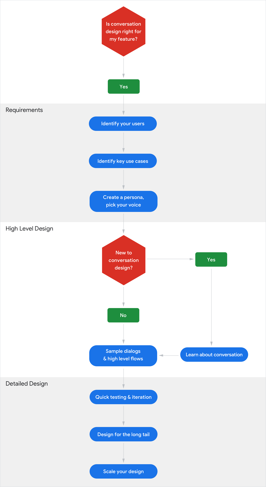

# How do I get started?

Here’s an overview of the conversation design process.

{ align=right width="500" }

For clarity, we’ve shown this as a linear process. However, in practice, these
are not discrete steps that are fully completed before the next is begun. To
borrow software development terms, the conversation design process should be
more “agile” and less “waterfall”, with considerable testing and iteration done
throughout.

First, determine whether conversation design is
[the right fit](../conversation-design-process/is-conversation-the-right-fit.md)
for the Action you want to build.

Next, you’ll focus on your users. Who are they? What are their goals? What’s
their context? Considering technical limitations, level of effort, and timeline,
what use cases can you support? This is all part of
[gathering requirements](../conversation-design-process/gather-requirements.md).

Focus on the other half of the conversation. Who’s going to be the voice of your
Actions? This is when you get to
[create a persona](../conversation-design-process/create-a-persona.md) that
represents your brand and mission.

Now it’s time to start working on high-level designs. If you’re new to
conversation design then start by
[learning about conversation](../learn-about-conversation.md) before moving on
to
[writing sample dialogs](../conversation-design-process/write-sample-dialogs.md)
and diagramming high-level flows. Focus on the spoken conversation first,
because if you start designing with a screen in mind, it’s easy to lose the
thread of the conversation and end up with a graphical interface that’s not
suitable for conversation.

As soon as you have some sample dialogs, start
[testing and iterating](../conversation-design-process/test-and-iterate.md) on
your designs.

In the last phase of the process, you’ll specify the detailed design. This
involves making sure your feature adequately covers
[the long tail](../conversation-design-process/design-for-the-long-tail.md) of
ways a conversation can deviate from the most common paths. To account for this,
you’ll add handling for [errors](../conversational-components/errors.md) and
other unlikely or uncommon scenarios.

Finally, you’ll
[scale your design](../conversation-design-process/scale-your-design.md) to help
users wherever they are. Since the Google Assistant helps users across devices
(like Google Home, phones, smart displays and more), your Actions should, too.
So in this final step, you’ll re-design your spoken conversation as a fully
multimodal conversation.
