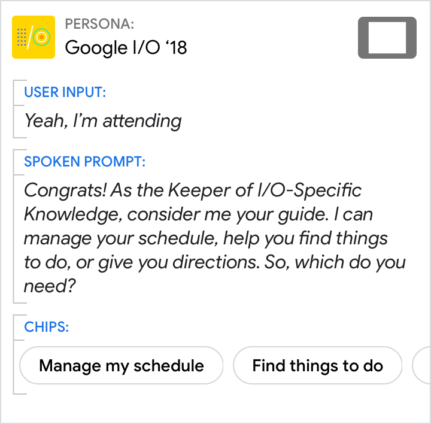
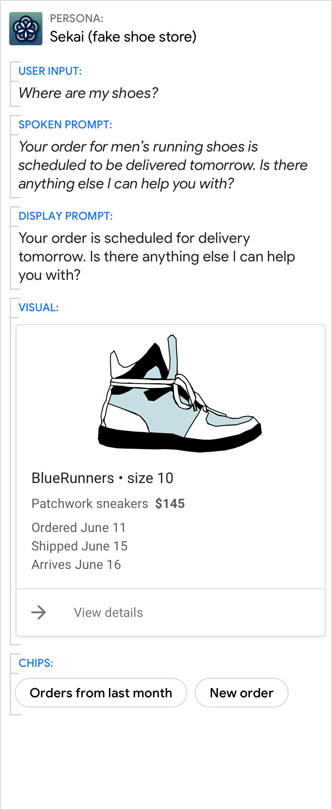
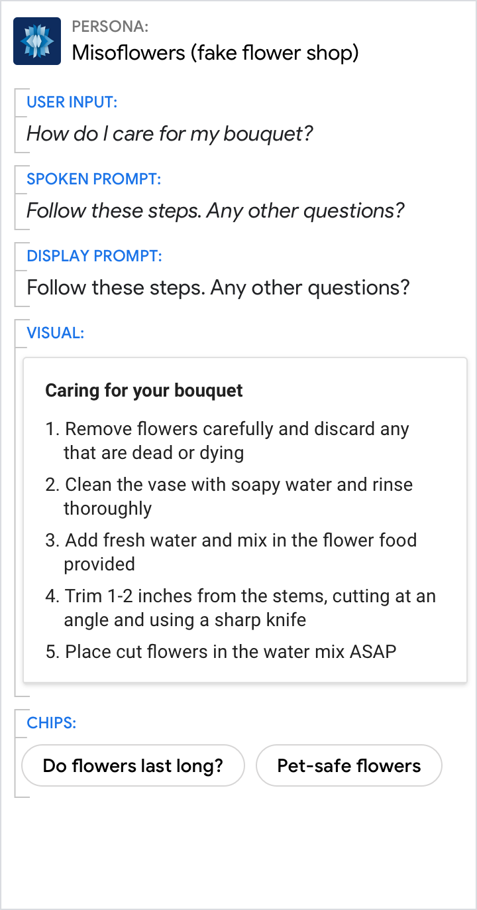

# Scale your design

Now that you have a solid conversation on Google Home, it’s time to scale your
design to help users wherever they are. Since the Google Assistant helps users
across devices, your Actions should too. To do that, you’ll adapt your spoken
conversation into a multimodal conversation.

## Multimodal design

Watch this video to learn how to leverage the strengths of each modality to
create a compelling experience that scales across devices.

<figure markdown>
  <iframe width="560" height="315"
src="https://www.youtube.com/embed/JDakZMlXpQo?si=Wg1l8OODqk2cGoTP"
title="YouTube video player" frameborder="0" allow="accelerometer; autoplay;
clipboard-write; encrypted-media; gyroscope; picture-in-picture; web-share"
allowfullscreen></iframe>
  <figcaption>Saba Zaidi and Ulas Kirazci, on designing multimodal Actions at
  Google I/O 2018</figcaption>
</figure>

## Anatomy of a response

Your Action's response to the user is made up of components.

### Conversational components

{ align=right width="250" }

[Conversational components](../conversational-components/overview.md) are
combined to compose the content in the spoken prompts, display prompts, and
chips.

Conversational components (prompts and chips) should be designed for **every
dialog turn**.

Component | Description
---|---
Spoken prompt | The content your Action speaks to the user, via TTS or pre-recorded audio
Display prompt| The content your Action writes to the user, via printed text on the screen
[Chips](../conversational-components/chips.md) | Suggestions for how the user can continue or pivot the conversation

## Visual components

[Visual components](../visual-components/overview.md) include cards, carousels,
and other visual assets.

Perfect for scanning and comparing options, visual components are useful if
you're presenting detailed information — but they **aren't required for every
dialog turn**.

Component | Description
---|---
Basic card | Use basic cards to display an image and text to users.
Browsing carousel | Browsing carousels are optimized for allowing users to select one of many items, when those items are content from the web.
Carousel | Carousels are optimized for allowing users to select one of many items, when those items are most easily differentiated by an image.
List | Lists are optimized for allowing users to select one of many items, when those items are most easily differentiated by their title.
Media response | Media responses are used to play and control the playback of audio content like music or other media.
Table | Tables are used to display static data to users in an easily scannable format.

## Group devices by the components used for the response

{ width="300" } | { width="300" } | { width="300" }
---|---|---
For conversations on smart speakers or headphones, the spoken prompts carry the whole conversation and convey the core message. | For conversations in the car or on a smart display, the screen may not always be available to the user. Therefore, the spoken prompts have to carry most of the conversation and convey the core message. The screen can be used for supplementary visual information as well as suggestions to continue or pivot the conversation. | Conversations on a TV, laptop, phone or watch are equally suited for audio input/output and screen-based interactions. The user can choose to continue the conversation in either the spoken or visual modality. Therefore, all the components work together to carry the conversation and convey the core message.

## Go from spoken to multimodal

When you
[wrote your sample dialogs](../conversation-design-process/write-sample-dialogs.md),
we recommended that you
[start with the spoken conversation](../conversation-design-process/write-sample-dialogs.md)
— that is, designing for a screenless devices like smart speakers and
headphones. Now that you’re ready to scale your designs to other devices, pieces
will move out of the spoken prompts and into the display prompts, chips, and
visuals.

{ width="300" } | { width="300" } | { width="300" }
---|---|---
Start with the original spoken prompt from the example [sample dialog](../conversation-design-process/write-sample-dialogs.md). | Most of the time, you can simply re-use the same spoken prompt on devices like smart displays, since the need to convey the core of the conversation remains the same.  At this point in the conversation, there isn’t any content that would be appropriate in a visual component like a card or carousel, so none is included.  Be sure to add chips. At a minimum, these should include any options offered in the prompts so the user can quickly tap them to respond. | Since there isn’t any content that would be appropriate in a visual component, there’s no content that can be moved out of the spoken prompt. Therefore, it’s okay to re-use the original.  The display prompt should be a condensed version of the spoken prompt, optimized for scannability. Move any response options to the chips, but be sure to always include the [question](../conversational-components/questions.md).  Re-use the same chips you just created.

{ width="300" } | { width="300" } | { width="300" }
---|---|---
Start with the original spoken prompt from the example [sample dialog](../conversation-design-process/write-sample-dialogs.md).  Note that the spoken list is limited to 6 items (of 17 total) in order to reduce cognitive load. The topics are randomized to not favor one topic over another.  For more insight on scaling your design, check out this two-part blog post that details how we designed and built the I/O 18 Action. You can also take a closer look at the open-source code. | Once again, it's okay to re-use the same spoken prompt, since we can't assume the user is looking at the screen.  Including a visual list of all the topics helps the user to browse and select. Note that the visual list of all 17 items (paginated) is shown in alphabetical order, which is easiest for users to search for the topic they want.  Because the list already enumerates the topics that can be chosen, there is no need to include them as chips. Instead, include other options like "None of those" to offer the user a way out. | Here, we can assume that the user has equal access to the audio and the screen. Since the visual modality is better suited to lists, leverage this strength by directing the user to the screen to pick a topic. This allows us to shorten the spoken prompt to a simple [list overview](../conversational-components/informational-statements.md) and [question](../conversational-components/questions.md).  Only the question needs to be maintained in the display prompt.  Re-use the same chip you just created.

For more insight on scaling your design, check out this two-part blog post that
details how we
[designed](https://medium.com/google-developers/how-we-designed-it-the-google-i-o-18-action-for-the-google-assistant-9370ffbaf9b0)
and
[built](https://medium.com/google-developers/how-we-built-it-the-google-i-o-18-action-for-the-google-assistant-7f287ad31b7)
the I/O 18 Action. You can also take a closer look at the
[open-source code](https://github.com/actions-on-google/dialogflow-iosched-nodejs).

## Relationship between prompts

In general, spoken prompts are optimized for and follow the conventions of
spoken conversations. Display prompts are optimized for and follow the
conventions of written conversations. Although slightly different, they should
still convey the same core message.

Design prompts for both the ear and the eye. It's easiest to start with the
spoken prompt, imagining what you might say in a human-to-human conversation.
Then, condense it to create the display prompt.

### Say, essentially, the same thing

Do | Don't
---|---
{ width="300" } | { width="300" }
Keep the same narrative from spoken prompt to display prompt. | Don't lead the user to a different topic or branching experience.

### Display prompts should be condensed versions of their spoken counterparts

Do | Don't
---|---
{ width="300" } | { width="300" }
Use condensed display prompts. | Don't simply duplicate spoken prompts.

### Keep the voice and tone consistent

Do | Don't
---|---
{ width="300" } | { width="300" }
Stay in persona. | Avoid designing prompts that feel like they’re coming from different personas.

### Design spoken and display prompts so they can be understood independently

Do | Don't
---|---
{ width="300" } | { width="300" }
If you’re asking a question, make sure it appears in both prompts, so the user knows what to do next. | Don't rely on spoken prompts alone to carry the conversation. This can backfire when the user can't hear them. Here, if the user has their device muted, they won’t hear the question.

## Relationship between components

Remember that all the components are meant to provide a single unified response.

It's often easiest to start by writing prompts for a screenless experience,
again imagining what you might say in a human-to-human conversation. Then,
imagine how the conversation would change if one of the participants was holding
a touchscreen. What details can now be omitted from the conversational
components? Typically, the display prompt is significantly reduced since the
user can just as easily comprehend the information in the visual as they can in
the display prompt. Group the information in such a way that the user doesn't
have to look back and forth between the display prompt and visual repeatedly.

### Always include the question in the prompts

Do | Don't
---|---
{ width="300" } | { width="300" }
Make the call to action clear by asking a question. | When presented with this design, many users did not take their turn.

### Avoid redundancy

Do | Don't
---|---
{ width="300" } | { width="300" }
Spread information across the display prompt and visual component. | Don't cram everything from the visual component into the prompts. Focus on just the key information.

### Give the short answer in the prompts, and the details in the visuals

Do | Don't
---|---
{ width="300" } | { width="300" }
Use the spoken and display prompts to give the specific answer to the user’s directed question (11:30 AM in this example). Use the visuals for related details. | Avoid redundancy between the spoken prompt, display prompt, and visuals.

### Even when the visuals provide the best answer, make sure the prompts still carry the core of the message

Do | Don't
---|---
{ width="300" } | { width="300" }
Use the prompts to give an overview. Use the visuals to provide additional detail. | Don’t force the reader to scan and read. Your persona should reduce the work the user needs to do, which includes the effort of scanning through detailed information.

### Encourage users to select from lists or carousels, but allow them to continue with their voice

Do | Don't
---|---
{ width="300" } | { width="300" }
Encourage the user to look at the list. | Don't rattle out the full list.
