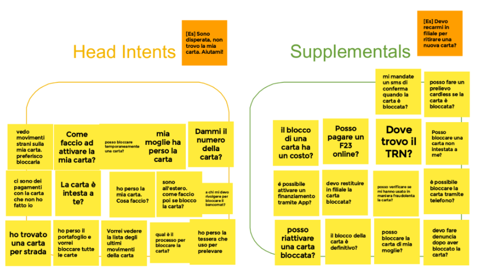

{width="700"}

## What is it?
At Google, we believe that conversation design is a fundamental discipline that lies at the heart of natural and intuitive conversations with users. To help customers and partners get a jump start on the conversation design process, Google has created a 2-day workshop that can bring business and IT teams together to learn best practices and design principles for conversational agents before moving into the development of sample dialogs and implementing high-level conversational flows.

## Why?
A large majority of Conversational AI users jump straight into the implementation of a conversational system without carefully collecting user requirements and without creating an initial design for the conversational interface. It can be tempting to quickly adapt a traditional application into a conversational system by simply adding voice input and text-to-speech (TTS) output. Unfortunately, the logic that works for traditional applications almost never works as a drop-in replacement for a conversational interface, which is why you need to start from the bottom up using conversation design principles and best practices.

## 3 Key Takeaways

**Key Takeaway 1**: Learn a conversational design framework that starts with identifying the right use cases, gathering requirements from users, and creating personas that represent your brand and mission.

**Key Takeaway 2**: Work with Google Conversational AI SMEs in focused design thinking groups to create sample dialogues that are intuitive, comfortable, frictionless, and user-centric for your target customer segments.

**Key Takeaway 3**: Learn how to transform your user requirements and initial designs into sample dialogues and conversation flows, then how to test and iterate on your implementation.

## Why is Generative AI in this workshop? 
When designing conversations we want to ensure that we are divergent when it comes to options and possibilities, and convergent when we are trying to help users solve a problem or make transactions. Responses generated by Large Language Models help create a persona and make experiences a bit more human. And when the user says something unxpected, LLMs can steer the conversation back to the successful path and reset the expectations about what is and isn't possible. 

## Table of content

Topic | Description | Activity 
---|---|---
Introduction | Find out why conversation design is important and what is its ultimate goal
Identify your key use cases | Learn when conversation is a good fit for a usecase. Then understand the differences between head intents and supplementals in the context of a user-agent dialogue | Action VS Information
Identify your users | Now focus on your users. Who are they? What are their goals? What’s their context? | Create your personas and journeys
Pick your persona | A persona forms an emotional connection with users. Learn how Generative AI can help gain user trust and make experiences a bit more human
Write sample dialogs | Sample dialogs give you a quick, low-fidelity sense of the "sound-and-feel" of the interaction you're designing. | Create a sample dialog
Test and Iterate | Discover the Wizard of Oz prototyping | Test the dialog
Design for Context Sensitive Repair | Learn how to design your agent to prevent errors and how to handle common detours and unexpected user inputs with a bit of help from Large Language Models  

## Resources

Use [this deck](https://conversation-design.web.app/static/conversation-design-workshop.pdf){target="_blank"} to deliver the Conversation Design Workshop to your customers.

## Workshop Preview

{width="300"}
{width="300"}{width="300"}
