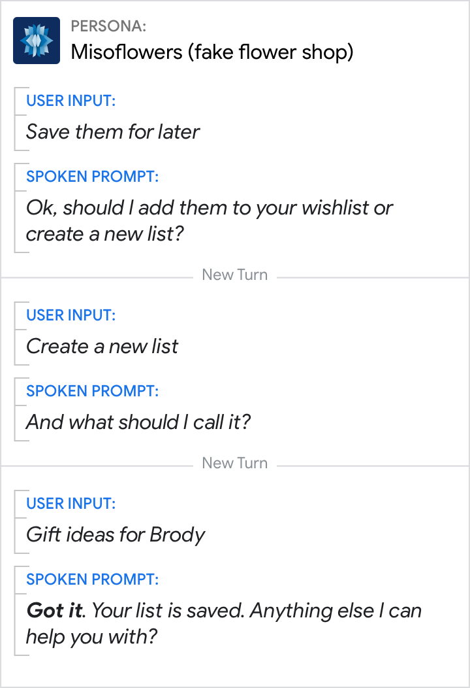
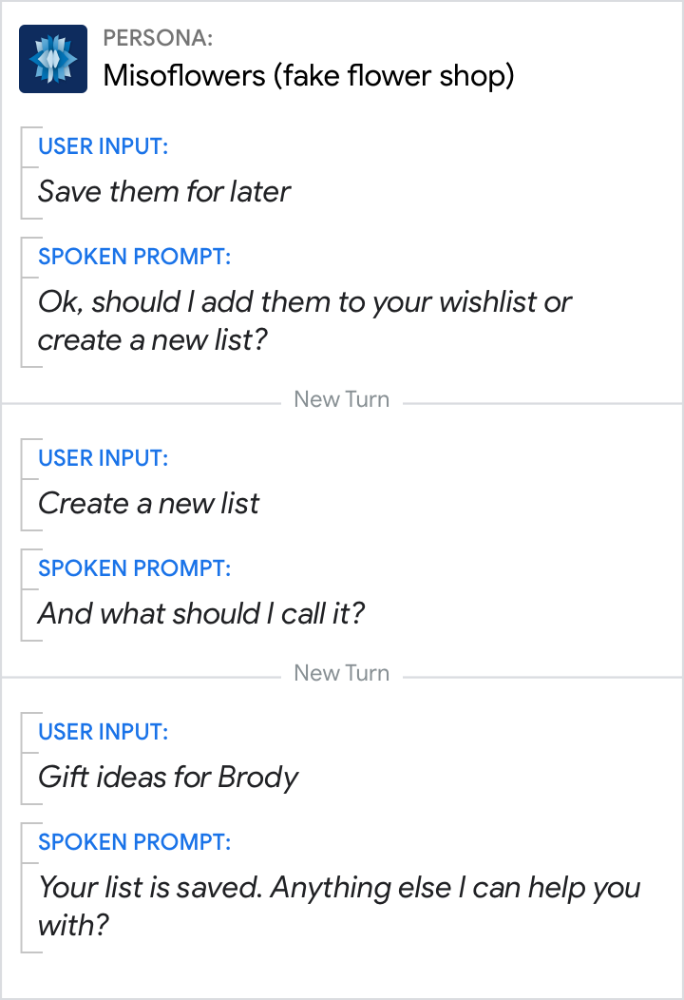
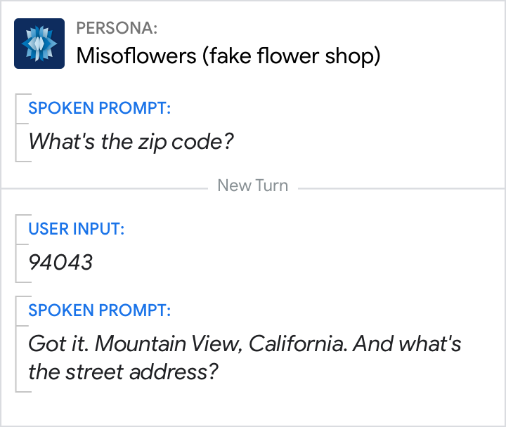
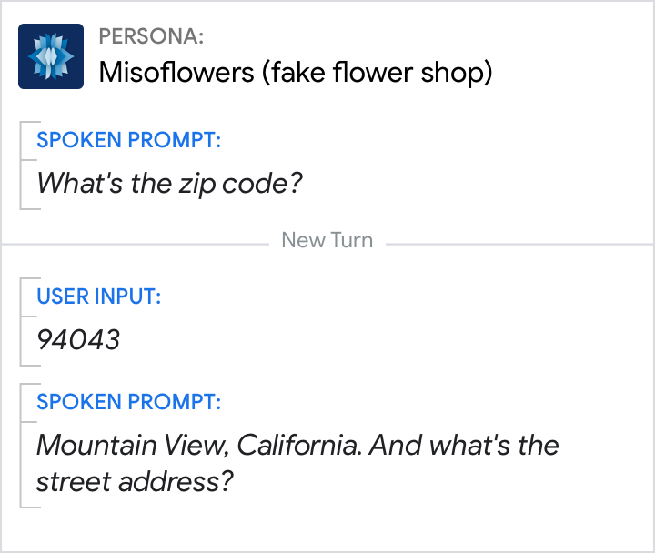
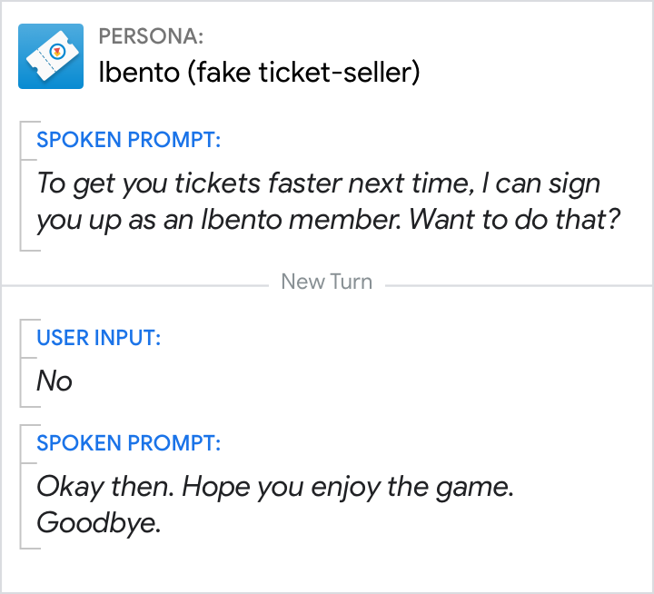
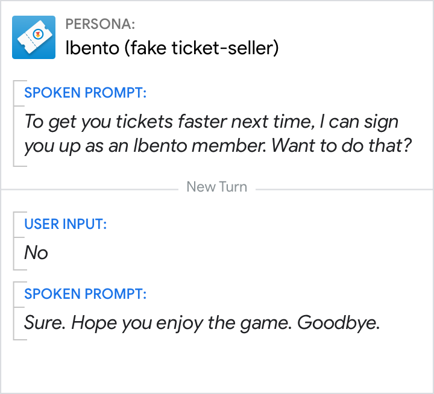

# Acknowledgements

Acknowledge the user's contributions to the conversation. Acknowledgements
assure users that their input was received.

## Guidelines

Acknowledgements are words and phrases like "Okay," "Sure," "Alright," "Thanks,"
and "Got it." Use them to acknowledge acceptance, confirmation, refusal,
disconfirmation, correction, and before changing the subject. This reassures the
user that they've been heard and that your persona is keeping track of the
conversation. It also helps the dialog feel fluid and natural.

Avoid overuse by adding randomization and by skipping some acknowledgements in
dialogs. The experience will quickly become monotonous and robotic if your
persona starts every utterance with "Okay". For example, after your persona has
completed a task, it's appropriate to randomize among synonyms like "Done," "Got
it," "Alright," "There," "You got it," and "Sure."

Note that acknowledgements are not [discourse markers](discourse-markers.md),
because acknowledgements (1) can stand by themselves, and (2) don't provide
insight into how what follows relates to what came before.

## Usage

## Acknowledge acceptance

Without it, your persona seems hasty or even rude.

Do | Don't
---|---
{ width="300" } | { width="300" }
Words like "Great" or "Got it" acknowledge that your persona heard and saved the list title. | Without the acknowledgement, the user feels unsure whether your persona heard and saved the list title.

### Acknowledge to confirm

Do | Don't
---|---
{ width="300" } | { width="300" }
Acknowledge the user's input before confirming the location. | Lack of acknowledgement can make the dialog feel abrupt.

### Acknowledge refusal

Do | Don't
---|---
{ width="300" } | { width="300" }
Acknowledge the user's refusal before changing the subject with a simple "Okay", "Okay then", or "No problem". | Avoid acknowledgements that imply acceptance, like "Sure" or "Got it", when the user has refused an offer.
