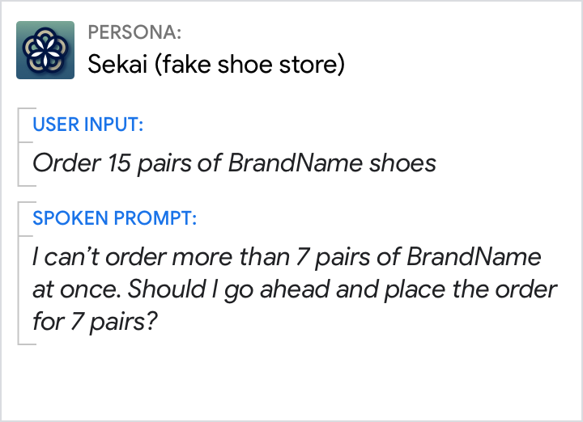

# Apologies

In general, apologies should be avoided. Saying "sorry" too frequently sounds
annoyingly repetitious and risks undermining the user's confidence in your
persona.

## Guidelines

In almost all situations, there are better ways to communicate than with an
apology. Your persona should show empathy and emotional intelligence by offering
solutions, not apologies or excuses. Furthermore, your persona should take
responsibility, never blame the user, and never blame another party. People
think less of individuals who blame others for failure.

It's okay to use "sorry" when it serves a transitional social or phatic function
and is not a full-fledged, heartfelt apology. If you can remove "sorry" without
changing the meaning, then the function is transitional. For example, the
reprompts "Sorry, for how many people?" and "For how many people?" convey the
same meaning.

"Sorry" is most helpful in [no match](errors.md) prompts to make it clear to the
user that your persona couldn't understand or interpret their response in
context. But avoid overuse. For [system errors](errors.md), avoid saying "sorry"
when it's not your persona's fault.

## Usage

### Offer solutions, not apologies

Do | Don't
---|---
{ width="300" } | { width="300" }
Offer the next best alternative. If there's an error, think about what can be done to fix it or how else the user could accomplish their task. | Without the acknowledgement, the user feels unsure whether your persona heard and saved the list title.

### If nothing can be done to resolve the issue, then notify the user briefly

Do | Don't
---|---
{ width="300" } | { width="300" }
Let the user know that you can't fulfill their request. | Don't be overly apologetic.

### Acknowledge instead of apologizing

Do | Don't
---|---
{ width="300" } | { width="300" }
Simply make the correction and move on without focusing on the error. | People are more forgiving of human errors than technology errors. Though people might say "Oops" or "My bad" in human-to-human conversation, these simply slow down the user in human-to-computer conversation and draw the user's attention to the error.

### Never blame the user

Do | Don't
---|---
{ width="300" } | { width="300" }
Provide clear motivation for any actions you want the user to take. Tell the user why they might want to do something before telling them how to do it. | Don't shift the blame to the user. Don't presume they want to take action.

### Never blame another party

Do | Don't
---|---
{ width="300" } | { width="300" }
Your persona should take responsibility for not being able to fulfill the user's request, even when it's out of your control. | Trying to make yourself look good by blaming others can backfire. Don't provide excuses. Either offer a solution or take responsibility.
