# Chips

Chips help users 1) refine topics, 2) discover related topics, next steps, and
pivots, and 3) take action. Sometimes it’s faster and easier for users to tap a
chip than it is to say or type their response. When users tap a chip, that text
becomes part of the conversation as the user’s response.

## Goals

!!! note
    For code examples, see the Actions on Google
    [developer documentation](https://developers.google.com/assistant/df-asdk/responses#suggestion_chip).

### Refine topics

Offer chips that clarify user goals and intent

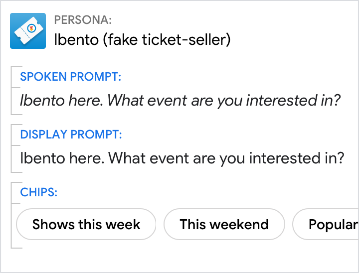{ width="300" }

### Discover related topics, next steps, and pivots

Show related entities and queries

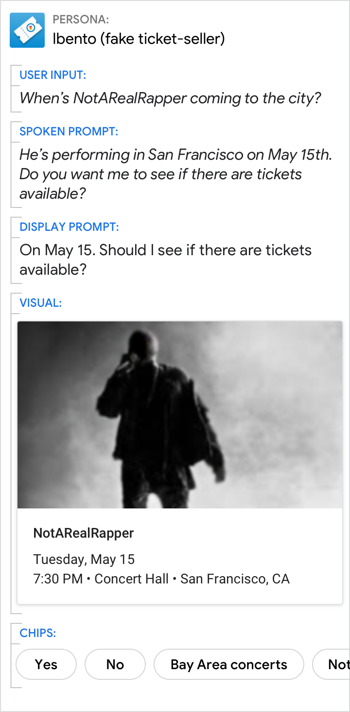{ width="300" }

### Take action

Surface relevant actions

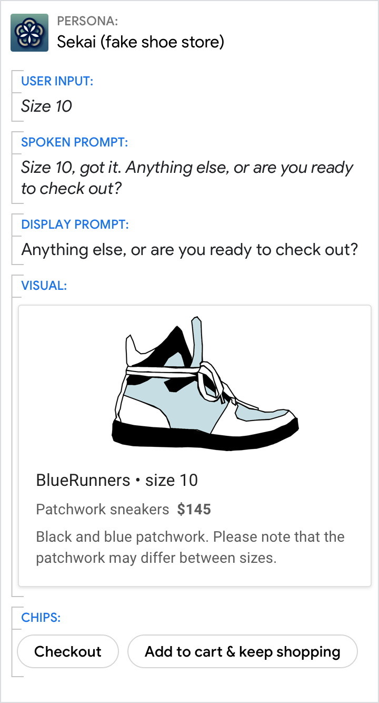{ width="300" }

## Requirements

Requirement | Description
---|---
Screen only | Chips can only be displayed on devices with screen output. The number of chips that appear depends on the size of the screen on which they appear, with any remaining chips scrolling offscreen.
Maximum number of chips per turn | 8
Maximum text length per chip | 25 characters
User response | By default, when a user taps a chip, the text of that chip then becomes the user response. So make sure you include all your chips as training phrases that trigger an intent. If you’re using Dialogflow, go [here](https://cloud.google.com/dialogflow/cx/docs/concept/intent) to read more about intents.
URLs (optional) | Chips can link out to external websites.

## Guidelines

Chips should be

- **Conversational** to make it easy for users to say and remember them
- **Relevant** to ensure user trust
- **Action-oriented** to encourage user engagement and promote conversation
- **Concise** for scannability and to maximize the number of chips shown
- **Consistent** to create a reliable experience throughout a dialog
- **Clear** about destination to set appropriate user expectations

### Provide a range of options

Especially when asking a [wide-focus question](questions.md), include chips that
cover the full range of options rather than focusing exclusively on one topic.

Do | Don't
---|---
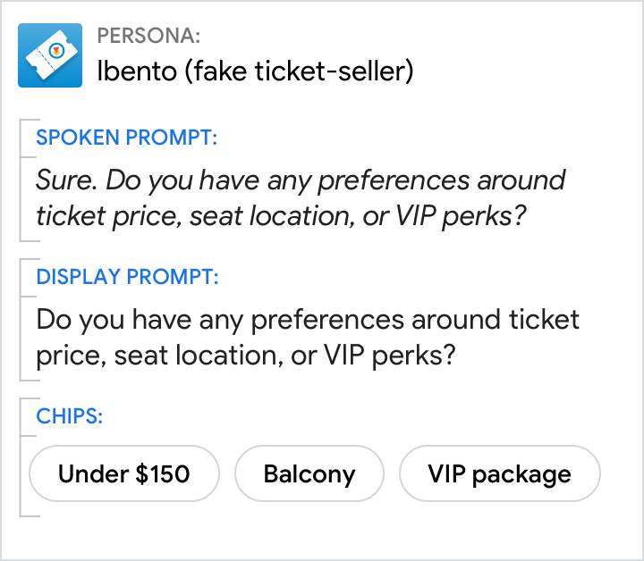{ width="300" } | 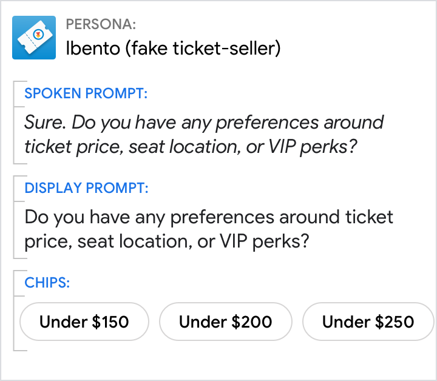{ width="300" }

### Move the conversation forward, but don’t put words in the user’s mouth

Prioritize being brief and action-oriented over using the exact words a user
might say.

Do | Don't
---|---
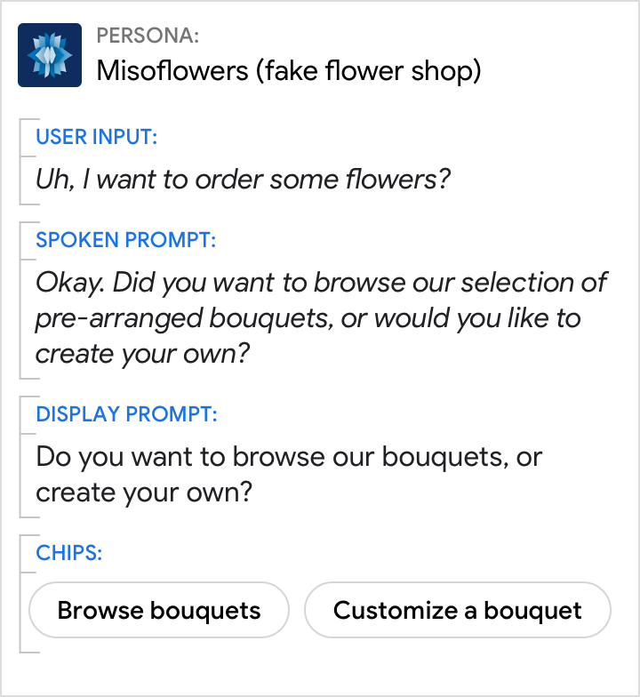{ width="300" } | 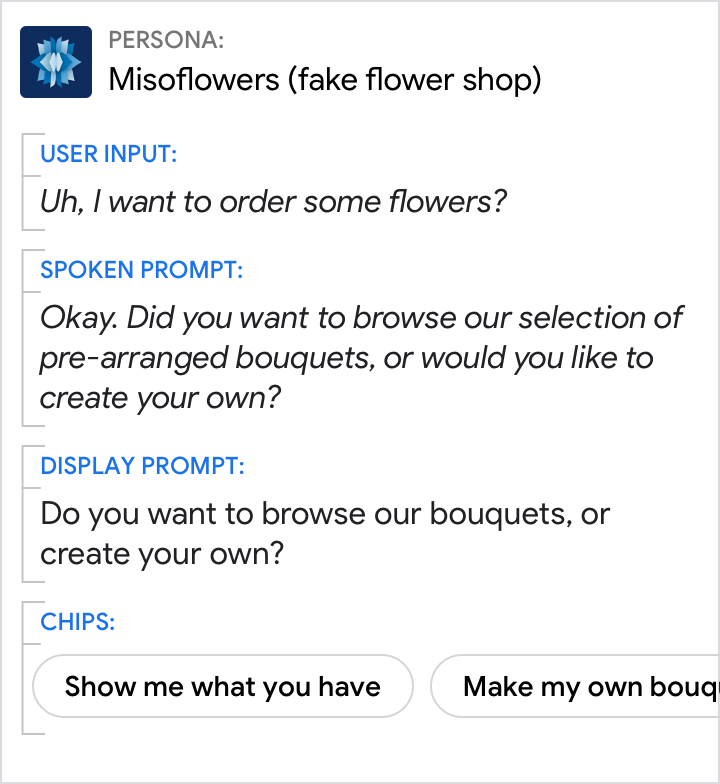{ width="300" }

### Favor verb-noun combinations

Lead with a verb if the chip starts an action. And follow verbs with a noun to
confirm what the chip is referencing.

Do | Don't
---|---
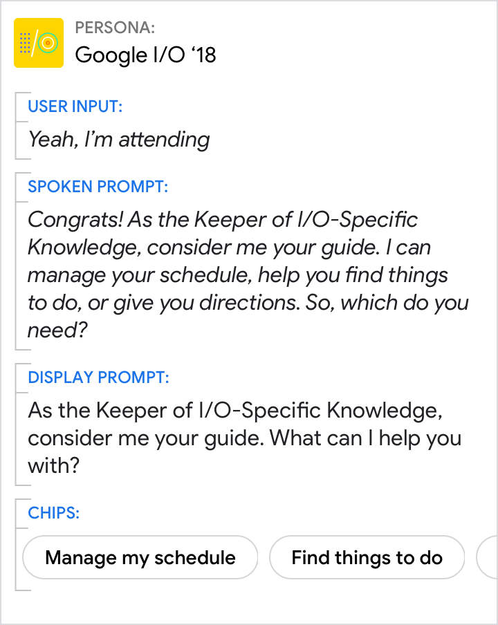{ width="300" } | 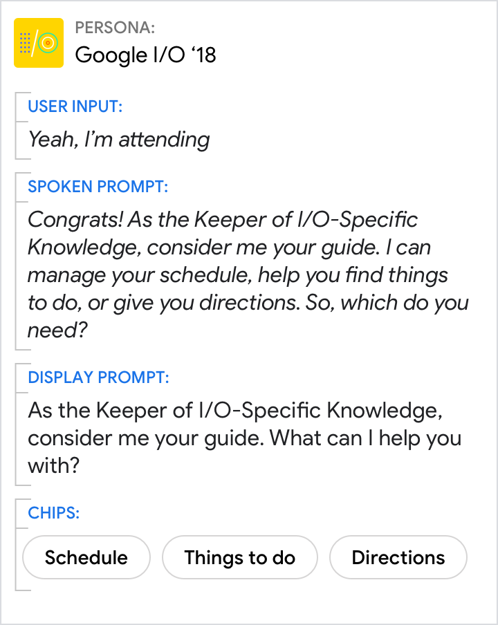{ width="300" }
Use the prompts to give an overview. Use the visuals to provide additional detail. | Don't force the reader to scan and read. Your persona should reduce the work the user needs to do, which includes the effort of scanning through detailed information.

### Don’t repeat options shown in a list or carousel

Lists and carousels are optimized for helping users make a selection. In these
cases, use chips to help the user refine the list or to say they don’t want any
of those options.

Do | Don't
---|---
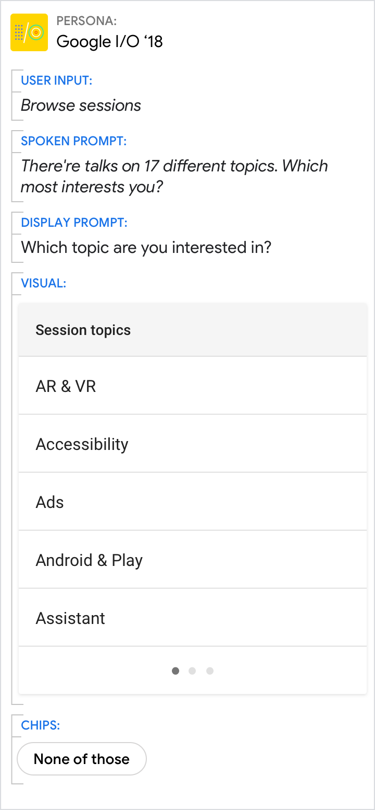{ width="300" } | 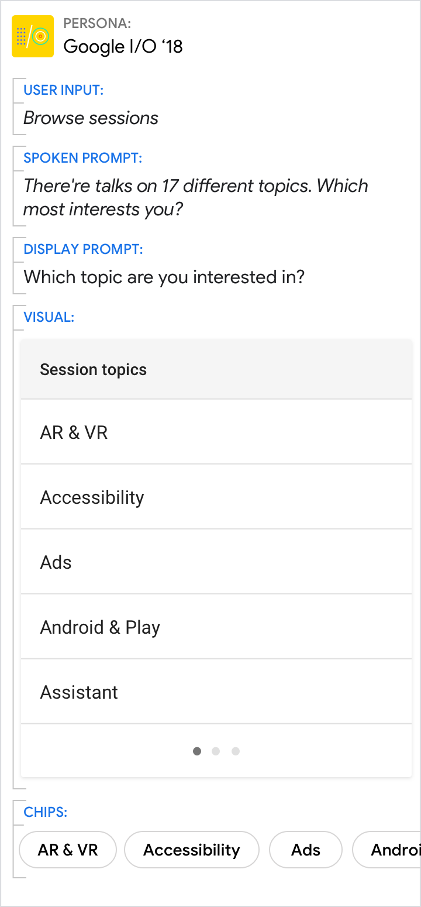{ width="300" }
Use the prompts to give an overview. Use the visuals to provide additional detail. | Don't force the reader to scan and read. Your persona should reduce the work the user needs to do, which includes the effort of scanning through detailed information.
