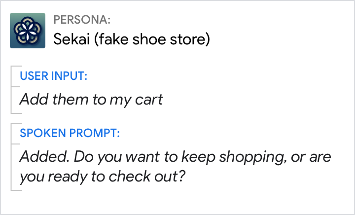
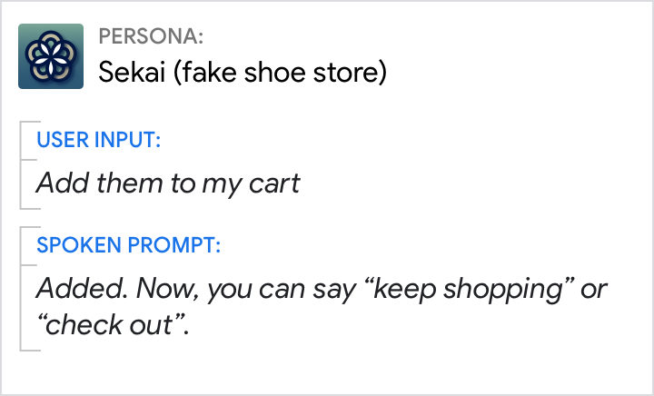
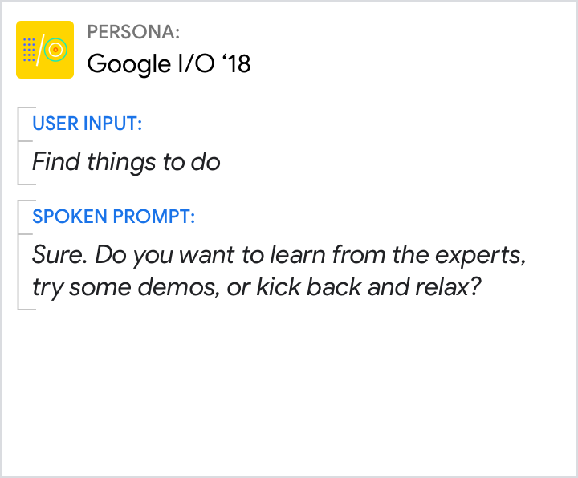
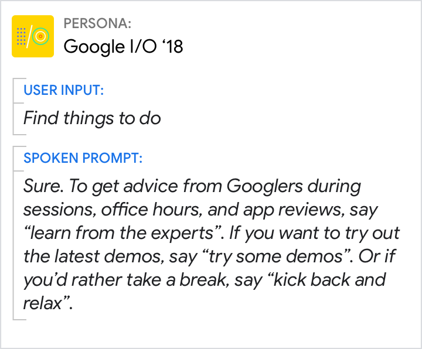
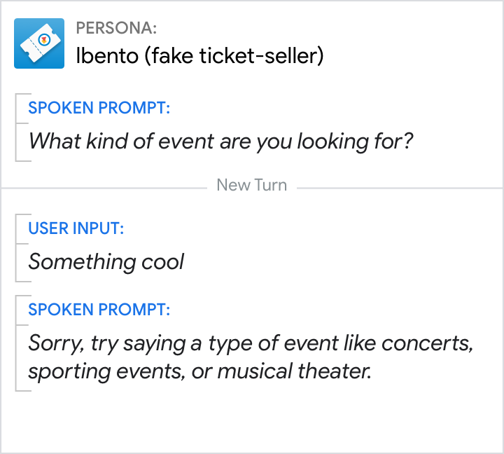
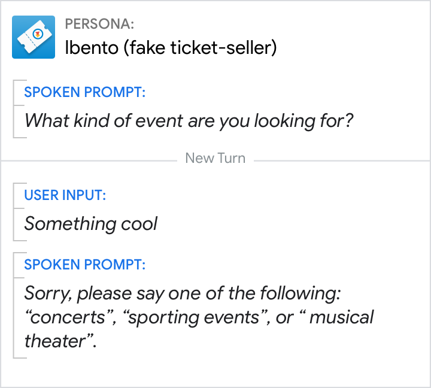

# Commands

Users shouldn't have to be taught how to speak to your persona. Instead of
training users to use specific words or phrases (i.e., commands), adapt to what
users would naturally say.

## Guidelines

The magic of conversational interfaces is that users don't have to learn how to
use them. Your persona should leverage the power of natural language
understanding to adapt to the user's word choices, instead of forcing the user
to memorize a set of commands. It's easier, and more natural, for users to
respond to a [narrow-focus question](questions.md) (e.g., "Do you want to hear
some more options?") than to be taught what to say (e.g., "To hear more options,
say ‘continue'.").

Teaching commands discourages experimentation and undermines trust. The implied message is that users have to say these exact phrases or they won't be understood. In other words, the interface is not intuitive and the grammar is limited.

## Usage

### Focus on what the user can do rather than on what they can say

Do | Don't
---|---
{ width="300" } | { width="300" }
Focusing on actions reduces cognitive load. The user simply has to learn that they can continue browsing shoes or complete their purchase. They're already experts at both of these. | Focusing on what the user can say increases cognitive load by requiring memorization. The user not only has to learn that they can continue browsing shoes or complete their purchase, but they also have to memorize the commands "keep shopping" and "check out". It also gives the impression that only these exact phrases will work.

### Use verb phrases to indicate actions the user can take. Users will be cooperative and echo them

Do | Don't
---|---
{ width="300" } | { width="300" }
Ask a question and let the user answer in their own words (for example, "learn from the experts", "I wanna try the demos", "relaxing sounds good", etc.). | Avoid this artifact from touchtone phone systems (for example, "To leave a message, press 1.").

### After a No Match error, it's okay to offer suggestions of things the user could say when they could benefit from more support

Do | Don't
---|---
{ width="300" } | { width="300" }
Make it clear that the words or phrases are examples, not an exhaustive list. | Specifying "one of the following" makes it seem like the user can only say one of the 3 options. Furthermore, "please say" makes it seem like your persona is correcting the user as if they had said something wrong.

When giving examples of things to say, don't encourage robotic, keyword-style
phrases. But if users want to say "Timer 20 minutes" instead of "Set a timer for
20 minutes", let them. Users should be able to give orders in any way they
please, even in a manner that would be perceived as rude toward another person.

## One-shot commands vs multi-turn dialogs

Think of one-shot commands as shortcuts, allowing users to give multiple pieces of information at once. However, users won't know to do this on their first try, so make sure your design accommodates a range of user expertise. Include both a dialog for novice users and shortcut commands for expert users.

### Build multi-turn dialogs for novices and one-shot commands for experts

Allow a multi-turn dialog for novice users | Help users remember | Allow one-shot commands for expert users
---|---|---
*The customer is unfamiliar with the florist's inventory and options. A dialog is necessary for success.* | *No longer a novice, the customer is more confident in asking for what they want. Some customers are content with this level of expertise*. | *Over time, the customer will remember the multiple components of their order and the one-shot command. The customer is now an expert and can order their custom bouquet using a single phrase. Note that not all customers will want to do this.*
**Misoflowers:** Hi, I'm your florist at Misoflowers. Do you want to browse our selection of pre-arranged bouquets, or would you like to create your own? | **Misoflowers:** Welcome back. Are you interested in our pre-arranged bouquets, or would you like to create your own? | **Misoflowers:** Hi again. Do you want to start with our pre-arranged bouquets, or would you rather create your own?
**User:** I wanna create my own | **User:** Can I create a bouquet with daisies and tulips? | **User:** I wanna create a bouquet of yellow daisies and white tulips.
**Misoflowers:** Sure, let's get a bouquet started. Do you have a particular type of flower in mind? | **Misoflowers:** Sure, let's get your bouquet started. We have daisies in white, pink, or yellow. Which would you like? | **Misoflowers:** Got it. One custom bouquet with yellow daisies and white tulips. Should I add it to your cart?
**User:** Uhhh, not really | **User:** Yellow | **User:** Yes
**Misoflowers:** In that case, what's the main color you'd like for your bouquet? | **Misoflowers:** And for the tulips, you have your choice of white, yellow, pink, or violet. So, which color do you want? |
**User:** Yellow | **User:** White |
**Misoflowers:** Okay, I found 8 options. Our most popular yellow flowers are daffodils, daisies, sunflowers, and yellow roses. Do any of those sound good? | **Misoflowers:** Got it. So that's a custom bouquet with yellow daisies and white tulips. Should I add it to your cart? |
**User:** Yeah, let's do daisies | **User:** Yes |
**Misoflowers:** Alright, I've added yellow daisies to your bouquet. Anything else? | |
**User:** Actually, can you put some tulips in there too? | |
**Misoflowers:** Tulips. Sure. They come in white, yellow, pink, and violet. Which color do you want? | |
**User:** Maybe the white ones? | |
**Misoflowers:** Got it. White tulips. Will that be all? | |
**User:** Yup | |

One-shot commands aren't inherently superior to multi-turn dialogs. This is
because giving multiple pieces of information all at once requires mental
preparation. Typically, users only give 2-3 in a single utterance. Furthermore,
some users are more cautious with speech recognition technology (for good
reason), or they may simply prefer a more relaxed, step-by-step approach.
