# Confirmations

Confirmations give users feedback on how their input was understood. This not
only empowers users to correct mistakes immediately, but it also reassures them
in a socially and conversationally appropriate way by establishing common
ground. Furthermore, confirmations help carry the thread of the conversation
forward by maintaining context. See also
[You Can Say That Again: The Role of Repetition in Conversation Design](https://medium.com/google-design/you-can-say-that-again-the-role-of-repetition-in-conversation-design-55937ef0f0ba)
by James Giangola, Conversation & Persona Design Lead @ Google.

## What and how to confirm

There are 2 types of things that might need to be confirmed:

### Parameters

Key pieces of information that were said or implied.

*Example: men's running shoes (shoe style), royal blue and neon green (color)*

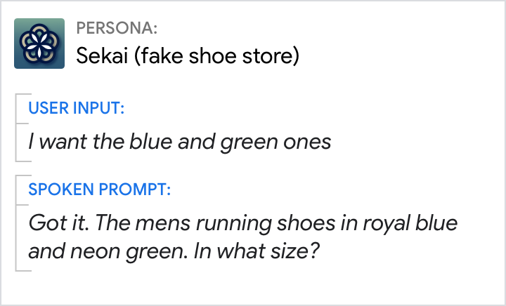{ width="400" }

### Actions

Something the Assistant is about to complete or has completed.

*Example: Adding a session to the user's schedule*

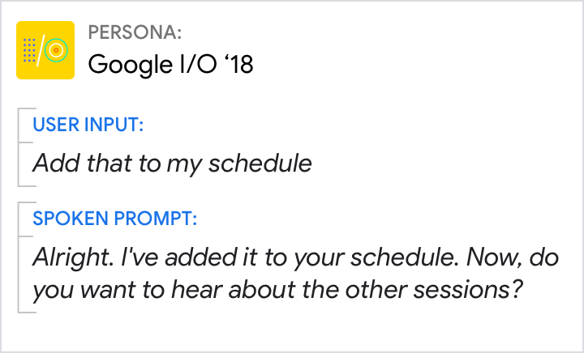{ width="400" }

And there are 3 ways to handle them:

### Explicit confirmation

Requires a response from the user to confirm ("Did I get the message right?").
Usually yes/no or some synonym.

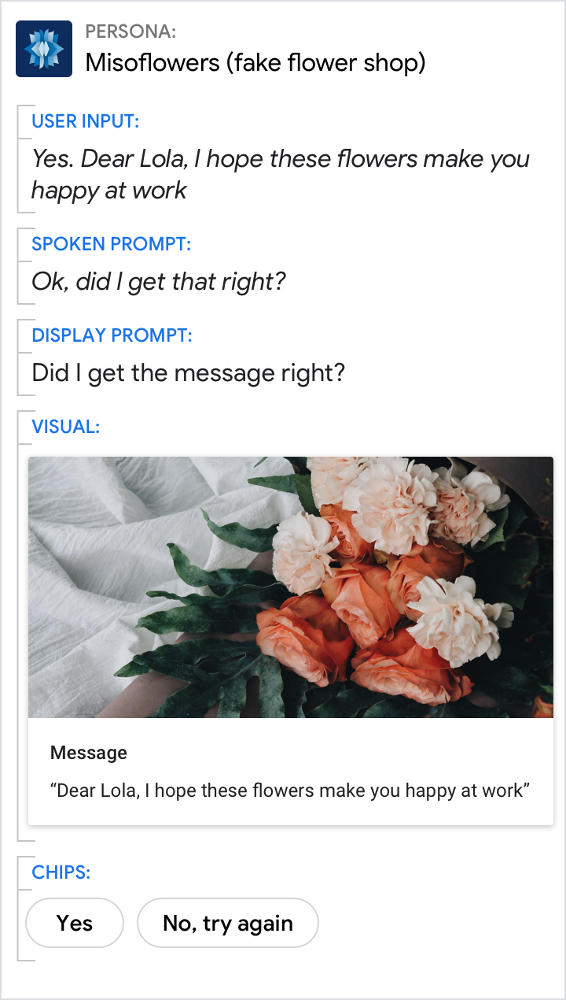{ width="400" }

### Implicit confirmation

Does not require a response from the user, although users might give one if they
want to make a correction ("no, 3 people"). Simply confirms ("for 2 people
sitting together") and moves on. In this example, the next step is to explicitly
confirm purchase of these specific seats.

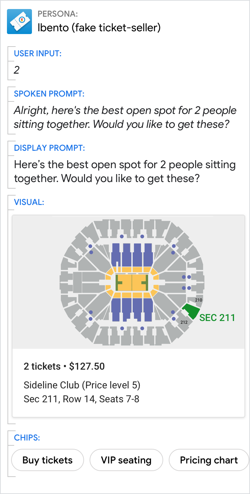{ width="400" }

### No confirmation

No overt confirmation (of the zip code).

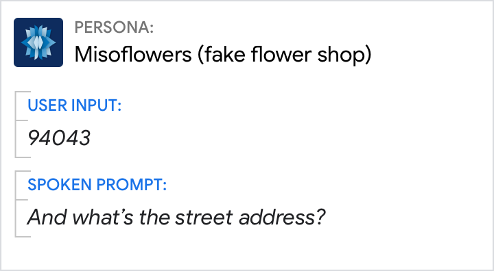{ width="400" }

## Usage

Some types of confirmations are far more frequent than others. Here's a list of
how to use confirmations, from the most- to the least-common scenarios:

### Implicit confirmation of parameters (common)

Use most of the time, not to confirm the user's input per se, but to confirm the
parameters that were said or implied. **Users require this context to understand
the response.**

Do | Don't
---|---
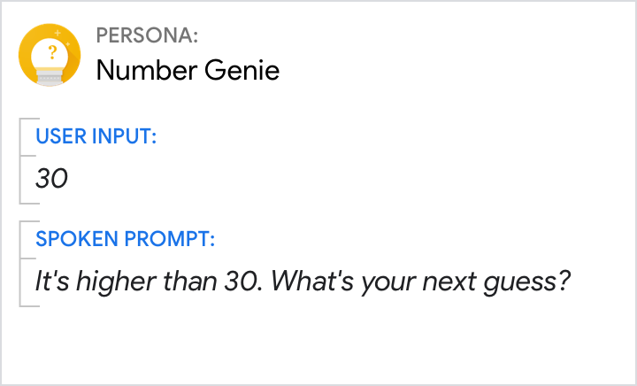{ width="300" } | 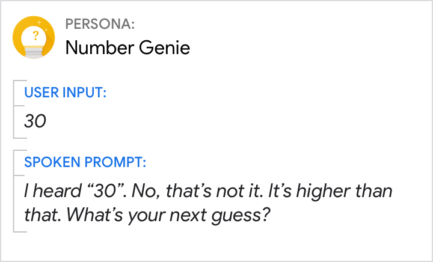{ width="300" }
Confirming the number guessed assures the user they were understood, and helps frame their next guess. | Don't belabor confirmations by focusing on what your Action heard or what the user said.

### Implicit confirmation of actions (common)

Acknowledge that an **action has been completed** (unless it is self-evident).

Do | Don't
---|---
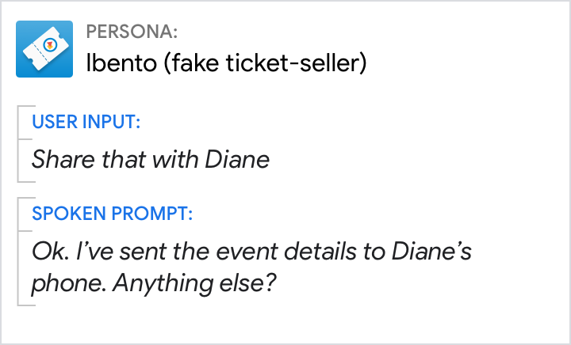{ width="300" } | 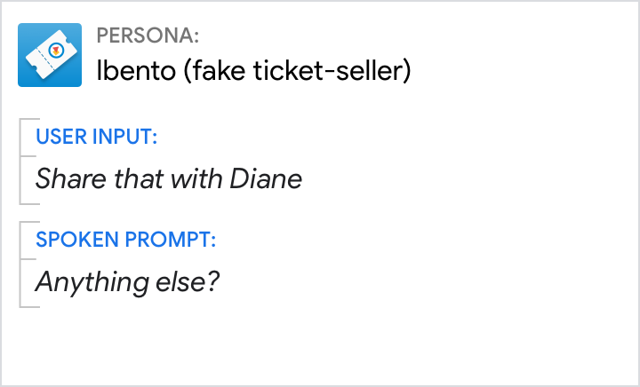{ width="300" }
Confirm that the details were sent, and let the user know where they were sent. | Users may not trust that the details were set.

### No confirmation of actions (uncommon)

Use when the **action/response itself makes it instantly clear that you
understood the user**. This is true for global commands like "stop" or "cancel".

Do | Don't
---|---
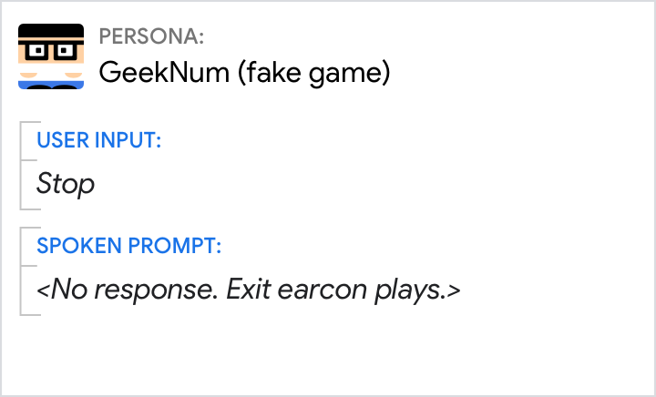{ width="300" } | 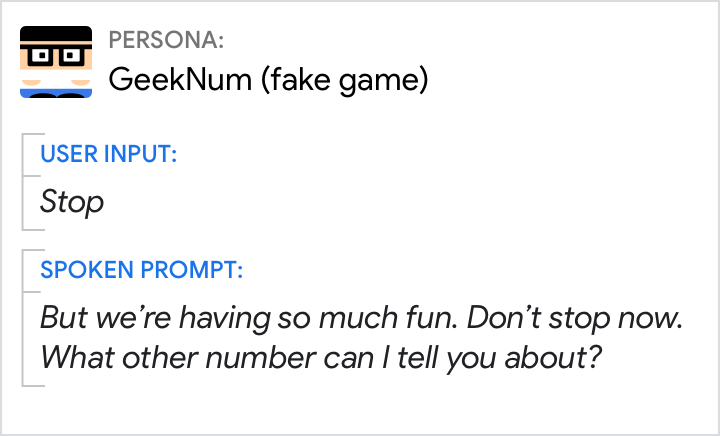{ width="300" }
By default, your Action leaves the conversation. See app exits. | Your Action cannot force the user to continue the conversation.

### No confirmation of parameters (rare)

Don't confirm **if the input is simple and typically recognized with high
confidence**, for example, yes/no grammars.

Do | Don't
---|---
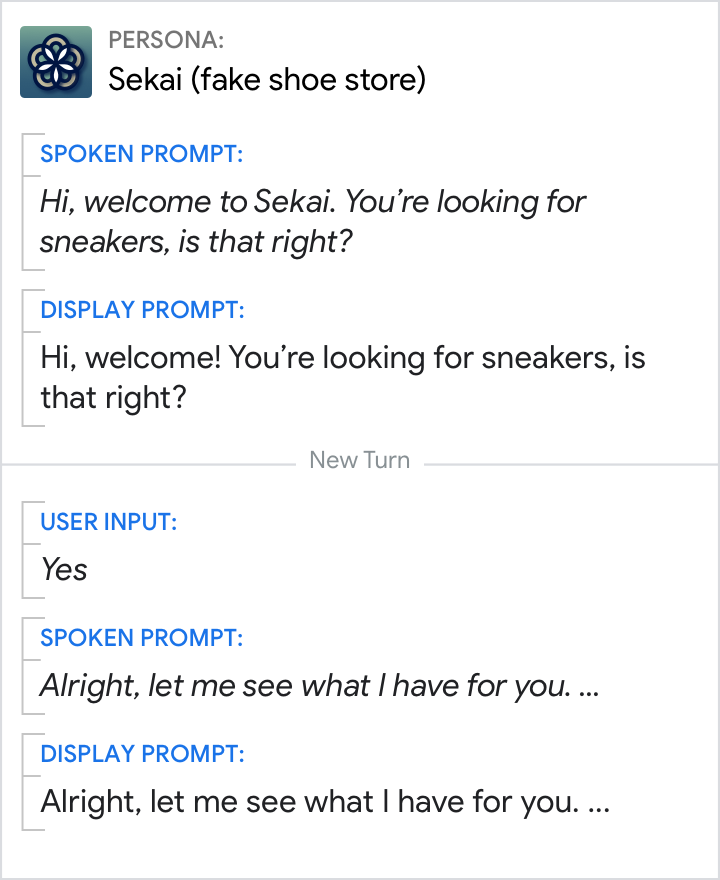{ width="300" } | 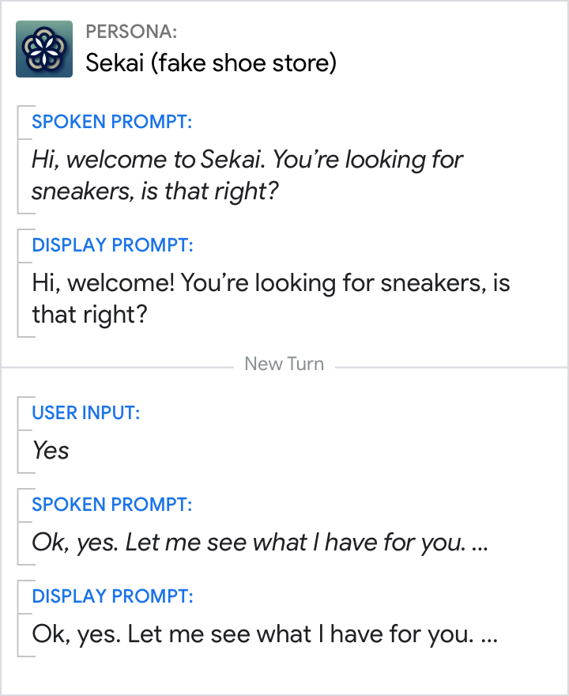{ width="300" }
Note that the user's ‘yes' response is not confirmed. | Don't confirm yes/no grammars, i.e. "Ok, yes."

### Explicit confirmation of actions (rare)

Double-check with the user **prior to performing an action that would be
difficult to undo**, for example, deleting user data, completing a transaction,
etc.

Do | Don't
---|---
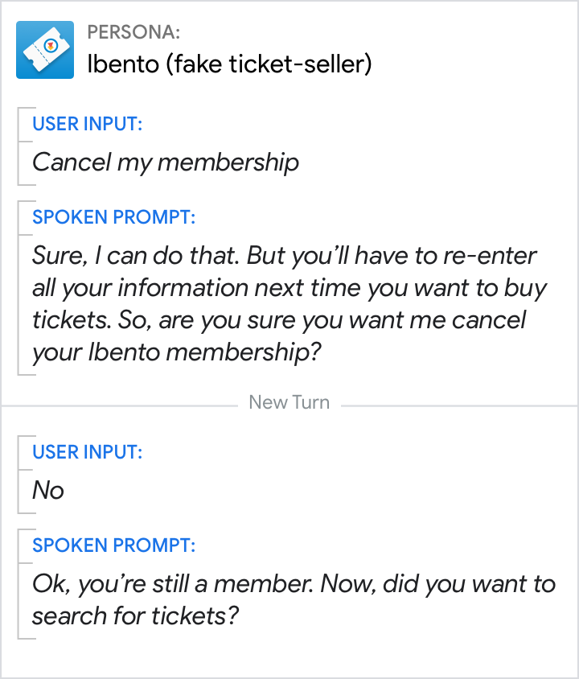{ width="300" } | 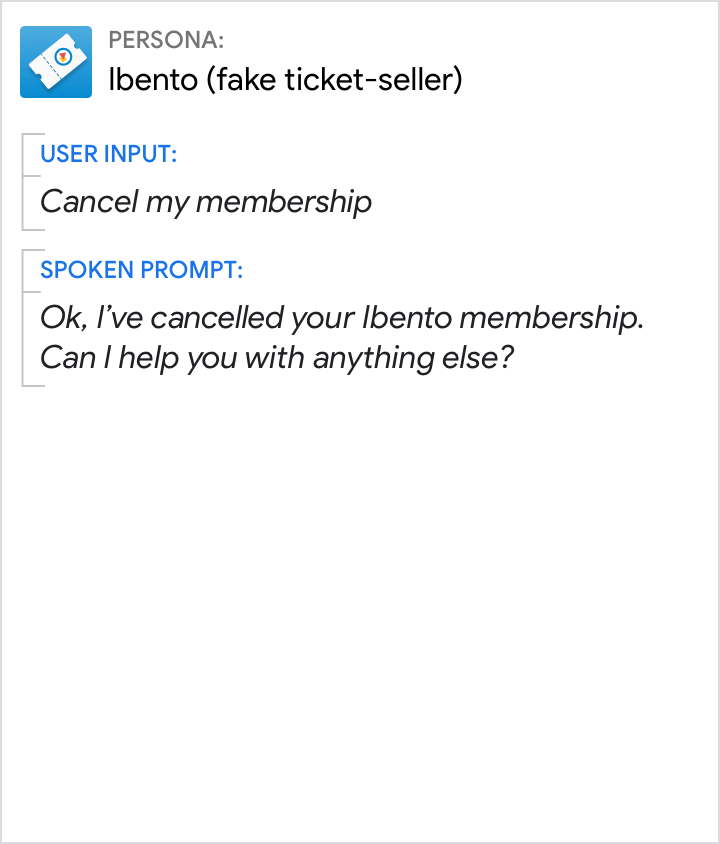{ width="300" }
Explicitly confirm before deleting user data. (Also, notice that not canceling the membership was implicitly confirmed, so there's no ambiguity.) | It would be difficult to recover from an error here. Creating a new membership account is time consuming and information associated with the account would be lost.

### Explicit confirmation of parameters (rare)

Use sparingly, only **when the cost of misunderstanding the user is high**, for
example, names, addresses, texts to be shared on the user's behalf.

Do | Don't
---|---
{ width="300" } | 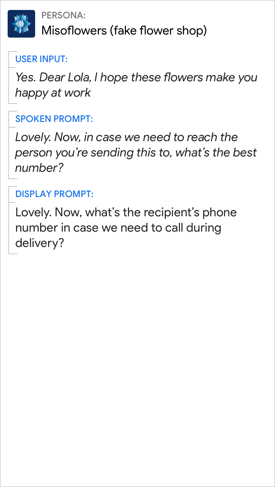{ width="300" }
Confirm the exact message to be sent prior to sending since the user is unable to correct it after it has been sent. | Here, it's not clear to the user what message will be included. If there was an error, the user would never know unless Lola (the recipient) said something.

## Corrections

Expect users to make corrections, after explicit and implicit confirmations,
when there's been a misunderstanding or misinterpretation of their input. Give
users the opportunity to make changes, even when there weren't mistakes.

### Allow one-step corrections

Expect user corrections to follow the Cooperative Principle by saying "no",
followed by their correction (for example, "No, 7 AM"). This is called a
one-step correction.

Do | Don't
---|---
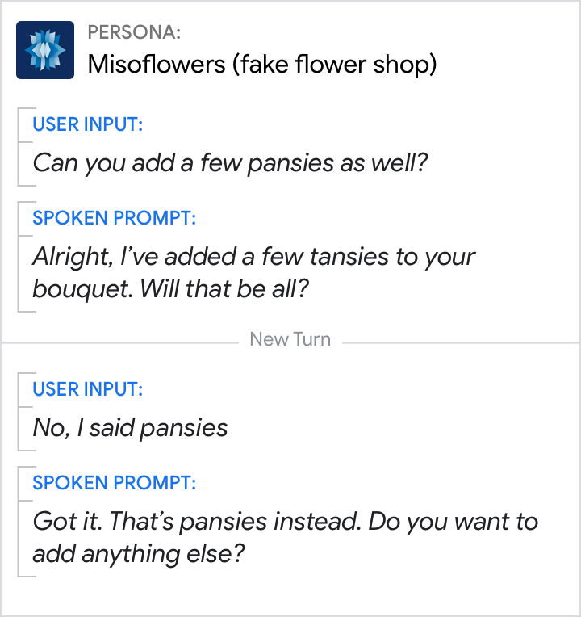{ width="300" } | 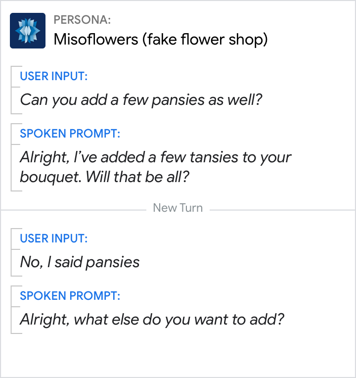{ width="300" }
Allow users to make a one-step correction. | Here the user's response was misinterpreted as a "no" to the question "Will that be all?"

### Build dialogs to support connections

Let users make changes to any of the parameters (the key pieces of information
that were said or implied).

Do | Don't
---|---
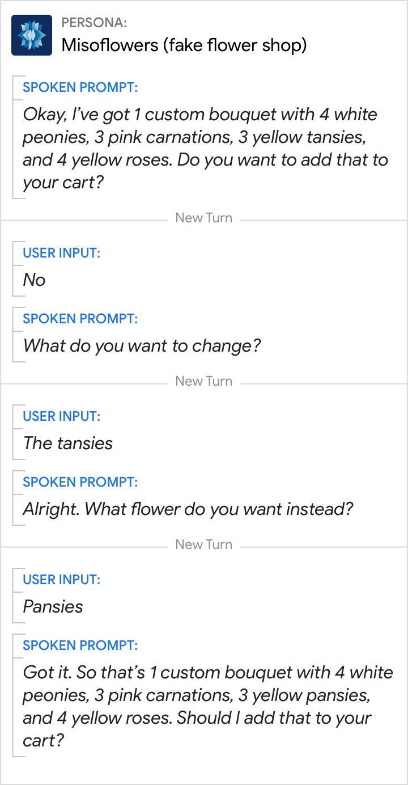{ width="300" } | 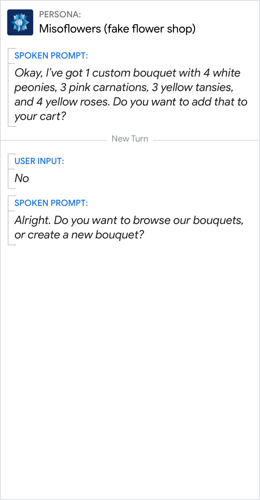{ width="300" }
Disambiguate what users want to correct and ask for the new information. | Don't cancel and force users to start the dialog over, in this case by creating a new custom bouquet.
