# Discourse markers

When we communicate, we mark how upcoming words or phrases relate to previous
discourse (i.e., spoken or written language used in a social context). These
discourse markers ease comprehension by providing a preview of what's coming up
next; they are essential for making a conversation sound natural and fluid, as
opposed to robotic and stilted.

## Examples

Discourse markers connect utterances by succinctly and explicitly relating what
has just been said to what is about to be said through notions such as:

Context | Discourse markers
---|---
**addition** | above all, also, along with, and, as well as, additionally, besides, further, furthermore, in addition, last but not least, moreover, not only… but also, too, what's more
**assessment** | amazingly, astonishingly, hopefully, ideally, importantly, incredibly, inevitably, ironically, justifiably, oddly, predictably, refreshingly, regrettably, sadly, strikingly, surprisingly, (un)fortunately, (un)reasonably, (un)remarkably
**comparison** | also, equally, in comparison, in the same way, like, likewise, similarly, too
**concession** | admittedly, after all, all the same, anyhow, anyway, at any rate, besides, in any case, in any event, nevertheless, still, though, yet
**contrast** | although, but, by comparison, conversely, however, on the contrary, on the other hand, unlike
**disclaimer** | be advised, FYI, for your information, (just) so you know, (just) so you're aware,
**example** | as an example, as an illustration, e.g., for example, for instance
**inferential** | in that case, otherwise, then
**purpose** | because of this, for that reason, so that, to this end
**reformulation** | i.e., in other words, in plain English, namely, specifically, strictly speaking, that is, that is to say
**replacement** | alternately, in lieu of, in place of, instead, on second thought, or, rather
**result** | as a result, consequently, for some reason or other, somehow, then, therefore, thus, since, so
**sequential order** | Ordinal enumeration: first, second, third… Cardinal enumeration: one, two, three… Alphabetical enumeration: a, b, c… Sequential relations: for starters, to begin with, next, then, finally, last, lastly, to conclude...
**summary** | all in all, in brief, in closing, in conclusion, in general, in short, in sum, in summary, to conclude, to sum up, to summarize, on the whole
**time** | after a while, after that, afterward, at the same time, in the meantime, later, meanwhile, previously, simultaneously, subsequently
**topic changers** | as an aside, by the way, incidentally, in passing, (just) to update you, now, on a different note, parenthetically, speaking of which, while we're on the subject
**uncertainty** | arguably, conceivably, indeed, evidently, likely, perhaps, possibly, presumably, seemingly, supposedly
**veracity** | absolutely, actually, as a matter of fact, assuredly, certainly, decidedly, definitely, doubtless, genuinely, in actuality, in reality, in truth, incontestably, incontrovertibly, indisputably, indubitably, literally, obviously, officially, really, strictly speaking, surely, to be sure, undeniably, undoubtedly, without a doubt

## Identification

Use these criteria to easily identify discourse markers. They're often confused
with [acknowledgements](acknowledgements.md) and/or implicit
[confirmations](confirmations.md). However, each component has a different
purpose in the dialog, which is why they're sometimes combined in a single
prompt.

### Discourse markers can't stand on their own

"By the way" and "For example" can't stand on their own—they require additional content.

### Removing a discourse marker does not change the truthfulness of the sentence

Discourse markers do not modify the truth condition of the utterance. Instead, they situate it relative to the greater context. Removing "Actually" from "Actually, your music app needs to be set up first" does not change its meaning. Here, "Actually" mitigates the user's expectations since we can't do what they've asked. This discourse marker provides the necessary transition from the user's request to the reason why we can't fulfill it.

Note that acknowledgments (e.g., "Sorry", "Okay", "Sure", "Alright", "Great") are not discourse markers because (1) they can stand by themselves, and (2) they don't provide insight into how the meaning of what follows relates to what came before.

## Usage

Use discourse markers like "and" or "also" to show how an utterance adds to the
previous one. Use discourse markers like "now" to change topics.

Do | Don't
---|---
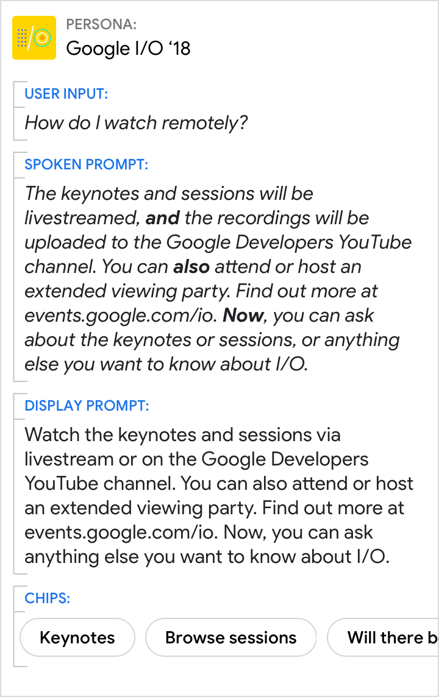{ width="300" } | 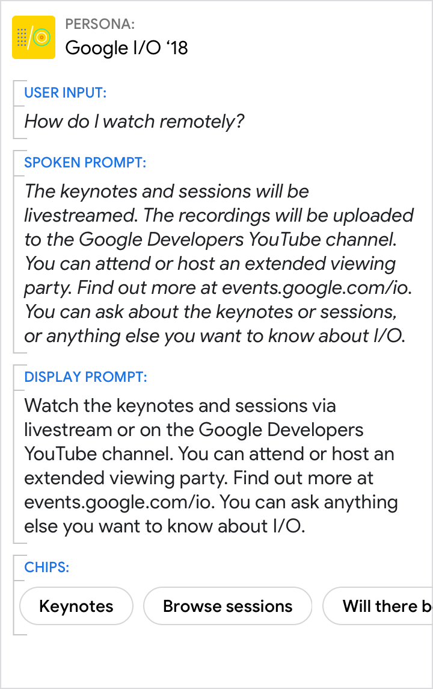{ width="300" }
It's clear that there are 3 ways to watch (livestream, YouTube recordings, extended viewing party). It's also clear when the topic changes from answering the question to offering to answer another. | Here, the relationship between the sentences is not clear, and the prompt sounds stilted without discourse markers.

Use discourse markers like "so" to show how one utterance is the result of
another.

Do | Don't
---|---
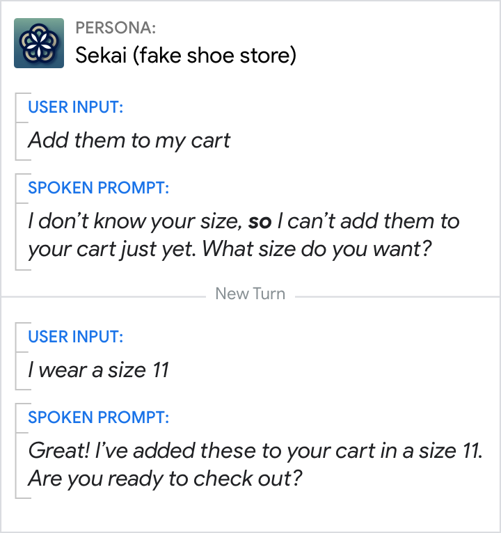{ width="300" } | 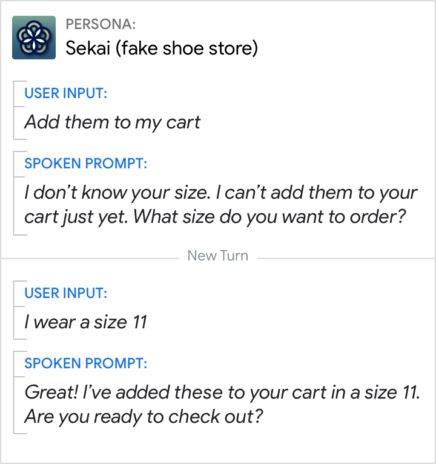{ width="300" }
"So" helps clarify cause-and-effect relationships. | Without "so", the conversation sounds robotic and impersonal. Users also have to work harder to connect the dots.

Do |
--- |
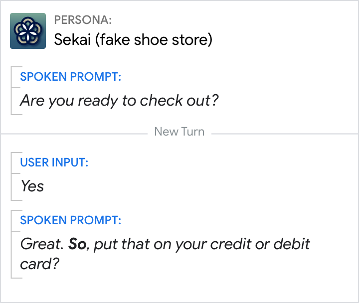{ width="300" } |
"So" is a turn-taking transition. Here, the result is that now the user has to choose a payment method. |

Use discourse markers like "by the way" to introduce additional, often
tangential information that's highly relevant.

Do | Don't
---|---
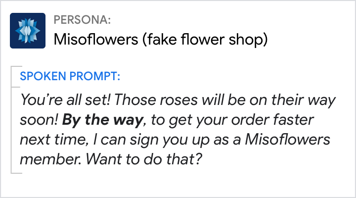{ width="300" } | 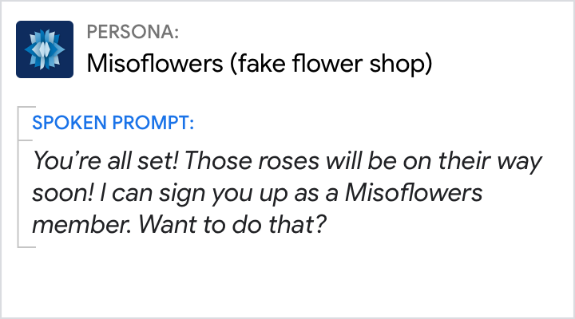{ width="300" }
"By the way" transitions from the answer to the additional information provided. In this example, the additional information is relevant and useful to the user. | The last sentence feels abrupt and unrelated without the discourse marker to shift the topic. The tangent is more likely to confuse the user and catch them off guard.

Use enumeration to separate items on a list, making it clear where one item ends
and another begins.

Do | Don't
---|---
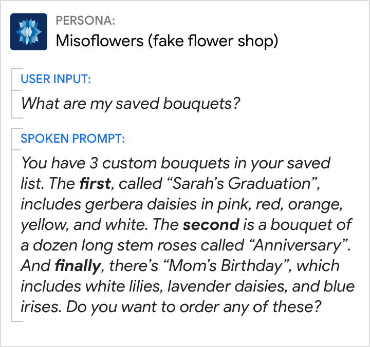{ width="300" } | 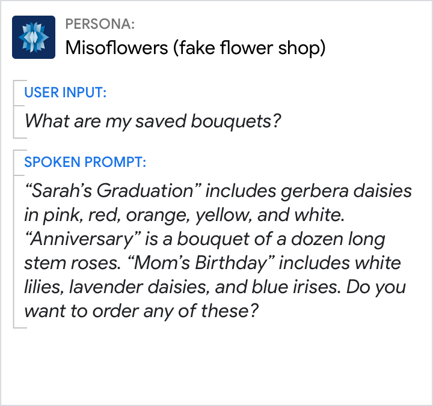{ width="300" }
Start with an overview and enumerate the items on the list, especially if they're user-generated text strings. | When information is unstructured, it's easy for the listener to get lost and feel overwhelmed.

Use "otherwise" to introduce contrary circumstances that add to or refine the
preceding statement.

Do | Don't
---|---
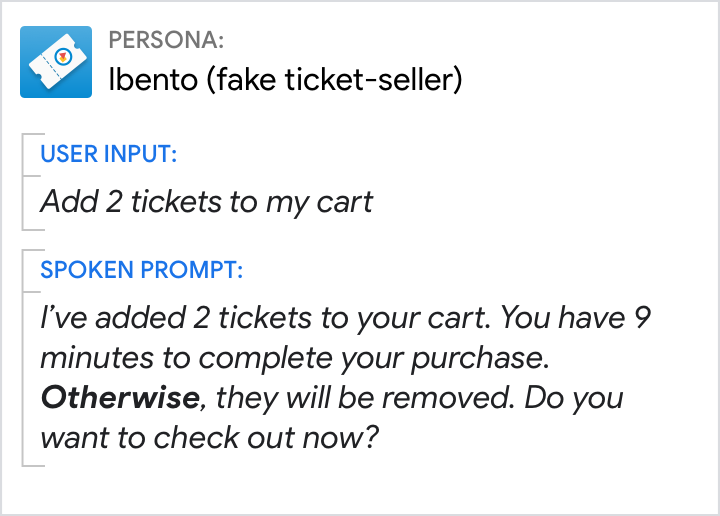{ width="300" } | 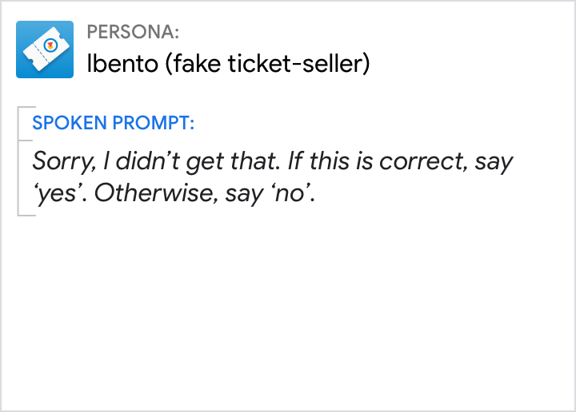{ width="300" }
Only use "otherwise" when the information that follows is informative, not obvious. | Avoid "otherwise" for predictable, binary choices. A better prompt would be "Sorry, did I get that right?"
