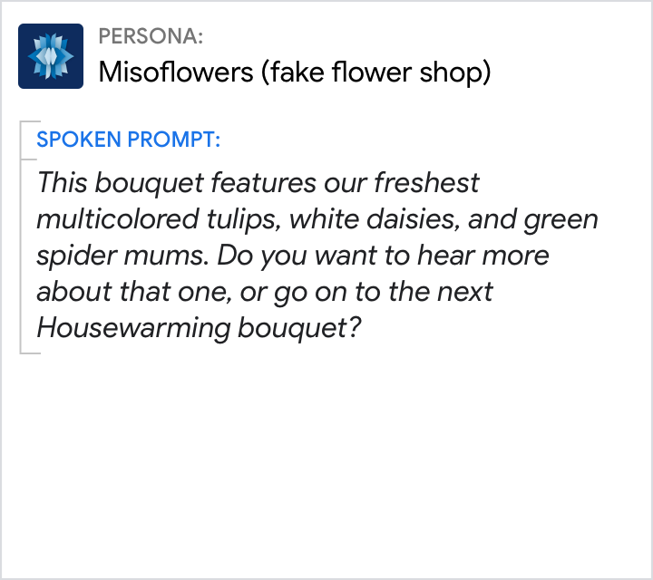
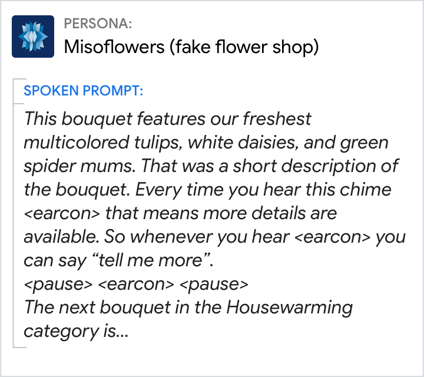

# Earcons

Earcons, or audio icons, are a type of non-verbal audio (NVA) designed to convey
a specific meaning. Your persona can use earcons to communicate with users in
the briefest way possible.

## Guidelines

Earcons impose cognitive load because users have to learn what they mean; they're not intuitive.

- Limit use to just a few sounds that are easily distinguishable so that users don't have to learn too many
- Use them in moderation, or they can quickly become overwhelming
- Use them consistently so that users learn to associate the sound with its context

There's a risk that users might make the wrong association and assume an earcon
means something different than intended. All sounds should align with your
brand, complement your
[persona](../conversation-design-process/create-a-persona.md), and feel like a
coherent set. Generally, earcons are as brief as possible; however, when used as
greetings, they can be a bit longer.

Visit the Actions on Google
[sound library](https://developers.google.com/assistant/tools/sound-library) for
a list of sounds you can use to enhance the user experience of your Action.

## Usage

If you feel like you have to teach users what an earcon means, don't use an
earcon.

Conversation is intuitive and efficient on its own. Earcons often don't add value, but instead add cognitive load. Users have to process the instructions and remember them for later.

Do | Don't
---|---
{ width="300" } | { width="300" }
The prompt should be tapered over time, e.g., "Wanna hear more?" | This time-consuming instruction is too much to process and remember.

## Additional resources

If you've wondered what goes into designing sound as part of a user interface,
you can hear all about it in episode 30 of the podcast Twenty Thousand Hertz:
["The Bleeps, the Sweeps, and the Creeps!"](https://www.20k.org/episodes/the-bleeps-the-sweeps-and-the-creeps)

> "There are sounds we interact with every single day and never give a second
> thought. Our phones, computers, cars, and other devices are constantly
> communicating with us through user interface sounds and it's their job to be
> heard, but not distracting. In this episode, we speak with Will Littlejohn,
> Facebook's Director of Sound Design, and Conor O'Sullivan, Sound Design Lead
> at Google, about the sounds they create that help connect families, friends,
> and communities."
