# Endings

Your persona should end conversations appropriately. Take advantage of this
component to provide closure in a way that demonstrates social intelligence.

## Completed intent

When the user fulfills their intent, assure them that it's been done, and then
take leave. But also look for opportunities to further assist.

Confirm any completed actions and look for opportunities to offer proactive
assistance.

Do | Don't
---|---
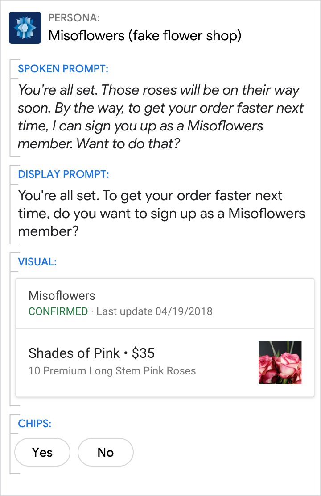{ width="300" } | 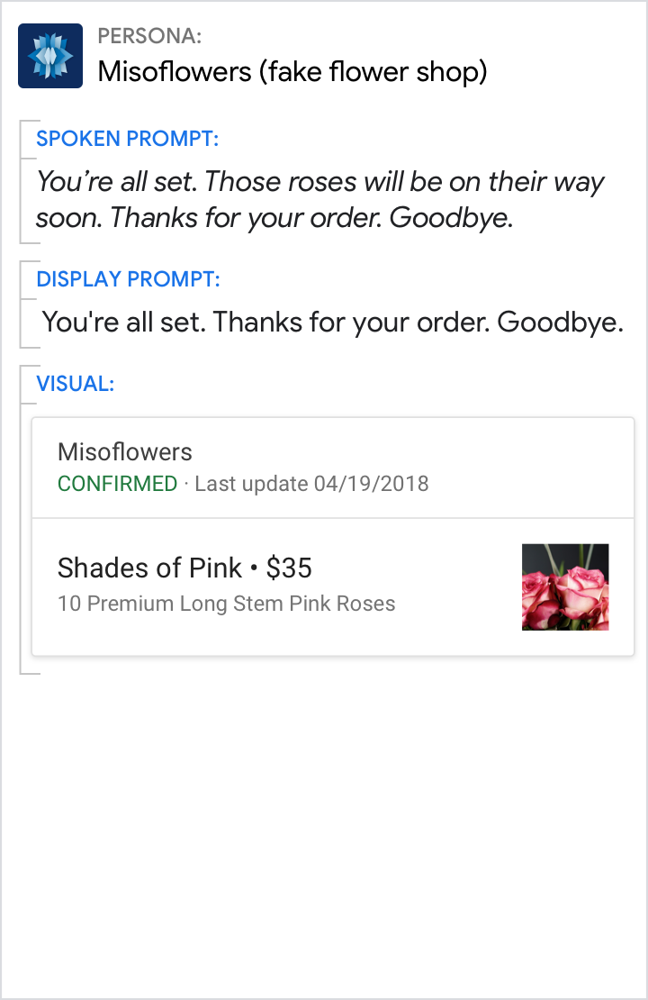{ width="300" }
Let the user know that the action has been completed. The persona also takes this opportunity to give the user also has a fast and simple way to sign up as a Misoflowers member after the purchase is complete. | Here, the persona misses an opportunity to save the user time/effort on future orders.

Suggest related intents in the chips.

Do | Don't
---|---
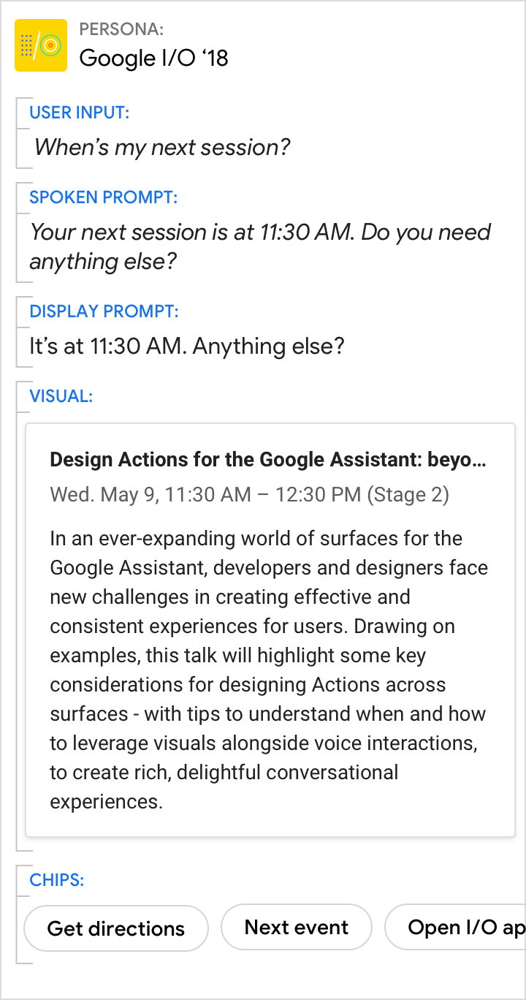{ width="300" } | 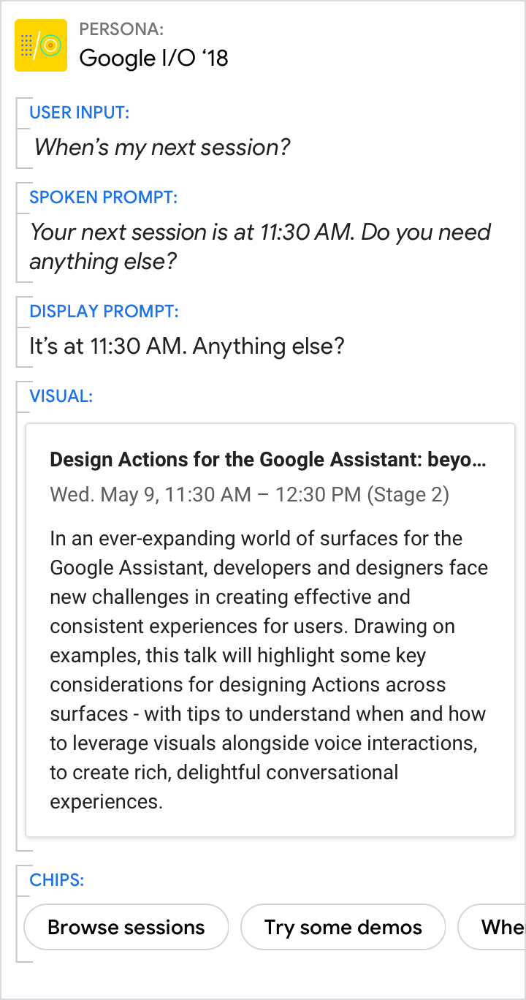{ width="300" }
The chips anticipate what the user might want to do next. | While these chips offer other things the user could do, they are less relevant in this context.

## Abandoned intent

Users abandon tasks for all kinds of reasons. Maybe they got interrupted. Maybe
they lost interest. Or maybe your persona misunderstood them and consequently
took them down the wrong path. Regardless of the reason, you should let the user
decide when the conversation should end.

### Let users quit before finishing a task

Don't double-check unless significant progress will be lost.

Note that "exit", "cancel", "stop", "nevermind", and "goodbye" are supported by
default, so if users say them, your Action will end. See App Exits for more
information.

Do | Don't
---|---
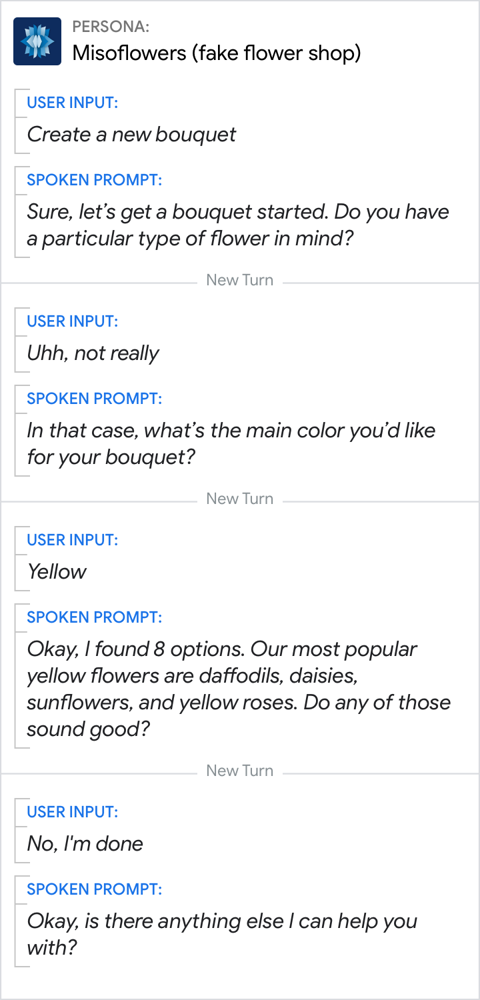{ width="300" } | 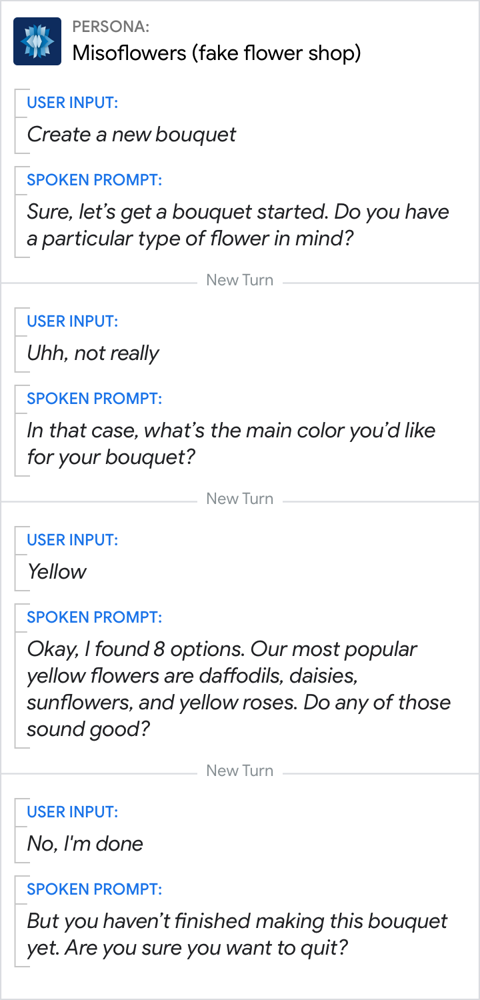{ width="300" }
Honor requests like "I'm done", "I'm finished", or "forget it". | Don't second-guess the user's intention. Instead, trust that they asked for what they wanted. Here, it's not worth double-checking because the user hasn't made much progress yet.

## Say goodbye

Once the user has indicated the conversation is over, assume that you've lost their attention.

Do | Don't
---|---
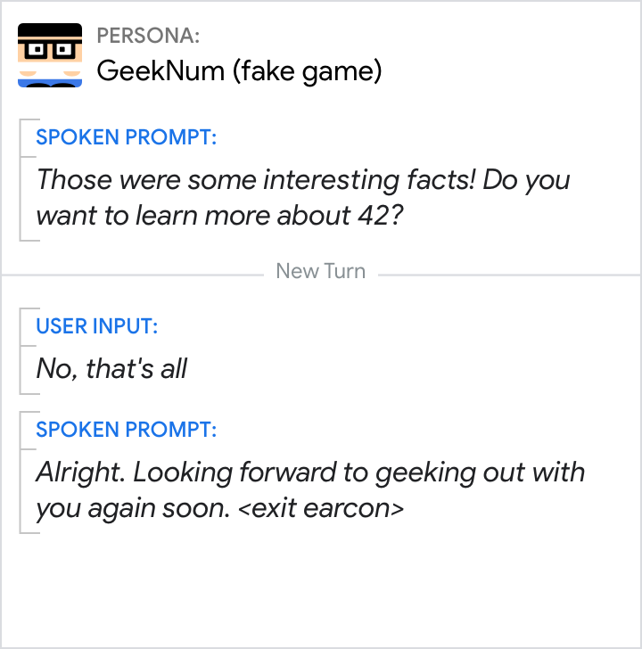{ width="300" } | 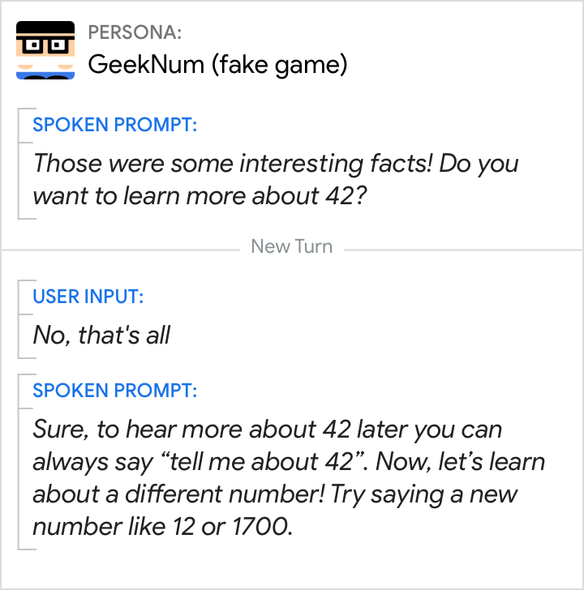{ width="300" }
Support all the ways in which users say goodbye, e.g., "No that's all" or "that's enough", and exit gracefully. | Don't keep trying to engage the user when they've indicated they're done. When the user has refused an offer, avoid acknowledgements that strongly imply acceptance, like "Sure" or "Got it". Finally, avoid teaching the user commands.

## Hand off to another device

Sometimes it's appropriate for your persona to hand off a conversation from one
device to another.

The most common handoffs are from a device without a screen to a device with a
screen. Don't force the user to switch devices. They may be trying to complete
their journey on a specific device for a variety of reasons. Honor that choice.

<figure markdown>
  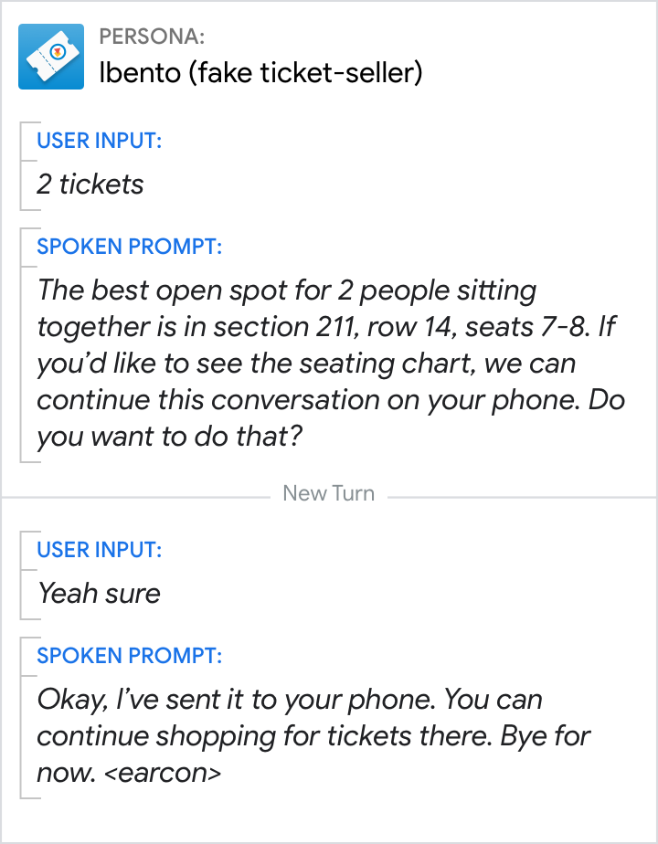{ width="300" }
  <figcaption>Let users know they have the option to switch devices, but don't force them to switch.</figcaption>
</figure>

## Unsupported intent

Conversations may end when your Action doesn't support the functionality the
user has requested. This is a type of system error.

When a request is out of scope, notify the user briefly and avoid overusing
apologies like "sorry". Avoid overpromising. Use phrases like "I can't do X yet"
only in situations when there are plans to build the requested functionality.

Do | Don't
---|---
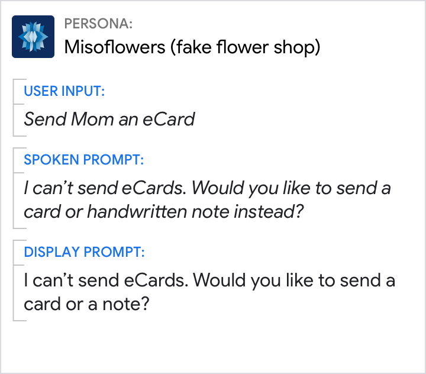{ width="300" } | 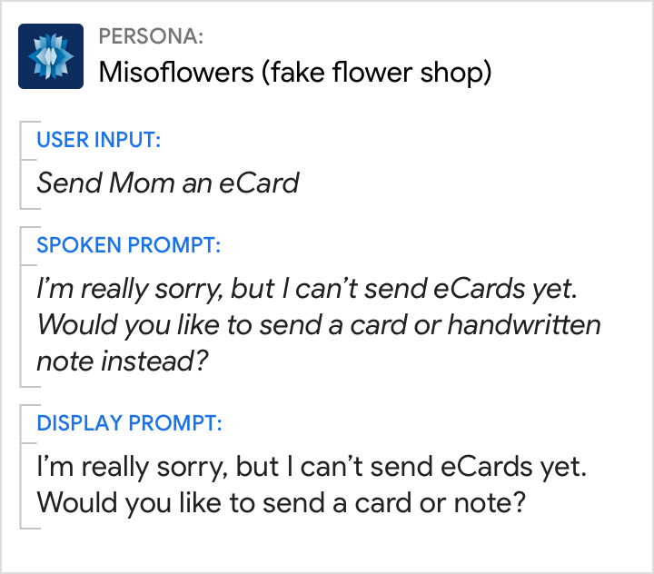{ width="300" }
Do take responsibility and briefly let the user know their request isn't supported. | Don't be overly apologetic. Don't use "yet" if the feature isn't coming soon.

## Errors

Unfortunately, sometimes conversations end due to an unrecoverable error. See error handling for details on how to handle Max No Input errors, Max No Match errors, and System errors.

### Error handling

This example follows the recommended No Match handling by providing a rapid reprompt, following it with escalating detail, and finally ending the conversation.

Do | Don't
---|---
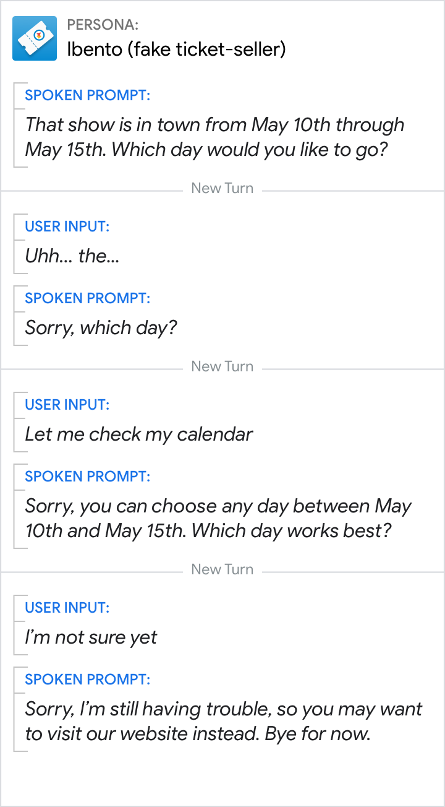{ width="300" } | 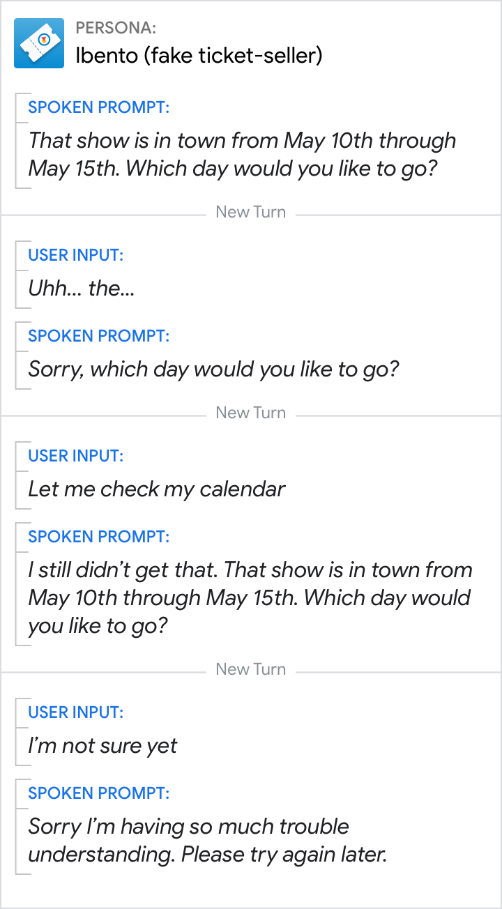{ width="300" }
End the conversation after repeated recognition errors. Review these errors to see if there are ways you can improve your Action, for example, by adding an ability to save an event for later. | Don't give the user a vague "try again later." Don't be overly apologetic.
