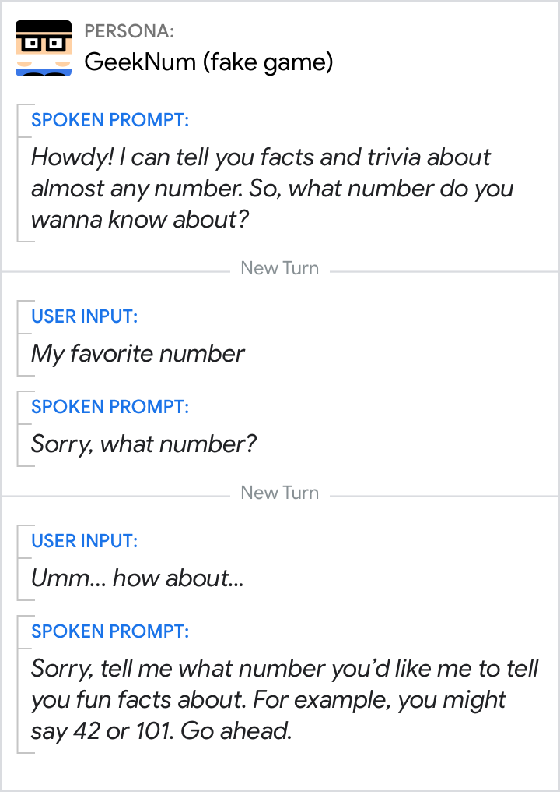

# Errors

Errors occur when your Action can't move forward because it 1) didn't understand
the user's input, or 2) didn't get input. Since this can happen at any time,
your Action needs to have unique error handling for each turn in the
conversation to help the user get back on track.

## Guidelines

How your Action responds to errors can make or break the user experience. When
users are unable to complete their tasks, they're unlikely to talk to your
Action in the future. One poorly handled error can outweigh dozens of successful
interactions. But with good error handling, the user won't even know an error
occurred.

Keep in mind the following considerations:

- **Cooperation**
    - Assume the user is being cooperative, and what they're saying is relevant
      and valid. Users are just trying to accomplish something; it's your job to
      figure out what that is.

- **Transparency**
    - Be honest and transparent when explaining why something doesn't work.

- **Context-specific**
    - Good error handling is context-specific. Even though you' re asking for
      the same information, the conversational context is different on the
      second or third attempt.

There are 3 types of errors:

  | Errors in human-to-human conversations |  | Errors in human-to-computer conversations
---|---|---|---
Imagine you're talking to someone and... | ...they don't respond to you. | No Input | The Action hasn't heard the user's response, or the user hasn't responded by the time the microphone closes.
 | ...they say something that confuses you. | No Match | The Action can't understand or interpret the user's response in context.
 | ...they ask you to do something you can't do. | System error | The systems that the Action depends on for information can't complete the task.

## No Match

### Why No Matches happen

A No Match error occurs when the Action can't understand or interpret the user's
response in context.

Here are a few possible causes of No Match errors.

Do | Don't
---|---
{ width="300" } | { width="300" }
The user doesn't respond fully or clearly, possibly hesitating, changing their mind or not completing their sentence. | The user might not be speaking to the Action.

Do | Don't
---|---
{ width="300" } | { width="300" }
The user says something relevant to the question, task, or domain, but the Action doesn't understand it. This might occur when either the user's response isn't included in the recognition grammar, or it's given in a noisy environment. | The user wants to switch topics entirely.

### 1st level No Match (rapid reprompt)

Quickly and concisely collect the information again or in another way. The user
was trying to engage, so they probably just need another chance. Do not repeat
the original prompt verbatim since it will sound robotic.

Rapid reprompts typically combine an [apology](apologies.md) with a condensed
repetition of the original [question](questions.md).

Do | Don't
---|---
{ width="300" } | { width="300" }
Reiterate the question quickly and succinctly. | Don't dwell on or over-explain the error.

Do | Don't
---|---
{ width="300" } | { width="300" }
Combine [apologies](apologies.md) with [questions](questions.md). | Don't provide examples for simple responses. Avoid escalating detail in the 1st No Match prompt (exceptions below).

There are exceptions when the user could benefit from more support in the 1st No
Match prompt.

Do |
---|
{ width="300" } |
Including additional information can help users respond by narrowing down their request. |

Do |
---|
{ width="300" } |
Allow users more guidance when reasonable, particularly after [wide-focus questions](questions.md). |

### 2nd level No Match (escalating detail)

In each context, consider why the user might be having difficulty. Then, in the
reprompt, include additional support in the form of options, examples, or visual
information. Examples are particularly effective, since they give the user an
implicit model of what to say and how to say it, without drawn-out explanations
or instructions.

Do | Don't
---|---
{ width="300" } | { width="300" }
Try to be helpful, providing your best guess at relevant information that can be useful. | Don't repeat the same thing over and over. The user is stuck and needs additional guidance.

Do | Don't
---|---
{ width="300" } | { width="300" }
Talk to the user like you're having a human-to-human conversation. | Make sure that you're not being condescending!

### Max No Match

End the conversation after 2 No Match collection attempts, to avoid further user
frustration.

Do | Don't
---|---
{ width="300" } | { width="300" }
End the conversation gracefully when there's nothing you can do to help the user. | Vague promises, particularly when you don't know what the user has asked for, are unhelpful and erode user confidence.

Let users know if there are other ways they can complete their task.

Do | Don't
---|---
{ width="300" } | { width="300" }
Next steps can be better than nothing, even when the user has to do it themselves. | Don't recommend trying again in a few minutes or on another device if it's unlikely to fix the issue.

## No Input

### Why No Inputs happen

The Action hasn't detected a response from the user, because the user:

- hasn't said anything while the microphone was open
- hasn't spoken loud enough

Here are a few possible causes of No Input errors.

Do | Don't
---|---
{ width="300" } | { width="300" }
The user left the room, is distracted, or maybe changed their mind. | There's no speech, just noise.

Do | Don't
---|---
{ width="300" } | { width="300" }
The user is thinking or unsure about how to respond. | The user spoke before the mic opened.

### 1st level No Input

When writing No Input prompts, assume that the user hasn't heard the question.

Do | Don't
---|---
{ width="300" } | { width="300" }
Repeat the question (by rephrasing) in a similar and concise way. | Don't say "I didn't hear you", because it's likely the user hasn't said anything. And don't assume the user heard the first question or remembers the options that were offered.

There are exceptions when the user could benefit from more support in the first
No Input prompt.

Do |
---|
{ width="300" } |
When there's a good chance the user might be stumped, see if you can provide more support. |

Do |
---|
{ width="300" } |
Users might not respond to a [wide-focus question](questions.md) because they don't know what they can say. So give them some options. |

If information is not required, then move on to the next step in the dialog.

Do |
---|
{ width="300" } |
Continue to the next step if the information isn't required. However, make sure to not penalize the user, e.g., by skipping over something perceived as important or interesting without an opportunity to provide it later. |

### 2nd level No Input

Give users one more opportunity to respond before exiting.

Do |
---|
{ width="300" } |
Restate the question to give the user one more chance to respond. |

### Max No Input

To avoid pestering the user, end the conversation after 2 No Input collection
attempts.

Do |
---|
{ width="300" } |
End the conversation gracefully when the user stops engaging. |

## Error counters

{ width="400" align="right" }

Users should experience no more than 3 No Input or No Match errors in a row,
after which your Action should play the appropriate max error prompt and exit
the conversation.

Good error handling is context-specific. Even though you're asking for the same
information, the conversational context is different on the second or third
attempt. In order to play the right error prompt for the context, you'll need to
keep track of how many, and what type of, errors have occurred.

Follow this flowchart to determine which error prompt to play. Note that every
time you open the mic, there's the potential for a No Input or No Match error to
occur.

!!! note
    For
    [code examples](https://developers.google.com/assistant/df-asdk/dialogflow/tips),
    see the Actions on Google developer documentation.

## System errors

System errors occur when the user was understood correctly, but the systems your Action depends on for information either can't complete the task or fail due to technical reasons. Some common scenarios include:

- System failure (the system is unresponsive or returns a general error—e.g.,
  the light will not turn on, the database is unavailable)
- Invalid request (e.g. the user tried to make an appointment in the past)

Evaluate every system your Action depends on and account for all possible errors that could be encountered. Where possible, provide the reason and possible next steps in a way that's transparent, honest, and helpful.

Do |
---|
{ width="300" } |
Try to be transparent without being overly technical. See if there are any next steps you might offer. |

Do |
---|
{ width="300" } |
Try to provide feedback on how the request was invalid and educate the user where possible. |
