# Greetings

Your Action has to introduce itself and make a good first impression by showing
value. The goal is to make the user feel confident and in control as quickly as
possible, so it's important to help users discover what they can do with your
Action without making it feel like a tutorial.

## Prompting

There are 3 main goals you want to accomplish with your greeting:

- Welcome the user
- Set expectations
- Let the user take control

It's easiest to understand this through examples.

### Example 1 - Number Genie

Go [here](https://github.com/actions-on-google/dialogflow-number-genie-nodejs)
to see how this Conversational Action was built using Dialogflow.

Do | Don't  | Don't
---|---|---
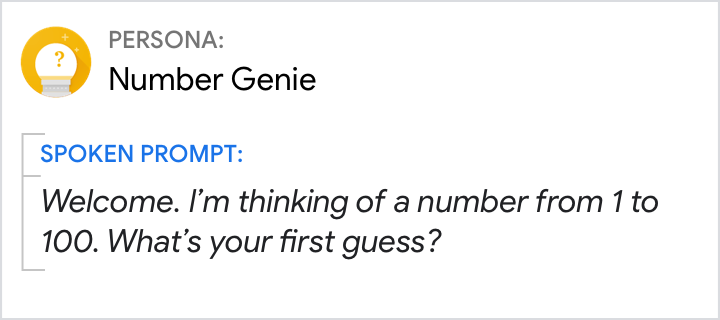{ width="300" } | 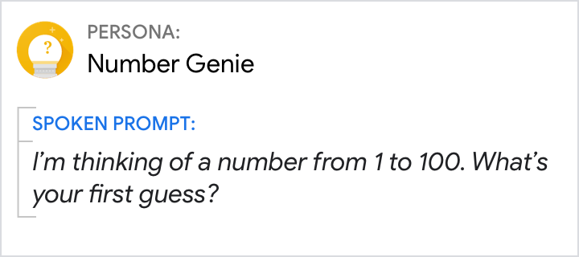{ width="300" } | 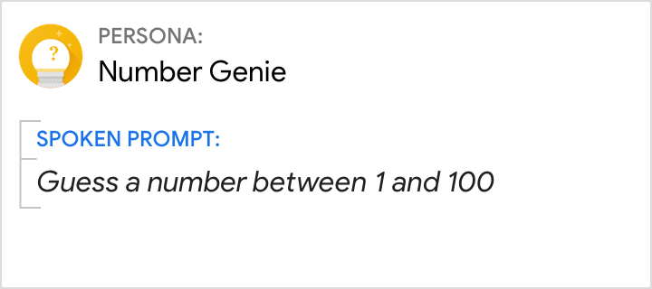{ width="300" }
**Welcome the user.** Greet the user briefly, e.g., with a simple "Welcome" or "Hi". | Don't just jump right in. Say hello. | Users will perceive your Action's persona as rude if you start by telling them what to do.

Do | Don't  | Don't
---|---|---
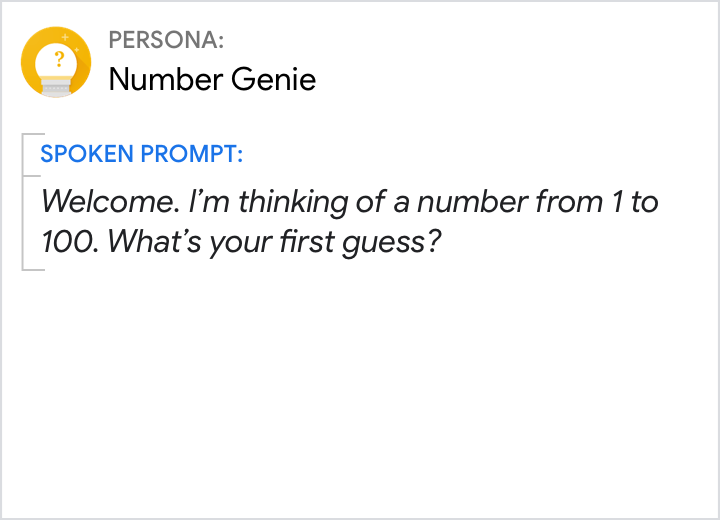{ width="300" } | 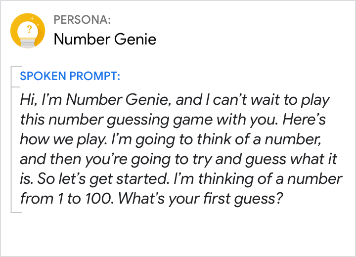{ width="300" } | 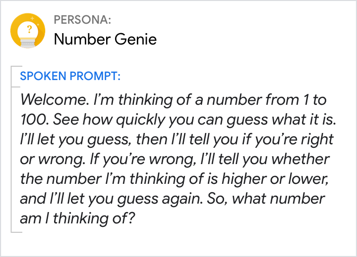{ width="300" }
**Set expectations.** Build on real-world knowledge by tapping into users' existing mental model for how guessing games are played. "I'm thinking of a number..." does this quickly and efficiently. No further explanation is needed. Saying "first guess" sets the user's expectations that this will be a back-and-forth conversation that allows the user to continue refining their guess. | Don't repeat your Action's name—either the user or the Assistant has already said "Number Genie" as part of the invocation. Avoid explanations, especially of familiar concepts like how to play a guessing game. | Don't overwhelm the user with lots of details upfront. They'll discover how the game works as they start to play.

Do | Don't  | Don't
---|---|---
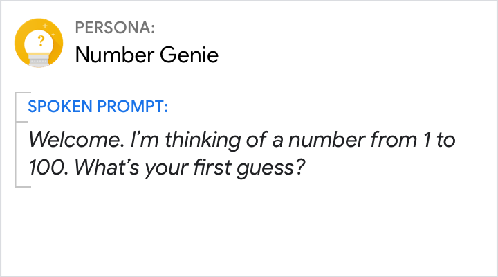{ width="300" } | 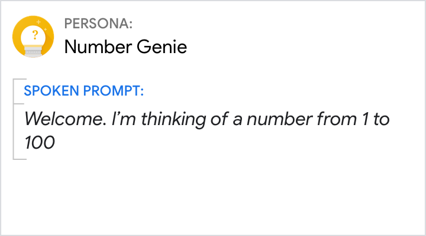{ width="300" } | 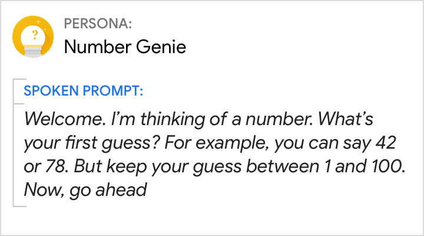{ width="300" }
**Let the user take control.** Ask [questions](questions.md) to let the user know it's their turn to speak. Users should find it easy to respond to this [narrow-focus question](questions.md), by saying "a number from 1 to 100". | If you don't ask a question, users aren't likely to respond. This will cause a [No Input error](errors.md). | Don't tell users what they can say. Instead, phrase your question in a way that encourages responses your Action can handle.

### Example 2 - Google I/O 18

Go [here](https://github.com/actions-on-google/dialogflow-iosched-nodejs) to see
how this Conversational Action was built using Dialogflow.

Do | Don't  | Don't
---|---|---
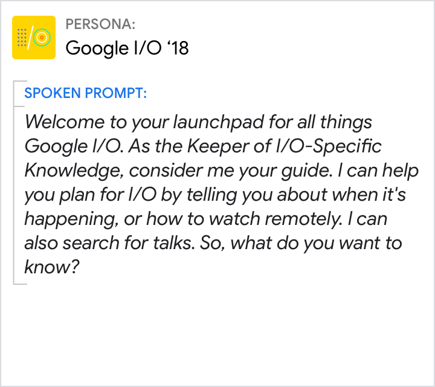{ width="300" } | 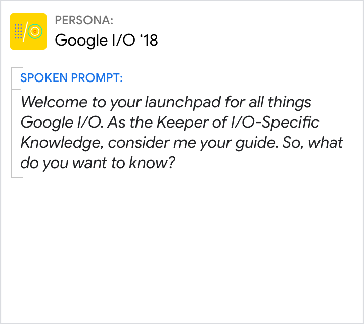{ width="300" } | 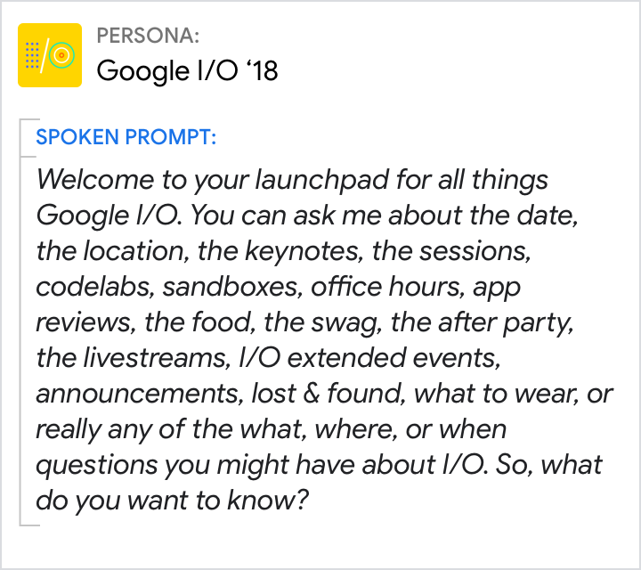{ width="300" }
Since the name "Google I/O 18" doesn't really give a sense of what this Action can do, the persona needs to provide the mental model. The Action is described as a "launchpad" and the "Keeper of I/O-Specific Knowledge" is meant to evoke a game master and guide. | Don't make your users guess what your app can do. Without giving a few examples, this [question](questions.md) has too wide a focus and is likely to put users on the spot and cause a "deer in the headlights" moment. | Don't offer more than 3 options at a time. If your Action has more than 3, randomize which are offered or consider offering the 2 most popular options along with a third "more options" category.

## Tapering

Consider both first-time and repeat users of your Action. A novice user might
need more detailed descriptions of your Action's options and features. This same
information can become frustrating to more experienced users (it violates the
[Cooperative Principle](../learn-about-conversation.md)). On the other hand, an
expert user might benefit from a well-placed tip about an advanced feature
(information which might overwhelm a novice user).

First time user | Repeat user | Repeat user
---|---|---
**User** Hey Google, talk to Google I/O 18 | **User** Hey Google, talk to Google I/O 18 | **User** Hey Google, talk to Google I/O 18
**Google Assistant** Alright, here's Google I/O 18. &lt;earcon&gt; | **Google Assistant** Alright, here's Google I/O 18. &lt;earcon&gt; | **Google Assistant** Alright, here's Google I/O 18. &lt;earcon&gt;
**I/O 18** Welcome to your launchpad for all things Google I/O. As the Keeper of I/O-Specific Knowledge, consider me your guide. I can help you plan for I/O by telling you about when it's happening or how to watch remotely. I can also search for talks. So, what do you want to know? | **I/O 18** Welcome back. I can tell you more about I/O. For example, you might like to know about the keynotes, codelabs, or app reviews. I can also help you find sessions or office hours. So, what do you want to know? | **I/O 18** Hi again. I have all kinds of info on I/O, from codelabs and sandboxes to the keynotes and sessions. So, tell me what you want to know about.

Also make sure to vary your greetings based on the
[invocation](https://developers.google.com/assistant/conversation-design/help-users-find-your-action)
that led the user to your Action.
