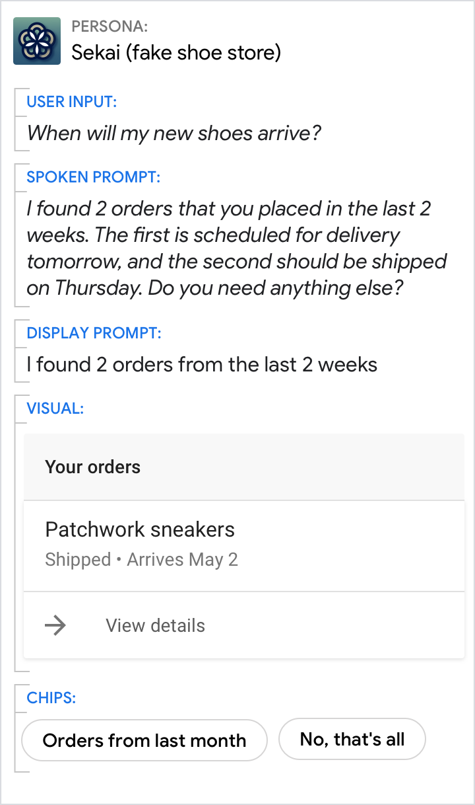

# Informational statements

Understanding this type of conversational component will help you give users
information in a clear and concise way.

## Overviews

Overviews (also called introductions, headers, preambles, or advance organizers)
set expectations about how information will be structured. They set up mental
"compartments" in which the user can receive the incoming information, thereby
reducing cognitive load.

### Introduce a list of information by giving a short overview

Do | Don't
---|---
{ width="300" } | { width="300" }
Set user expectations about the information they're getting. Here, the search window was 2 weeks, and 2 orders were found. | Don't surprise the user with multiple results off the bat. Don't use a vague introduction ("Here's what I found") when a specific one would provide more value to the user (e.g., the length of the list, search criteria).

## General information

Users will have lots of questions for your persona, so use informational
statements to provide clear and concise answers. Focus on the essential, or
core, information that's most relevant to the user's query. More peripheral
details should be presented in the visuals instead or omitted entirely. It's
okay to include additional information that the user didn't specifically ask for
as long as it's highly relevant to their query.

- **Spoken prompts** should lead with an [implicit confirmation](questions.md)
  of the information that was said or implied, followed by the new information.
  This is because spoken English places the most important information (e.g.,
  the answer) at the end of the sentence; this is known as the End-Focus
  Principle.
- Most of the time, the **display prompt** is used to point to more detailed
  information in the accompanying visuals. When there are no accompanying
  visuals, it's acceptable to use the same verbiage for the spoken and display
  prompts. However, you should condense the information in the display prompt to
  make it easier to scan.
- **Chips** should include ways the user can continue the conversation with your
  persona. Try to offer actions the user could take with this information or
  related information they might be interested in.

### For some answers, a simple informational statement is sufficient

Do | Don't
---|---
{ width="300" } | { width="300" }
Use implicit confirmations ("...this year's developer festival...") to carry the thread of the conversation forward by maintaining context. Note that the spoken prompts use end-focus, while the display prompts front-load key info for scannability. | Don't provide the answer without the context.

### Most informational statements will have accompanying visuals

Do | Don't
---|---
{ width="300" } | { width="300" }
Use the spoken and display prompts to give the specific answer to the user's directed question (11:30 AM in this example). Use the visuals for related details. | Avoid redundancy between the spoken prompt, display prompt, and visuals.

### Even when the visuals provide the best answer, make sure the prompts still carry the core of the message

Do | Don't
---|---
{ width="300" } | { width="300" }
Use the prompts to give an overview. Use the visuals to provide additional detail. | Don't force the reader to scan and read. Your persona should reduce the work the user needs to do, which includes the effort of scanning through detailed information.

### Your persona can offer more information than was requested if it's highly relevant

Do | Don't
---|---
{ width="300" } | { width="300" }
Some facts about prime numbers in general are relevant to the user here, above and beyond a list of prime numbers. | Here, the persona misses an opportunity to share relevant facts.

### For less-relevant information, use the visuals to provide additional detail

Do | Don't
---|---
{ width="300" } | { width="300" }
Keep informational statements concise by including only the most relevant information (e.g., today's hours). Use the visuals to provide additional detail. | Don't overwhelm the user by putting lots of information in the spoken and display prompts. Instead, leverage the visuals.

## Menus

Your persona can present the user with a menu or list of options.

### Menus can be used to present options before asking a question

In this example, a narrow-focus question is used for disambiguation.

Do | Don't
---|---
{ width="300" } | { width="300" }
If the user requires information before making a choice, provide the information first, then ask the question. (Or use phrasing like "which of these...") | Don't ask a question and then keep speaking. See [turn-taking](../learn-about-conversation.md).

### Menus are often incorporated into narrow-focus questions

In this example, a narrow-focus question is used for disambiguation.

Do | Don't
---|---
{ width="300" } | { width="300" }
A question can include a menu as long as the options are short and few. This narrows the question's focus and makes it easier for the user to understand. | There are only a few options, they're not wordy, and this is a familiar, intuitive question—so it feels heavy and robotic to split them into separate sentences.
