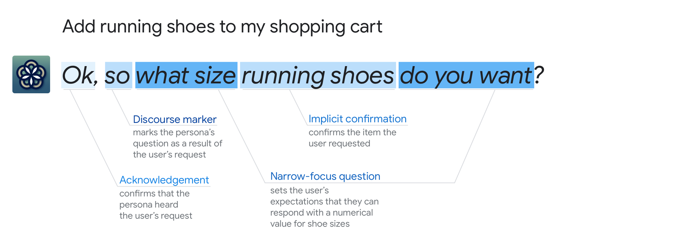

# Overview

Conversational components are all the things that make up a prompt, like
acknowledgements or questions. They also include chips, which are used to
continue or pivot the conversation. Prompts and chips are the core of the
conversational interaction and should be designed for every turn in the dialog.

This section offers guidance on writing 1) the spoken prompts the user hears, 2)
the display prompts the user sees, and 3) the chips the user can say or tap in a
way that is conversational and focused on the user.

## When to write prompts

### During high-level and detailed design

In the
[conversation design process](../conversation-design-process/how-do-i-get-started.md),
prompt writing is part of both high-level and detailed design. Avoid writing any
prompts during requirements gathering—instead, focus on describing
[key use cases](../conversation-design-process/gather-requirements.md).

### Starting with sample dialogs for a conversation on Google Home

The first prompts you write will be in your
[sample dialogs](../conversation-design-process/write-sample-dialogs.md). We
recommend starting with a conversation on Google Home. If you start designing
with a screen in mind, it can be easy to lose the thread of the conversation and
end up with a graphical interface that is not suitable for conversation. Getting
the conversational flow right is easier if everything is in one place—the spoken
prompts. As you expand to other interaction types, pieces will move out of the
spoken prompts and into the display prompts, chips, and visuals.

### When you have a clear understanding of the conversational context

It’s impossible to write a good prompt without a detailed understanding of the
[context](../learn-about-conversation.md). What happened before in the dialog?
What could happen next? What’s the user’s mental model for the thing you’re
talking about? Refer back to your sample dialogs throughout the design process
to make sure any prompt edits or new prompts still fit with the overall flow of
the conversation.

## Where and how prompts appear

Prompts are the core of the conversational interface. Spoken prompts will be
played on devices with audio output, and display prompts will be displayed on
devices with screen output. So depending on the device users are using to
interact with your Action, they’ll 1) hear spoken prompts, 2) see display
prompts, or 3) both.

### Spoken prompts can either be synthesized or recorded speech

Prompt | Description
---|---
Synthesized | The Actions on Google platform provides a variety of text-to-speech (TTS) voices that speak different languages. Go to [Languages and Locales](https://developers.google.com/assistant/console/languages-locales) to hear them. Note that you can adjust the way the synthesized speech sounds by using [Speech Synthesis Markup Language (SSML)](https://developers.google.com/assistant/df-asdk/ssml). For example, you may want to add silence or pauses, specify how numbers should be read, or adjust the intonation.
Recorded | You can hire a professional voice actor, or even try using your own voice. Either way, you’ll need to record all the audio that will be used in your Action.

### Display prompts have specific formatting requirements

Requirement | Description
---|---
Max 640 character limits | There's a 640 character limit per turn, but we recommend using 300 characters or less.
Show your display prompt in 1 or 2 parts | You can have your display prompt show up in 2 parts. Think of this like a carriage return, letting you visually split the display prompt for readability. For example, you might want to split the menu from the question, or separate a joke setup from the punchline.
Emojis | Text in a display prompt can include "quotes" and most other unicode characters, including emojis.

## Examples

Often, there are multiple ways that components can be combined. Consider these 3
variations:

This example contains 4 components:

{ width="800" }

This example drops the [discourse marker](discourse-markers.md), though one
could have been used to emphasize the connection between adding the running
shoes and the resulting question, for example, "So what size do you want?" or
"Now, what size do you want?":

{ width="800" }

This example also drops the implicit [confirmation](confirmations.md), which
would be appropriate if the user could see a visual of the specific running
shoes to be added, or if the final item (shoes with color and size specified)
will be confirmed later in the dialog:

{ width="800" }

## Types of conversational components

Conversational component | Example
---|---
[Acknowledgements](acknowledgements.md) | Okay.
[Apologies](apologies.md) | Sorry, I can’t send eCards yet.
[Commands](commands.md) | Create a bouquet of yellow daisies and white tulips
[Confirmations](confirmations.md) | Got it. The men’s running shoes in royal blue and neon green. In what size?
[Discourse](discourse-markers.md) markers | By the way, ...
[Earcons](earcons.md) | &lt;welcome chime when Google Home powers on&gt;
[Endings](endings.md) | Anything else I can help you with right now?
[Errors](errors.md) | Sorry, for how many?
[Greetings](greetings.md) | Welcome.
[Informational statements](informational-statements.md) | 42 is an abundant number because the sum of its proper divisors, 54, is greater than itself.
[Questions](questions.md) | What kind of flowers would you like in your bouquet?
[Suggestions](suggestions.md) | I can tell you more about I/O. For example, you might like to know about the keynotes, codelabs, or app reviews. I can also help you find sessions, or office hours. So, what do you want to know?
[Chips](chips.md) | Add to cart.
