# Questions

One of the most effective ways to get the user to continue the conversation
(e.g., make a choice) is to ask a question. When the call to action isn't clear,
the user won't know when, or how, to respond.

## Wide- to narrow-focus questions

Questions fall on a continuum from wide- to narrow-focus, based on the range of
responses they elicit.

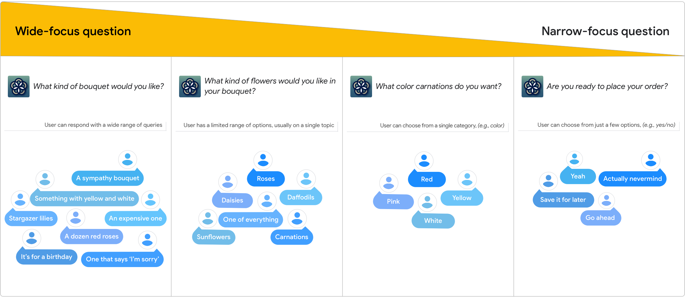

When designing a question, think about where it should fall on the continuum
from wide to narrow focus. Consider the pros and cons in the table below.

Type of question | Pros | Cons
---|---|---
**Wide-focus question**  Best for questions about domains that are familiar to the user and therefore are easy to answer. | <ul><li>Encourages the user to respond naturally and in their own words</li><li>Users feel in control</li><li>Provides best insight into what users want</li></ul> | <ul><li>Can put users on the spot and cause a "deer in the headlights" moment</li><li>Can be difficult for users to anticipate what answers are supported</li><li>May set expectations too high and overpromise</li></ul>
**Narrow-focus question**  Best for questions about complex or unfamiliar domains, or when options are limited or unclear. | <ul><li>Makes it clear what the user can say/do by establishing boundaries/limits</li><li>Easy for users to answer</li><li>Minimizes confusion</li></ul> | <ul><li>Can feel limiting to users</li><li>Can feel robotic and tedious (like many automated phone systems)</li><li>Questions may be longer</li></ul>

### Think about what users could say

Before asking a question, think about what responses you can reasonably support.
Don't ask the user a question if you're not prepared to handle their answer.

That said, don't be afraid to ask the user a question — it doesn't mean that you
have to support every response imaginable. The way a question is phrased sets
the user's expectations for what they can say. This phrasing can range from
open-ended, or wide-focus questions, to close-ended, or narrow-focus questions.

The magic and art of good conversation design is that users feel like they're in
control and that they can say anything at anytime, but in reality, the dialog
directs them along pre-scripted paths.

### Don't keep speaking after asking a question

Respect the rules of [turn-taking](../learn-about-conversation.md) by giving
users time to respond to the question.

Do | Don't
---|---
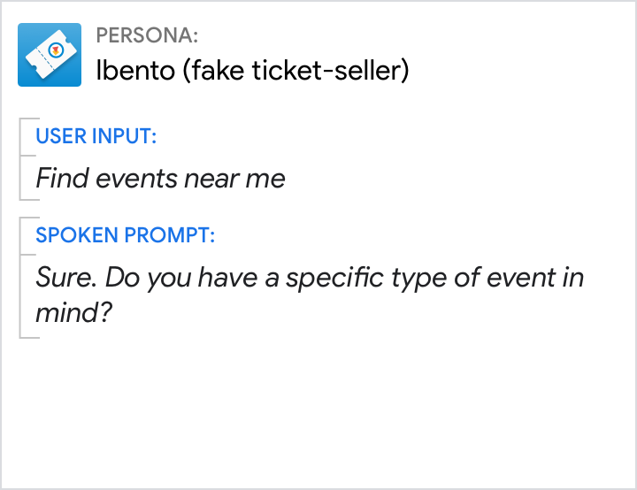{ width="300" } | 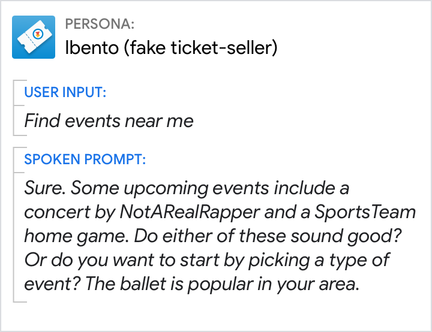{ width="300" }
Prompt the user with only a single question at a time. | Don't overwhelm the user with options and questions.

## Critical use cases for narrow-focus questions

There are a few specific use cases in which narrow-focus questions are critical.

### Error handling

The first time asking a question, your persona should present only the details
that are required to proceed.

When there's an error, narrow the focus of the question to provide more support
and get the user back on track.

See [errors](errors.md) for details.

Do | Don't
---|---
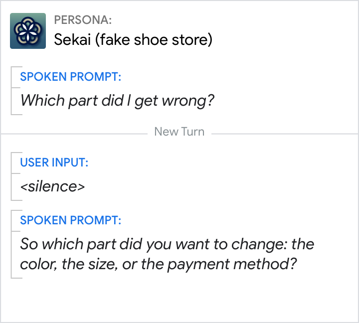{ width="300" } | 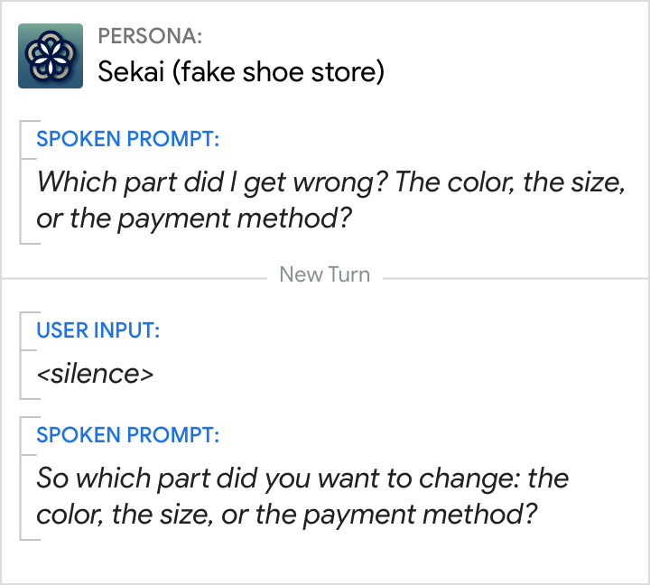{ width="300" }
Provide extra help when there's an error. | Don't slow all users down with details that most won't need to answer the question. Remember, irrelevant speech is time consuming.

### Disambiguation

Language is filled with ambiguity, though most of the time it is resolved
through [context](../learn-about-conversation.md). When context is not enough,
it's okay to ask the user for more information.

Do | Don't
---|---
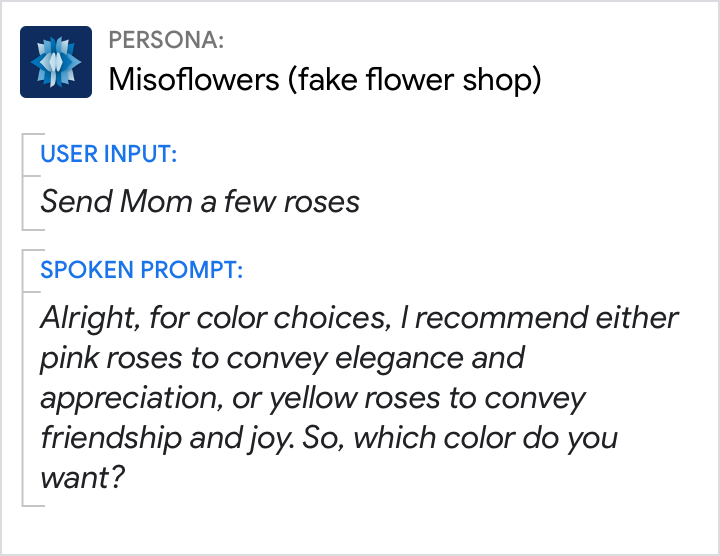{ width="300" } | 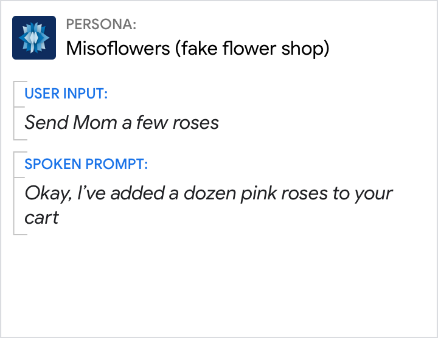{ width="300" }
To resolve ambiguity, ask the user a narrow-focus question. | The user's request is ambiguous. This response would've been appropriate if the user has ordered pink roses for their mom in the past.

### Explicit confirmations

Though they're uncommon, explicit confirmation questions are necessary in these
cases:

- When the cost of misunderstanding the user is high (e.g., names, addresses,
  text to be shared on the user's behalf)
- Prior to performing an action that would be difficult to undo (e.g., deleting
  user data, completing a transaction) See [confirmations](confirmations.md) for
  details.

Do | Don't
---|---
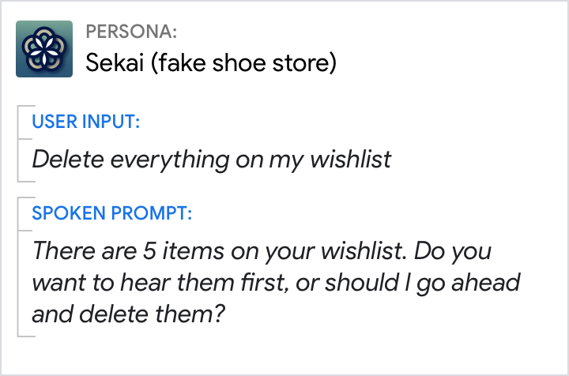{ width="300" } | 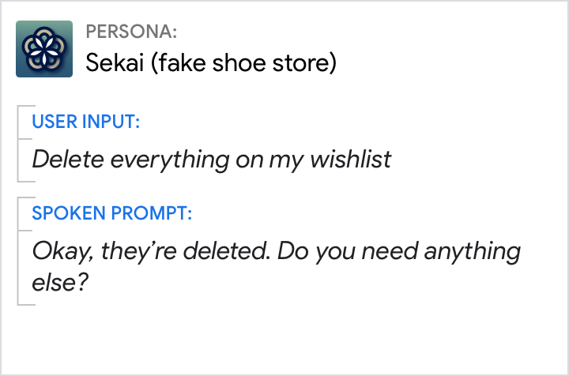{ width="300" }
Before deleting user data, use narrow-focus questions to confirm. | It would be difficult to recover from an error here.

## Learn from what users said

The insights gleaned from user data are invaluable, shedding light on how to
better phrase your questions.
[Analytics and monitoring tools](https://developers.google.com/assistant/console/analytics)
can help you learn how your questions are performing in the wild. Review all the
ways users appropriately. Also look for signs of user confusion—for example,
perhaps users are not responding (No Input), they take a long time to respond,
or they're hesitant, using filler words like um and ah.

There are 3 main approaches to handling unsupported responses:

- Add new synonyms to the grammar so that they map onto existing functionality
- Restrict the range of responses users can give by narrowing the focus of the question
- Design a new conversational path to support the requested functionality

If you're seeing a lot of unexpected responses from users, consider rewording
the question to narrow its focus.

Do | Don't
---|---
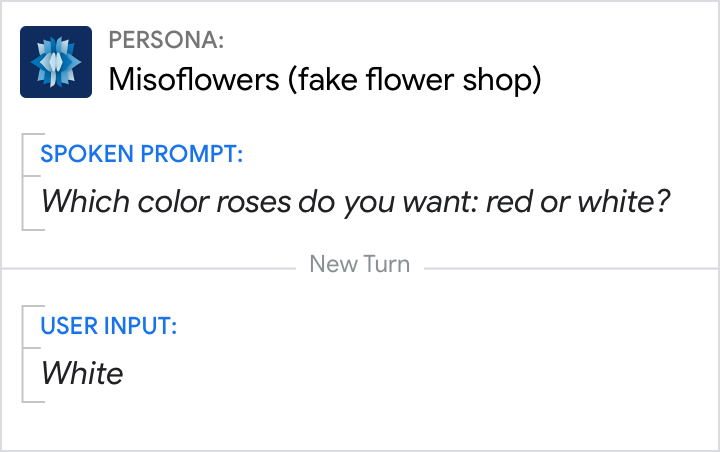{ width="300" } | 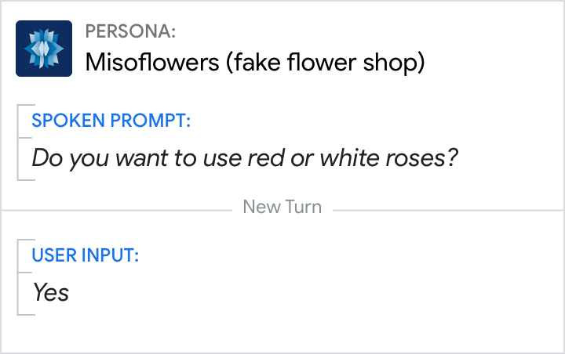{ width="300" }
Rephrase questions to make the options clear. | Typically, intonation and context will make it clear to the user that this is an either/or question, not a yes/no question. But if users are having trouble, consider rephrasing.
