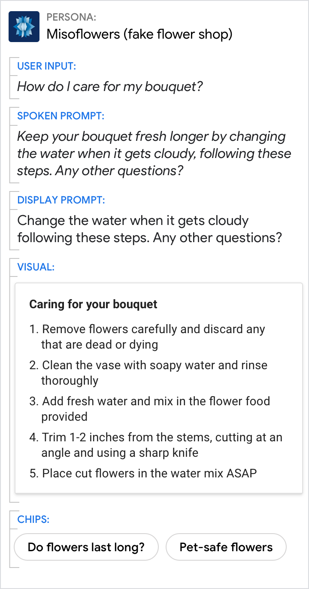

# Suggestions

Your persona can provide suggestions to help the user answer a question.
Suggestions can also be used as hints to help the user discover new features.

## Usage

Once you've decided to offer a suggestion, you have to decide where to put it:
the spoken prompts or the chips.

### Suggestions for spoken prompts

This is appropriate for conversations on smart speakers, on headphones, on smart
displays, or in the car. Even though some of these devices have screens, there's
no guarantee the user is looking at it or is close enough to interact with
chips, so the suggestions must go in the spoken prompts.

### Provide examples of conversational phrases the user could say

Do | Don't
---|---
{ width="300" } | { width="300" }
Offer a few randomized examples. | Don't assume a screen is available to the user.

### Examples are better than instructions

Do | Don't
---|---
{ width="300" } | { width="300" }
Offer examples like "between 2 and 5". | Don't provide instructions like "say a time of day".

### Suggestions for chips

This is appropriate for all conversations on devices with screens.

### Use chips to suggest answers

This is most helpful for wide-focus questions, though all questions can benefit
from the quick-tap response they enable.

Do | Don't
---|---
{ width="300" } | { width="300" }
Provide popular answers in the chips. If there are multiple categories, try to provide one example of each. | Don't put suggestions in both the spoken prompt and the chips. It makes the spoken prompt unnecessarily time consuming.

## Hints and discoverability

Hints can be used to help users discover new features.

Consider adding a discoverability hint to the end of a related query. Users
should only hear the hint once, so be sure to use a counter.

Do |
---|
{ width="300" } |
Provide clear motivation for any action you want the user to take. Tell the user why they might want to do something before telling them how to do it. |
