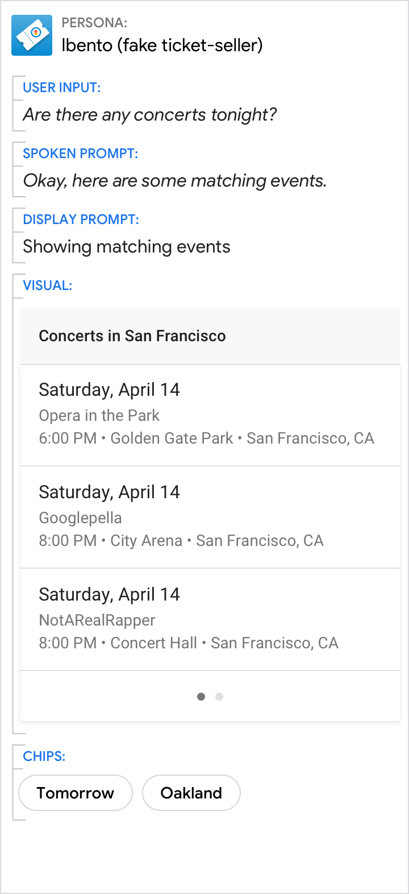
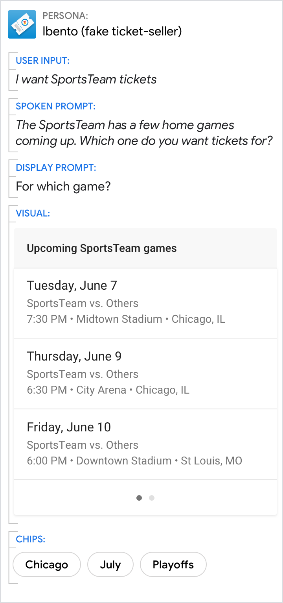
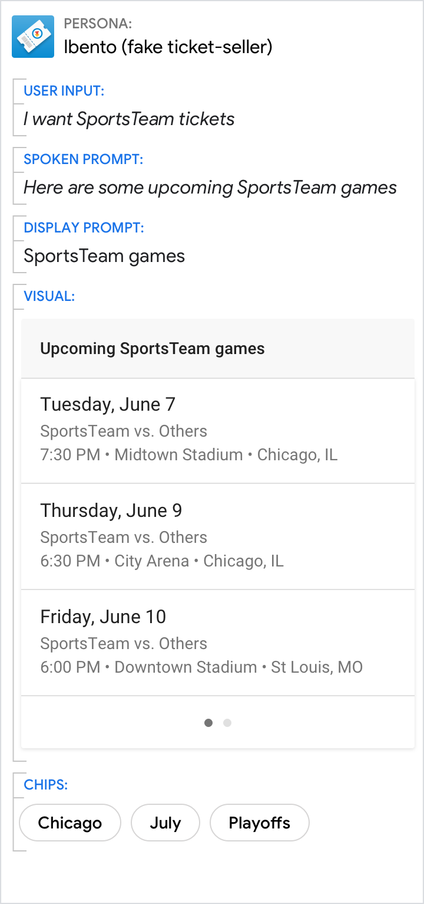
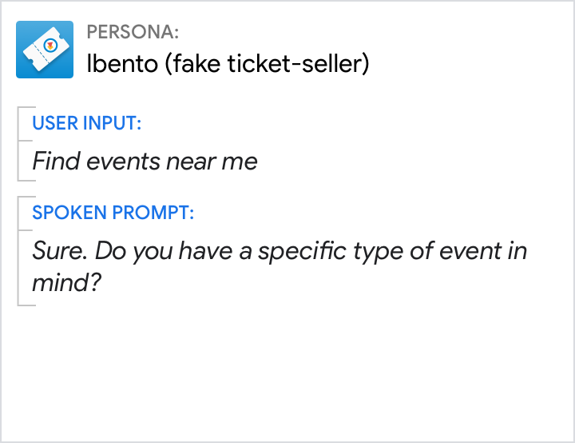
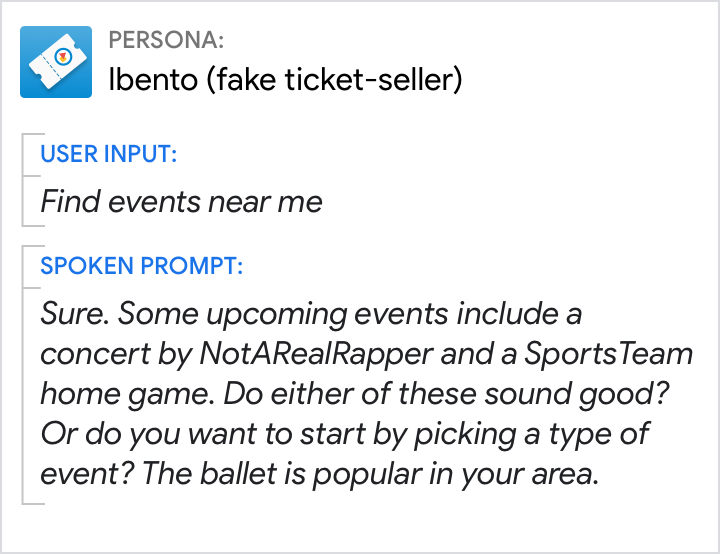

# Learn about conversation

New to conversation design? Here are a few high-level principles and concepts to
get you started before you write your first
[sample dialog](conversation-design-process/write-sample-dialogs.md).

## The Cooperative Principle

Watch this video for a crash course on how to write dialog that's comfortable,
frictionless, and user-centric by applying the Cooperative Principle.

<iframe width="560" height="315"
src="https://www.youtube.com/embed/wuDP_eygsvs?si=YyUg_C-VOuKTfNTm"
title="YouTube video player" frameborder="0" allow="accelerometer; autoplay;
clipboard-write; encrypted-media; gyroscope; picture-in-picture; web-share"
allowfullscreen></iframe>

According to the Cooperative Principle, efficient communication relies on the
assumption that there's an undercurrent of cooperation between conversational
participants.

The Cooperative Principle can be understood in terms of four rules, called
[Grice's Maxims](http://www.ucl.ac.uk/ls/studypacks/Grice-Logic.pdf).

We instinctively cooperate in terms of... | Maxim (or rule)
---|---
...the truth of what we say | Maxim of Quality
...the quantity of information that we provide | Maxim of Quantity
...the relevance of what we contribute | Maxim of Relevance
...the way we strive to communicate clearly, without obscurity or ambiguity | Maxim of Manner

Research has shown that people respond to technology as they would to another
human. This means users rely on their existing model of human-to-human
conversation and follow the Cooperative Principle even when interacting with the
persona of a conversational user interface, and they expect your persona to
follow it, too.

### Expect users to be informative

Because users are cooperative, they often offer more information than is
literally required of them.

Do | Don't
---|---
{ width="300" } | { width="300" }
Not only did this user answer the question about shoe-type, they also specified the size, in an attempt to find what they want quickly. Expect this kind of behavior from repeat users who know what other questions will be asked. | Here, the persona was only expecting the answer to the question about shoe-type. Cooperative users will be frustrated by having to repeat the shoe size again.

### Get the dialog back on track

Your persona won't always be able to handle cooperative responses. In these
cases, rely on lightweight and conversational error handling to get the dialog
back on track in a way that doesn't draw attention to the error.

Do | Don't
---|---
{ width="300" } | { width="300" }
If your persona is expecting a numerical answer, then cooperative/informative responses like these won't be understood. So handle this No Match error with a rapid reprompt. | Avoid responding with long reprompts when possible. In this case, the shorter reprompt will serve the same purpose, without making the user wait as long.

### Move the conversation forward

Like your users, your persona should also be cooperative and informative,
offering as much information as is necessary to advance the conversation.

Do | Don't
---|---
{ width="300" } | { width="300" }
This persona makes an effort to find alternative delivery options that will satisfy the user's intent—a cooperative gesture to move the conversation forward. | This persona makes no attempt to satisfy the user's intent and, after presenting some bad news, simply ends the interaction.

### Optimize for relevance

In conversation, saying too much is as uncooperative as saying too little.
Facilitate comprehension by keeping turns brief and optimally relevant from the
user's point of view.

Do | Don't
---|---
{ width="300" } | { width="300" }
This design is optimized for relevance. The persona doesn't include details that aren't relevant to the current decision. | From the user's point of view, most of this information is irrelevant and repetitive. All this detail imposes a heavy burden on the user's short-term memory as they patiently await their turn.

Do | Don't
---|---
{ width="300" } | { width="300" }
This design is optimized for relevance. Only the very few users who don't say the area code will be asked for it explicitly. | This design forces every user to listen to instructions on how to say a phone number in a way that's easiest for the persona, but not for the user. It also incorrectly presumes that the user would be unable to do this without instruction, making it feel like an error prompt.

### Listen between the lines

Knowing what someone said is not the same as knowing what they meant. People
often suggest things rather than state them explicitly. Our ability to "listen
between the lines" is known as "conversational implicature."

**Implicature vs implication.** By conversational implicature, "Last night I saw
John at a restaurant with a woman" suggests that John was with a woman other
than his wife, because if the woman had been his wife, the speaker would have
said so. However, by logical implication, the woman could have been John's wife,
since all wives are women.

Do | Don't
---|---
{ width="300" } | { width="300" }
Be sure to add handling for phrases like "That's it", "That's all," "Thanks," or "I'm done," for which the implied meaning is usually "I've gotten everything I need out of this conversation and am done talking. Goodbye." | Here, "That's it" was not added to the grammar, so it triggers a No Match error.

### Speak clearly, in plain English

People naturally avoid ambiguity and obscurity of expression in a conversation.
Using words and phrases that are familiar help reduce cognitive load. When it
comes to word choice, if you wouldn't say it, neither should your persona.

When you can't decide between a few similar terms, use Google Trends to find out
which term people search for most and Google Books Ngram Viewer to find out
which is more commonly published.

Do | Don't
---|---
{ width="300" } | { width="300" }
The user may have made a typo or quickly corrected themselves when speaking. So, the persona explains the issue, in plain English, and asks again. | "Invalid" is overly technical and doesn't help get the user back on track.

Do | Don't
---|---
{ width="300" } | { width="300" }
Keep confirmations simple. "Done!" is also a good option. | "Transaction," "requested," and "complete" are formal, not conversational. Also, this message fails to be relevant: There is no value in reminding the user that they've just requested a transaction.

Do | Don't
---|---
{ width="300" } | { width="300" }
Confirm that the user's request was understood, and point to the results. | "Matching events" is a technical expression. The "match" is the correlation between what the user said and the concerts available. Everyday users don't know, let alone care about, the challenge of matching queries to results. In addition, "matching events" is ambiguous—it can also mean events that match each other, like "matching socks."

## Context

Advances in automatic speech recognition (ASR) means that we almost always know
exactly what users said. However, determining what users meant is still a
challenge.

Utterances often can't be understood in isolation; they can only be understood
in context.

### Pronouns or generic references

Your persona needs to keep track of context in order to understand the user's
utterances.

If you're using Dialogflow, go here to read more about adding context.

Do | Don't
---|---
{ width="300" } | { width="300" }
Knowledge of the previous turn is required to know that "he" refers to NotARealDJ. And knowledge of the user's geographical location is required to know that "the city" refers to "San Francisco." | Here, the user's question isn't understood, and a No Match error occurs.

### Follow-up intents

Your persona needs to keep track of context in order to understand follow-up
intents.

Unless the user changes the subject, we can assume that the thread of
conversation continues. Therefore, it's likely that ambiguities in the current
utterance can be resolved by referring to previous utterances.

If you're using Dialogflow, read the section on follow-up intents for details.

Do | Don't
---|---
{ width="300" } | { width="300" }
Using follow-up intents, the persona is able to understand that "What about a half dozen?" is a follow-on to the user's previous utterance, and interpret it as "How much does a bouquet of 6 roses cost?" | If your Action fails to interpret utterances in their larger conversational context, it will either misinterpret the user's query or wind up in an error—in this case, a No Match error.

### References to what's on the screen

For multimodal interactions, everything on the screen is part of the context of
the conversation. If users can see it, they'll assume they can refer to it.

Do | Don't
---|---
{ width="300" } | { width="300" }
Do anticipate references to where an item is located on the screen, e.g., "the first one", or what it looks like, e.g., "the red one." | It's problematic when your persona doesn't appear to have any awareness of what is showing on the screen.

## Variation

Variety is the spice of life. Users pay more attention when there's more of it.
Variety can also keep the interaction from feeling monotonous or robotic.

So randomize. For any given prompt, there are usually a few conversational
alternatives that'll work. Focus your efforts on prompts that users hear
frequently, so these phrases don't become tiresome.

If you're using Dialogflow, you'll be able to easily add [multiple response
variations](https://cloud.google.com/dialogflow/cx/docs/concept/fulfillment).

Consider all the different ways to answer the question "what time is it?"

<figure markdown>
  
  <figcaption>If your Action told users the time, you'd want to add all of the
  above variations and randomize playing them to users in the conditions in
  which they apply.
</figcaption>
</figure>

## Turn-taking

By taking turns, we avoid interrupting each other and keep the conversation in
sync. Turn-taking is about who "has the mic": taking the mic, holding the mic,
and handing it over to another speaker. To manage this complex process, we rely
on a rich inventory of cues embedded in sentence structure, intonation, eye
gaze, and body language. Although your Action will be limited in expressing and
detecting these cues, you can still write prompts in a way that helps the user
know when to take their turn.

## Ask questions

Your persona should give clear signals when it's the user's turn.

Do | Don't
---|---
{ width="300" } | { width="300" }
Make the call to action clear by asking a question. | When presented with this design, many users will not take their turn.

## Don't monopolize

Your persona should not monopolize the conversation or try to present all
options/questions in a single turn.

Do | Don't
---|---
{ width="300" } | { width="300" }
Prompt the user with only a single question at a time. | Don't keep speaking after asking a question. Don't overwhelm the user with options and questions.

## Additional resources

[Conversation Design: Speaking the Same Language. Six principles of human
conversation poised to revolutionize Voice User Interface
design](https://design.google/library/conversation-design-speaking-same-language/)
by James Giangola, Conversation & Persona Design Lead @ Google

> - Give your VUI a personality
> - Move the conversation forward
> - Be brief, be relevant
> - Leverage context
> - Direct the user's focus through word order and stress
> - Don't teach "commands" — speaking is intuitive

[Method Podcast, Episode 8](https://design.google/library/margaret-urban-vui-google-assistant/),
Margaret Urban, Senior Interaction Designer @ Google, on the science of speech
and designing voice user interfaces for the Google Assistant

> A few highlights:
>
> - On the magic of language, 3:13
> - "I've been fascinated by language all my life. I think it's magical. It's like
  telepathy—that simply by the vibration of a sound wave, I can put an idea in
  your head."
> - On making computers sound human, 2:37
> - "How language is used in the social context is really important in creating
  something that sounds natural. Because we want the computers to talk like
  people. We don't want to force the people to talk like computers."

[The Incredible Thing We Do During Conversations](https://www.theatlantic.com/science/archive/2016/01/the-incredible-thing-we-do-during-conversations/422439/)
by Ed Yong. The Atlantic. January 4, 2016

> "When we talk we take turns, where the "right" to speak flips back and forth
> between partners. This conversational pitter-patter is so familiar and
> seemingly unremarkable that we rarely remark on it. But consider the timing:
> On average, each turn lasts for around 2 seconds, and the typical gap between
> them is just 200 milliseconds—barely enough time to utter a syllable. That
> figure is nigh-universal. It exists across cultures, with only slight
> variations. It's even there in sign-language conversations."

[The Secret Life of 'Um'. How filler words and tiny pauses keep conversations
from going off the
rails](https://www.theatlantic.com/science/archive/2017/12/the-secret-life-of-um/547961/).
by Julie Beck. The Atlantic. December 10, 2017

> "When one person asks another a question, it takes an average of 200
> milliseconds for them to respond. This is so fast that we can't even hear the
> pause. In fact, it's faster than our brains actually work. It takes the brain
> about half a second to retrieve the words to say something, which means that
> in conversation, one person is gearing up to speak before the other is even
> finished. By listening to the tone, grammar, and content of another's speech,
> we can predict when they'll be done."

[The importance of pauses in conversation](https://www.economist.com/news/books-and-arts/21732514-um-uh-mm-hmm-and-interruption-are-not-killers-conversation-its-lubricants)
by Johnson. The Economist. December 14, 2017

> "Conversation, it turns out, is a finely tuned machine, as Nick Enfield, a
> linguist at the University of Sydney, suggests in "How We Talk". Humans mostly
> follow a rule called "no gap, no overlap", reacting to the end of a
> conversational turn by beginning their own in about 200 milliseconds—about the
> time it takes a sprinter to respond to the starting gun. This is all the more
> remarkable given that it takes about 600 milliseconds for someone to work out
> what they are going to say by mentally retrieving the words and organising how
> they are to be expressed."
