# Capitalization and punctuation

Rules for display prompts, text in visuals, and chips.

## Capitalization

Use sentence case (capitalizing only the first word of titles, headings, labels,
and menu items). Research shows that sentence case is easier to scan than title
case.

Do | Don't
---|---
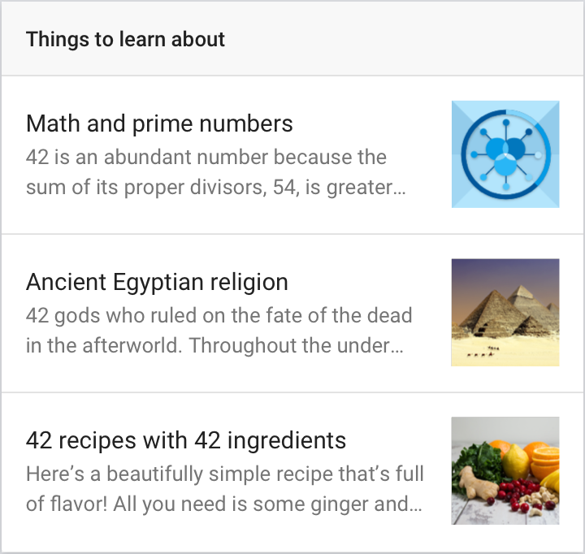{ width="300" } | 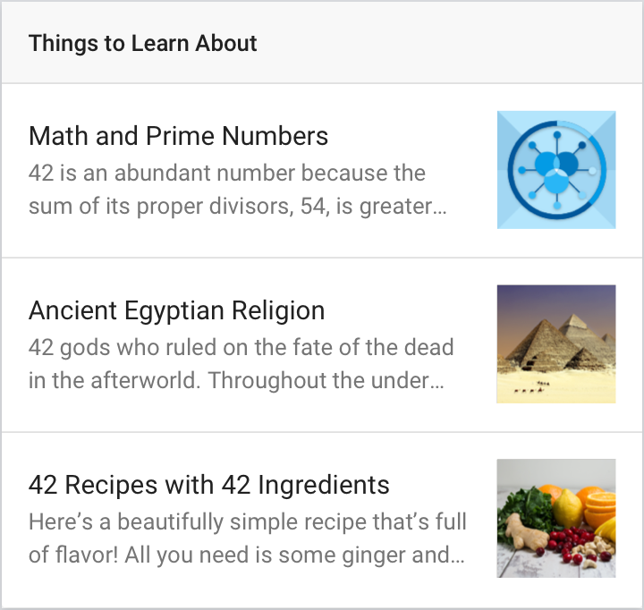{ width="300" }

## Contractions

Use contractions. Messaging without contractions sounds stilted and robotic,
rather than natural and conversational.

Do | Don't
---|---
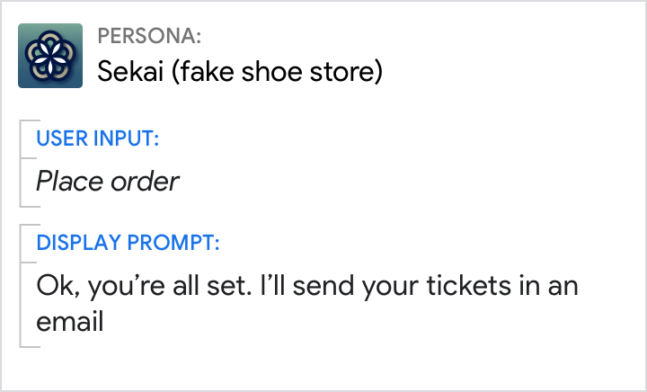{ width="300" } | 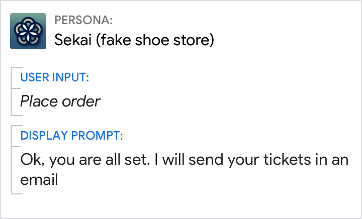{ width="300" }

## Commas

Use the serial comma in a list of 3 or more items. Serial commas add clarity.

Without the serial comma, individual items in your list may be incorrectly heard
or read as groups (e.g., "daisies and sunflowers" sound like they come together,
while "daisies, and sunflowers" are clearly separate).

Do | Don't
---|---
{ width="300" } | 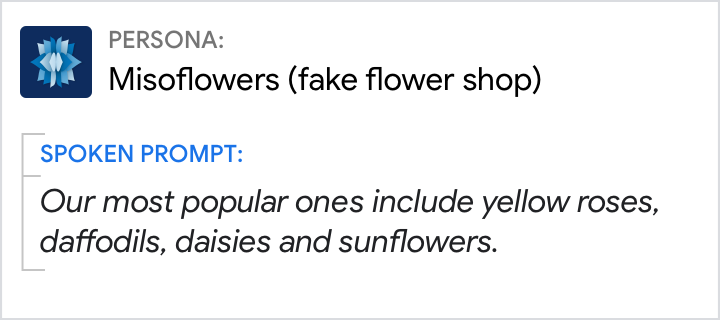{ width="300" }

## Exclamation points

Avoid exclamation points as they can be perceived as shouting.

Do | Don't
---|---
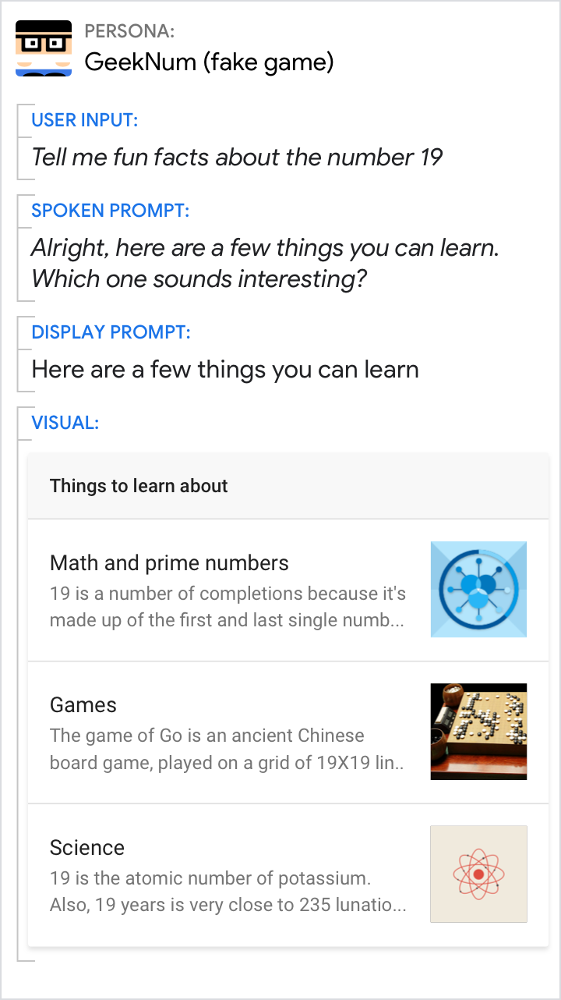{ width="300" } | 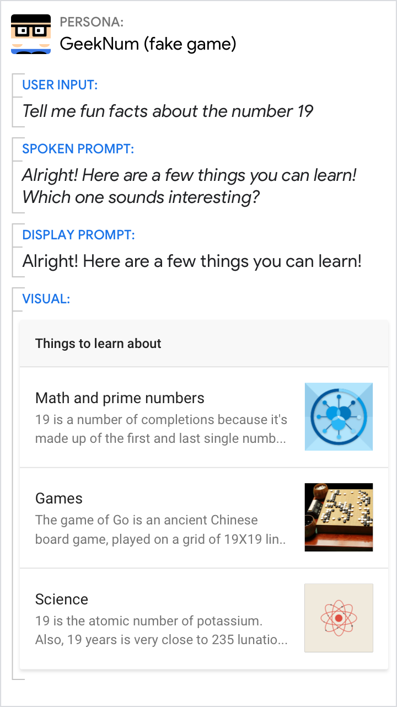{ width="300" }

## Numerals

Use numerals instead of text. Numerals make visual content more glanceable.

Do | Don't
---|---
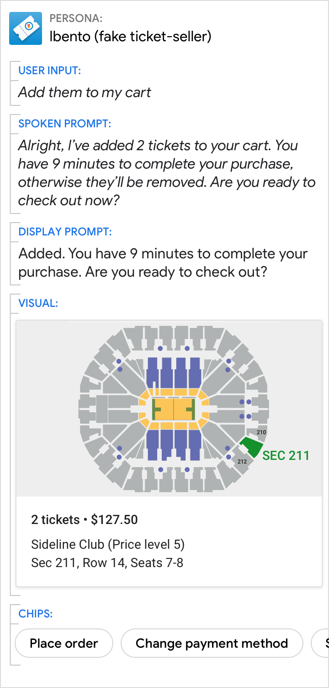{ width="300" } | 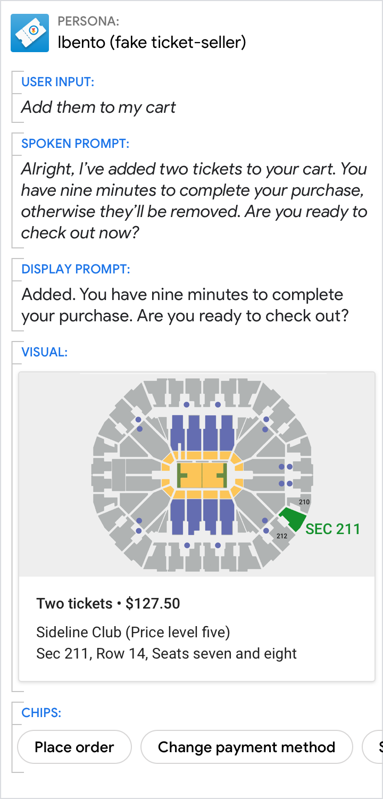{ width="300" }

## Symbols

Use specialized symbols instead of text. Symbols make visual content more
glanceable.

Do | Don't
---|---
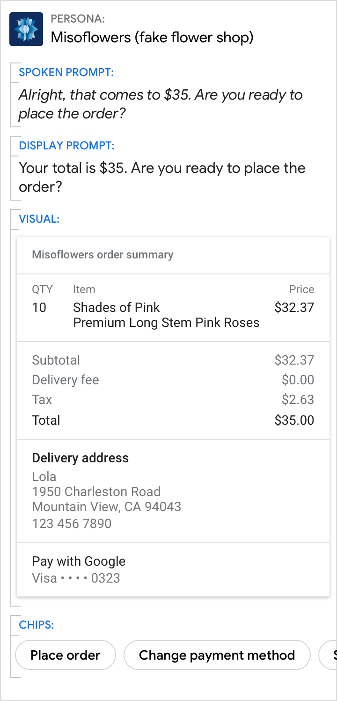{ width="300" } | 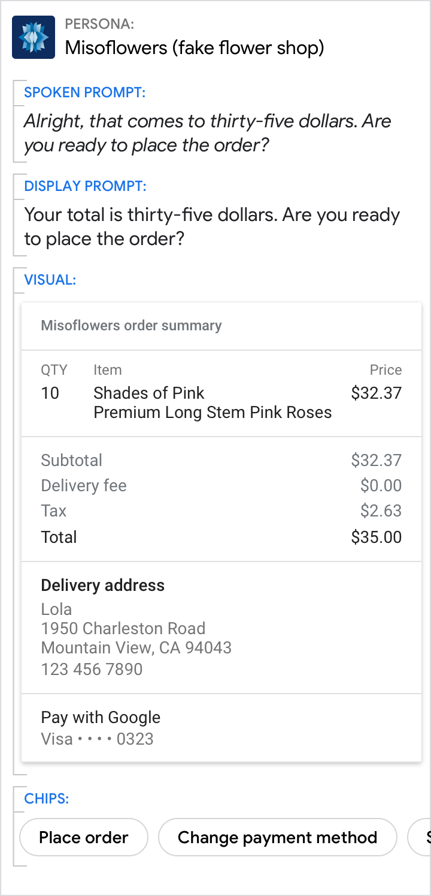{ width="300" }

## Time

Use the format "AM" or "PM".

Do | Don't
---|---
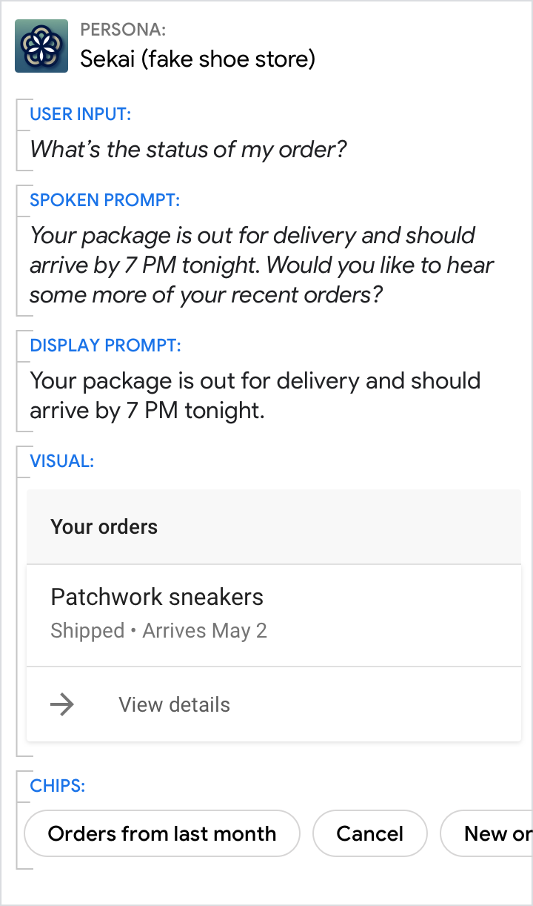{ width="300" } | { width="300" }
