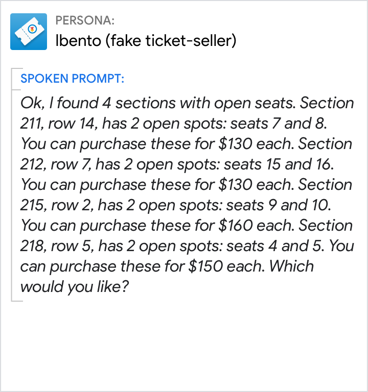

# Language

General style for spoken prompts, display prompts, text in visuals, and chips.

## Focus on the user

Make the user the center of attention, not your persona. User-focused text keeps
the conversation on track. It's more crisp and to-the-point.

Do | Don't
---|---
{ width="300" } | { width="300" }
Focus on the user. | Don't place unnecessary focus on the persona.

## Don't launch into monologues

Be informative, but keep responses concise. Let users take their turn. Don't go
into heavy-handed details unless the user will clearly benefit from it.

Do | Don't
---|---
{ width="300" } | { width="300" }

## Use short, simple words

Plain and simple language has the broadest appeal, making it accessible to
people of all backgrounds.

Do | Don't
---|---
{ width="300" } | { width="300" }
Use everyday language and shorter terms that are accessible to all reading levels. | Avoid technical jargon and sophisticated language.

## Avoid jargon and legalese

Be mindful of the terminology you're using, and watch for specialized
expressions that can elicit misunderstanding and mistrust. Types of content that
are especially prone to jargon include: sign-up flows, error messages, and
descriptions of settings.

Do | Don't
---|---
{ width="300" } | { width="300" }
Use common terminology that is familiar to most people (like "sign up as a member"). | Don’t use ambiguous or jargon-specific terms (like "streamlined identity experience").

## Randomize prompts when appropriate

Craft a variety of responses just like a person would. This makes the
conversation feel more natural and keeps the experience from getting stale.

Do | Don't
---|---
{ width="300" } | { width="300" }
For added variety, mix up similar responses. | Don’t loop the the same response.

## Lead with benefits

If you want the user to do something, give them a reason first. Follow this
formula: "To get what you want, do this thing."

Do | Don't
---|---
{ width="300" } | { width="300" }
Provide clear motivation for any actions you want the user to take. Tell the user why they might want to do something before telling them how to do it. | Starting a sentence with the action (e.g., arrive early) makes it more likely that the user will forget it by the time they learn why they should take action (e.g., to get the best seat).

## Avoid niceties

Niceties make responses feel distant and formal. Ditch them to keep the
conversation friendly and informal.

Do | Don't
---|---
{ width="300" } | { width="300" }
Use a friendly and familiar tone. | Don’t respond in an overly formal manner.

## Use contractions

Spelling out words like "cannot" and "do not" can sound punishing and harsh.

Do | Don't
---|---
{ width="300" } | { width="300" }
Use a friendly and familiar tone. | Without contractions, the persona’s response sounds stilted and robotic.

## Don't provide UI-specific directions

Refer to actions and concepts instead. This keeps the information fresh and
accurate even as the interaction design evolves.

Do | Don't
---|---
{ width="300" } | { width="300" }
Action-specific directions like "pick" "select" or "choose" future-proof the copy. | UI-specific directions like "tap" "scroll" "swipe" or "drag" become outdated over time.
