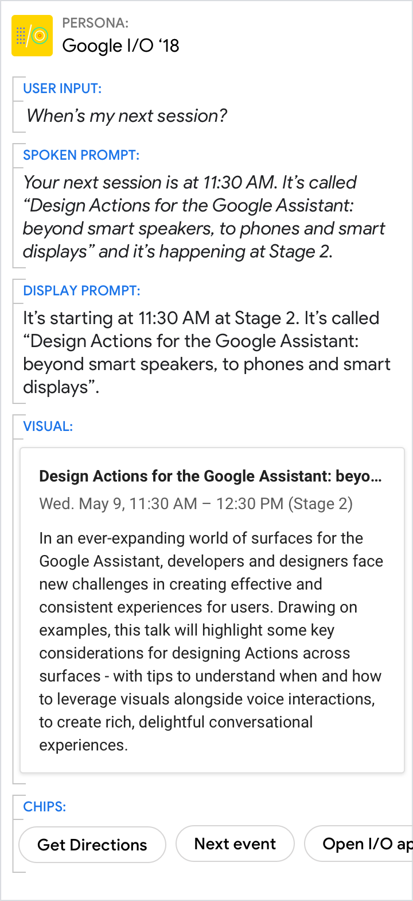

# Basic card

Use basic cards (also called entity cards) to display an image and text to
users.

## Example

Here's an example of what a basic card looks like when all required and optional
fields are completed.

{ width="400" }

!!! note
    For code examples, see the
    [Actions on Google](https://developers.google.com/assistant/df-asdk/responses#basic_card)
    developer documentation.

## Requirements

This visual component currently supports [customization](customization.md).

Field name | Required? | Restrictions / Customizations
---|---|---
**Foreground image** | Yes, required if there's no description | <ul><li>Max 1 foreground image.</li><li>Width and height vary by screen. If the image's aspect ratio is different than the screen, the image is centered with bars along the top or sides.</li><li>Image source is a URL. If an image link is broken, then a placeholder image is used instead.</li><li>Customizable image shape (angled or rounded corners).</li><li>Motion GIFs are allowed.</li><li>Alt text is required for accessibility.</li></ul>
**Card background** | No | <ul><li>Customizable image or color.</li></ul>
**Title** | No | <ul><li>Customizable font family and color.</li><li>Max 1 line recommended.</li><li>The card height collapses if no title is specified.</li></ul>
**Subtitle** | No | <ul><li>Plain text. Fixed font and size.</li><li>Max 1 line recommended.</li><li>The card height collapses if no subtitle is specified.</li></ul>
**Description**  (also called body or formatted text) | Yes, required if there's no image | <ul><li>Plain text by default. Fixed font and size.</li><li>Bolding, italics, and new lines available via a limited subset of markdown.</li><li>Max 10 lines with an image. This is about 500 characters, depending on the screen. Additional characters will be cut off.</li><li>Max 15 lines without an image. This is about 750 characters, depending on the screen. Additional characters will be cut off.</li></ul>
**Action link** | No | <ul><li>1 link can be specified at the end of a text-card.</li><li>Links can lead directly to web pages or generate other visual components to advance the dialog. They can also be deep links to apps.</li><li>Link title is required and cannot be misleading. This is checked during the approval process.</li></ul>

## Guidance

Basic cards are used to describe entities (i.e. topics including people, places,
or things) — they're best used when a 'definition-style' response form factor is
needed. Use them to summarize information or to provide additional, relevant
information to the user.

### Summarize information for the user

Do | Don't
---|---
{ width="300" } | { width="300" }
Summarize things like event details using a basic card. This allows users to scan it quickly for the information they want. | It's less efficient to present information like event details in the prompts.

### Give the short answer in the prompts and the related details in the card

Do | Don't
---|---
{ width="300" } | { width="300" }
Use the spoken and display prompts to give the specific answer to the user's directed question (11:30 AM in this example). Use the visuals for related details. | Avoid redundancy between the spoken prompt, display prompt, and visuals.

### A picture is worth a thousand words

Do | Don't
---|---
{ width="300" } | { width="300" }
Sometimes an image is the best way to convey information to the user. | Though the description is nice, a picture would have been better.
