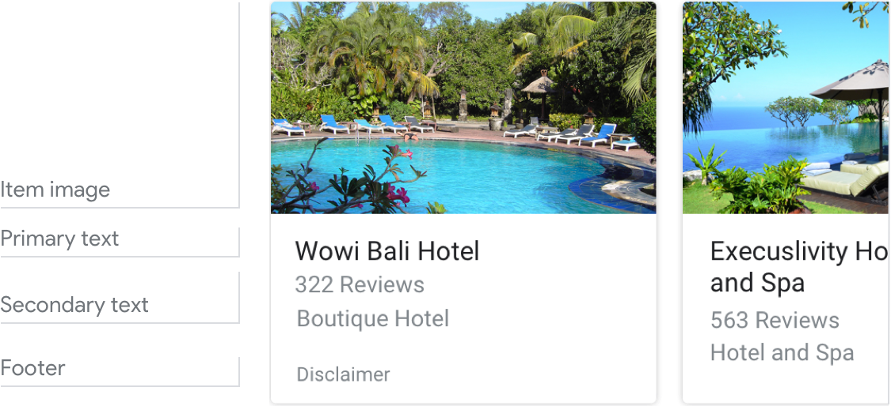
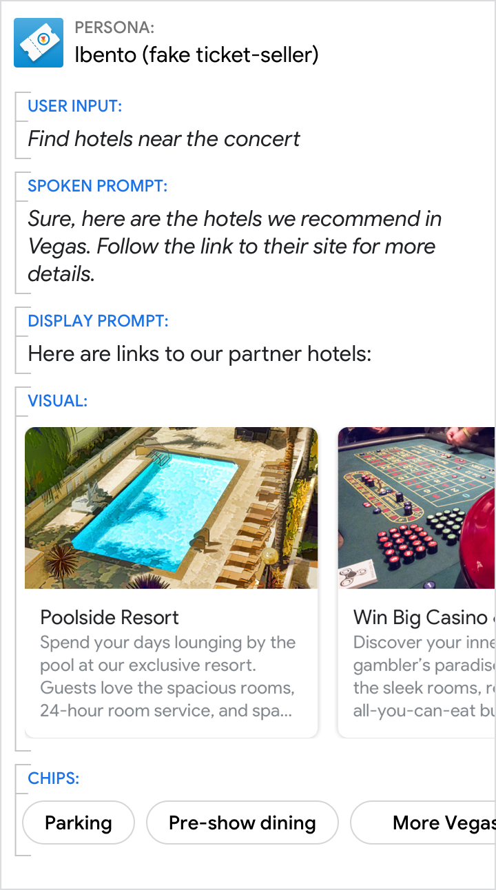

# Browsing carousel

Browsing carousels are optimized for allowing users to select one of many items
when those items are content from the web. When users select an item, it's
opened in a web browser (or an AMP browser if all items are Accelerated Mobile
Pages).

## Example

Here's an example of what a browsing carousel looks like when all required and
optional fields are completed.

{ width="600" }

!!! note
    For code examples, see the
    [Actions on Google](https://developers.google.com/assistant/df-asdk/responses#basic_card)
    developer documentation.

## Requirements

This visual component currently supports [customization](customization.md).

Field name | Required? | Restrictions / Customizations
---|---|---
**URL** | Yes | <ul><li>Every item in the carousel must link to web content. Accelerated Mobile Pages (AMP) content is recommended.</li></ul>
**Item image** | No | <ul><li>Choose from three different image aspect ratios: square, landscape, and portrait.</li><li>Default size depends on screen size and aspect ratio; any extra space will fill with bars.</li><li>Image source is a URL. If an image link is broken, then a placeholder image is used instead.</li><li>Alt text is required for accessibility.</li></ul>
**Primary text** | Yes | <ul><li>Each item's primary text must be unique (to support voice selection).</li><li>Plain text. Fixed font and size.</li><li>Max 2 lines recommended. Depending on surface, additional characters will be cut off./li></ul>
**Secondary text**  Also called body or formatted text. | No | <ul><li>Plain text. Fixed font and size.</li><li>Max 2 lines recommended. Depending on surface, additional characters will be cut off.</li></ul>
**Footer** | No | <ul><li>Fixed font and size.</li><li>Max 1 line. This is about 50 characters, depending on the screen. Additional characters will be truncated with an ellipsis.</li><li>Anchored at the bottom of the card, so items with shorter descriptions may have white space above the footer.</li></ul>

### Number of items

- Minimum: 2
- Maximum: 10

### Consistency

All items in a browsing carousel must include the same fields — e.g., if one
item includes an image, then all items in the carousel must include images.

If all items link to AMP-enabled content, the user will be taken to an AMP
browser with additional functionality. If any items link to non-AMP content,
then all items will direct users to a web browser.

### Interactivity

- Swipe: Slide the carousel to reveal different cards.
- Tap: Tapping an item opens a browser, displaying the linked page.
- The mic doesn't re-open when a browsing carousel is sent to the user.

## Guidance

Browsing carousels are used for browsing and selecting from web content.

Browsing carousels take users out of the multimodal conversational interaction
with your Action, so make this transition clear to users. They'll no longer be
talking/typing to your Action, but will instead be tapping/reading content from
a web browser.

### Be transparent

Make it clear to the user that they need to select an item by interacting with
the screen. Set expectations that this will open a web page and take them out of
the conversation.

The mic doesn't re-open when a browsing carousel is sent to the user, so don't
ask the user a question since you won't hear their reply.

Do | Don't
---|---
{ width="300" } | { width="300" }
Let users know that selecting an item will take them outside of the Action. | Don't ask a question when the mic is closed, and don't mislead users. Here, it isn't clear to the user that if they select a hotel, they'll no longer be talking to Ibento and will be taken to the hotel's webpage.
