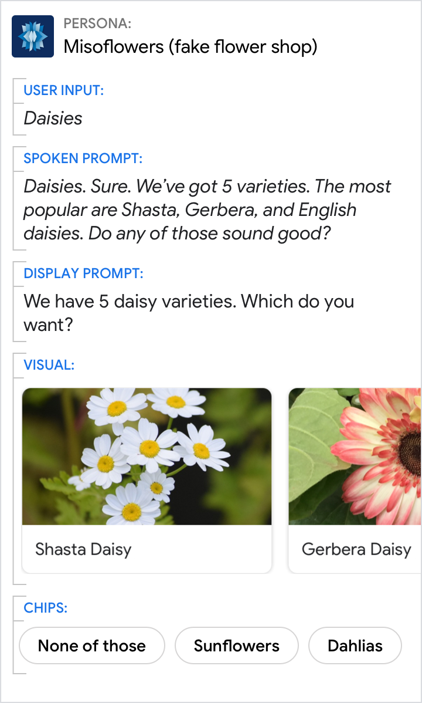
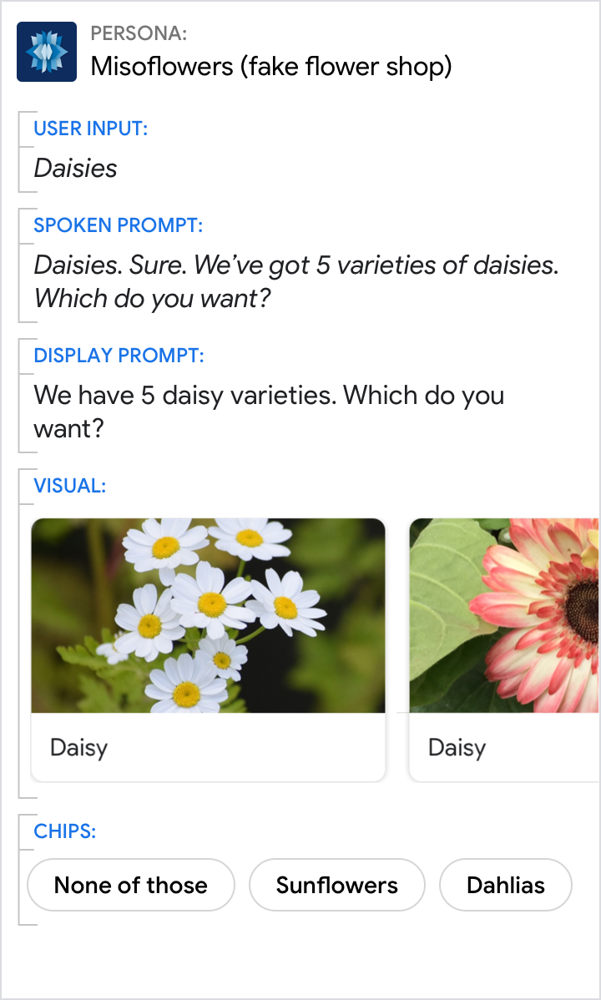
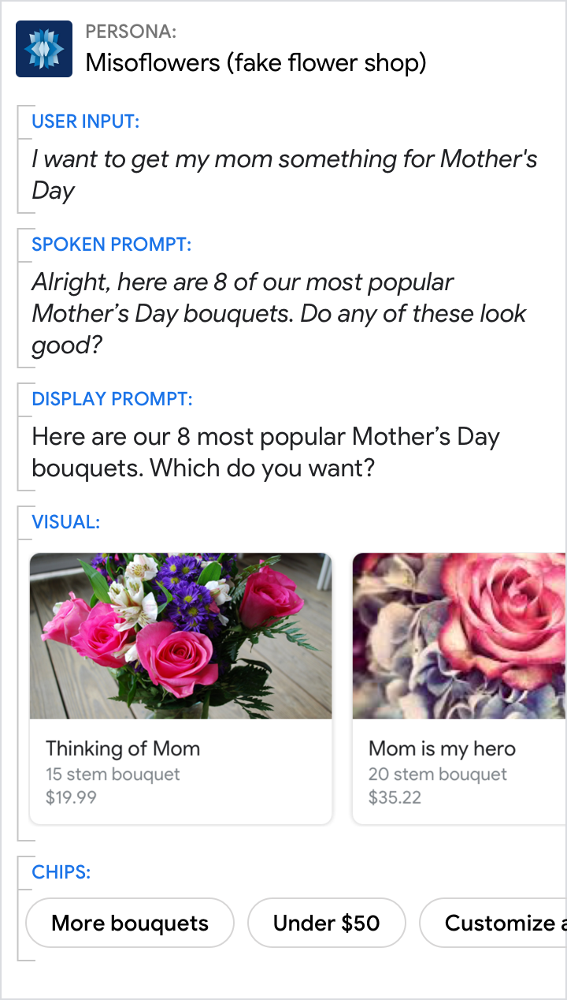
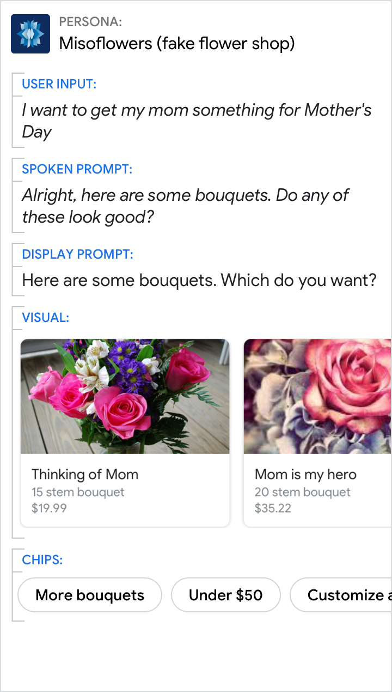
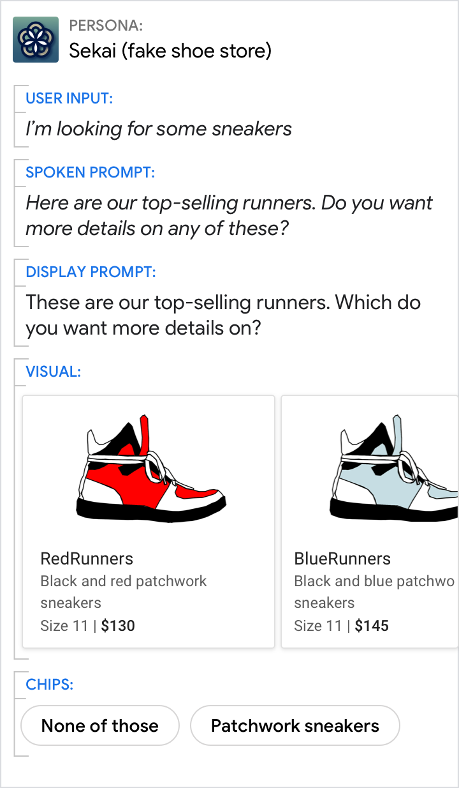
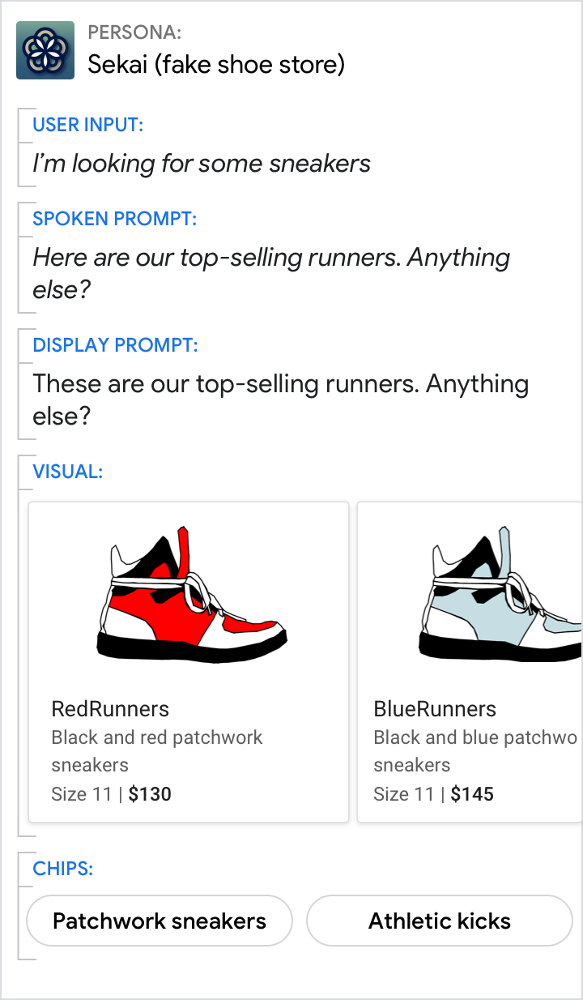

# Carousel

Carousels are optimized for allowing users to select one of many items when
those items are most easily differentiated by an image. Users can select an item
by either saying its title or tapping it.

## Example

Here's an example of what a carousel looks like when all required and optional
fields are completed.

{ width="600" }

!!! note
    For code examples, see the
    [Actions on Google](https://developers.google.com/assistant/df-asdk/responses#basic_card)
    developer documentation.

Note: for code examples, see the Actions on Google developer documentation.

## Requirements

This visual component currently supports [customization](customization.md).

Field name | Required? | Restrictions / Customizations
---|---|---
**Item image** | No | <ul><li>Choose from three different image aspect ratios: square, landscape, and portrait.</li><li>Default size depends on screen size and aspect ratio; any extra space will fill with bars.</li><li>Image source is a URL. If an image link is broken, then a placeholder image is used instead.</li><li>Alt text is required for accessibility.</li><li>Customizable image shape (angled or rounded corners).</li></ul>
**Card background** | No | <ul><li>Customizable image or color.</li></ul>
**Primary text** | Yes | <ul><li>Each item's primary text must be unique (to support voice selection).</li><li>Plain text by default. Fixed font and size.</li><li>Max 2 lines recommended. Depending on surface, additional characters will be cut off.</li></ul>
**Secondary text**  Also called body or formatted text. | No | <ul><li>Plain text. Fixed font and size.</li><li>Max 2 lines recommended. Depending on surface, additional characters will be cut off.</li></ul>

### Number of items

- Minimum: 2
- Maximum: 10

### Consistency

All items in a carousel must include the same fields — e.g., if one item
includes an image, then all items in the carousel must include images.

### Interactivity

- Swipe: Slide the carousel to reveal different cards.
- Tap: When users tap an item, the item's title is accepted as the user input,
  starting the next turn in the dialog.
- Voice/Keyboard: Replying with the card title is the same as selecting that
  item.

## Guidance

Carousels are mostly used for browsing and selecting among images.

Use carousels to help the user select from content that:

- can be most meaningfully browsed via scanning imagery (e.g., movie posters, album art, recipes, clothing)
- can be meaningfully blocked into rectangular chunks (e.g., tweets, news stories)

### Use titles that are unique and conversation friendly

Users will be able to say the item's title to select it, so make sure they're
easy to say, and uniquely identify each item.

Do | Don't
---|---
{ width="300" } | { width="300" }
Each item title should be as short as possible while staying distinct from the other items. | Never use the same title for multiple items. And avoid titles that are very similar.

### Introduce the carousel with a short overview

Consider including information about the following:

- How many items are in the carousel (e.g., "There are 7 items on your wish list.")
- Why these items were chosen (e.g., "Here are our most popular bouquets.")
- Any selection criteria on for the items (e.g., "concerts this weekend")
- What order the items are in (e.g., "starting with the most recent order" if reverse chronological)

Do | Don't
---|---
{ width="300" } | { width="300" }
Let the user know why you've suggested these specific items. | Don't leave the user wondering why your Action is showing these specific items.

### Encourage the user to choose one of the items from the carousel, but don't force them to pick one

Ask a [question](../conversational-components/questions.md) to let the user know
to take their [turn](../learn-about-conversation.md). Include chips like "none
of these" to let them indicate they don't want any of the options.

Do | Don't
---|---
{ width="300" } | { width="300" }
Make it clear to the user that they need to select something from the carousel. Here, the chips allow them to choose "none of these" or to refine the results (for example, by only showing "patchwork sneakers"). | Don't simply show the user a carousel. Ask them a question in a way that makes it clear what happens if they choose an item.
