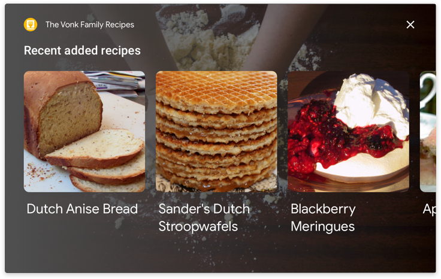

# Customization

Customizing your Action's theme allows you to better reflect your brand and
provide visual context to your user's experience.

## Overview

When theme customization, or theming, is used properly, it can help
differentiate your Action. The choices you make when customizing the visual
components of your Action (like [basic cards](basic-card.md),
[carousels](carousel.md), [lists](list.md), etc.) will help you effectively
convey your brand.

The Assistant's design is constantly evolving to help users wherever they are,
on whichever device they choose. So we've designed the guidelines in this
section to evolve along with it. Our goal is to enable you to express your
company's identity in a way that 1) feels natural in the overall system
interaction, 2) focuses on the biggest opportunities for brand expression, and
3) scales across all primary devices (for example, phones and smart displays)
without additional work.

The default Assistant surface theme is applied to your Action visual component
if you don't specify theming details. You can go to the Actions Console to
customize your Action theme.

## Color

Color is a strong brand identifier. You can customize primary and background
colors to represent your brand. Primary color is used to highlight important
components on the visual surface, like the card title and any action buttons.
This color should be the one most often associated with your brand.

!!! note
    Secondary text color is not open for customization at this point.

### Primary and background colors can work together to enhance the expression of your brand

<figure markdown style="float: left;">
  { width="400" }
  <figcaption>
    Choose a primary color first.
  </figcaption>
</figure>

<figure markdown style="float: right;">
  { width="400" }
  <figcaption>
    After you choose a primary color, pick a background color that goes with
    both the primary color and the secondary text color.
  </figcaption>
</figure>

### Choosing your primary and background colors from the same color family can help make your Action a cohesive experience

<figure markdown>
  { width="400" }
  <figcaption>
    The background color can be a lighter version of the primary color.
  </figcaption>
</figure>

### Choosing a complementary color for your background can make your primary color stand out even more

<figure markdown>
  { width="400" }
  <figcaption>
    The background color can be a complementary color.
  </figcaption>
</figure>

To ensure the colors you choose are accessible, we do a color contrast check in
the developer console to ensure sufficient color contrast ratios between the
primary and background colors and between the secondary and background colors.
For more guidance on choosing and coordinating primary and background colors,
visit the [Material Design site](https://m3.material.io/styles/color/roles).

## Background image

One of the most powerful ways to lend visual richness and dimension to a card is
to use an image as the background instead of a solid color. Consider the
following when choosing an image as the background:

### Choose a background image that provides context without distracting from the conversation

Note that to ensure foreground legibility, we apply a dark protection mask on
the background image. Text will automatically turn to white.

<figure markdown>
  { width="400" }
  <figcaption>
    This basic card uses a background image. A background image will replace any
    background color, so choose the option that best represents your brand.
  </figcaption>
</figure>

### If your Action has multiple dialog turns, choose a background image that works with different dialog turns

<figure markdown>
  { width="400" }
  <figcaption>
    The image needs to be neutral enough to maintain your desired look and feel
    through multiple dialog turns. Here, the same background image applies to
    both the basic card above and this carousel card.
  </figcaption>
</figure>

## Typography

Typography can express your brand while guiding the user's attention to the most
important information. For the biggest impact, you're able to customize the
largest text, like the title, on each card in your Action. In this location, an
expressive typeface such as a serif font, a script-style font, or a
heavier-weight font can attract attention and provide contrast to the secondary
text. For general typography guidance, please refer to the Material Design
Foundation.

!!! note
    Secondary text is applied based on different Assistant surface defaults and
    is not open for customization at this point.

### Choose a font that works well with secondary text

Do | Don't
---|---
{ width="300" } | { width="300" }
With its bold typeface and bright color, this font stands out against the background and attracts attention to the card title. | Without the heavier weight, this font is hard to read and fails to draw the eye to the title before the body text.

## Shape

### Image shape

In line with the components of Material Foundation, the shape of your images
offers another dimension for expressiveness. Right now, you can choose between
angled and curved shapes for images in visual components. Pick an image shape
that's suitable to your overall brand style.

### Use angled corners if your brand incorporates sharp edges and clean lines

<figure markdown>
  { width="400" }
  <figcaption>
    Your logo is a good place to look for guidance on which shape to choose. In
    this example, the logo is sharp and angular, so angled corners are in line
    with the brand.
  </figcaption>
</figure>

### Use curved corners if they fit your brand's overall style

<figure markdown>
  { width="400" }
  <figcaption>
    Other components can also guide you in your decision. Here, the action
    button's rounded edges and the logo both match the curved corners of the
    image.
  </figcaption>
</figure>

For more guidance on choosing image shapes, visit the
[Material Design site](https://m3.material.io/styles/shape/overview).
