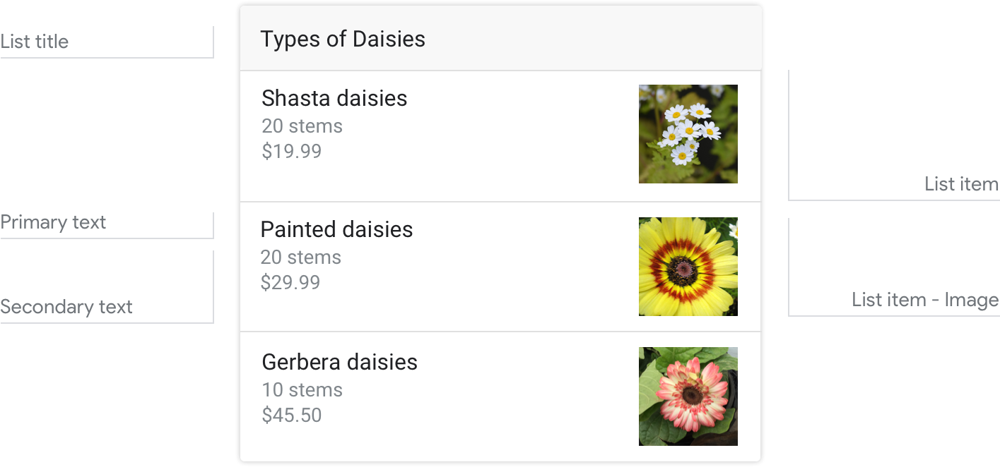
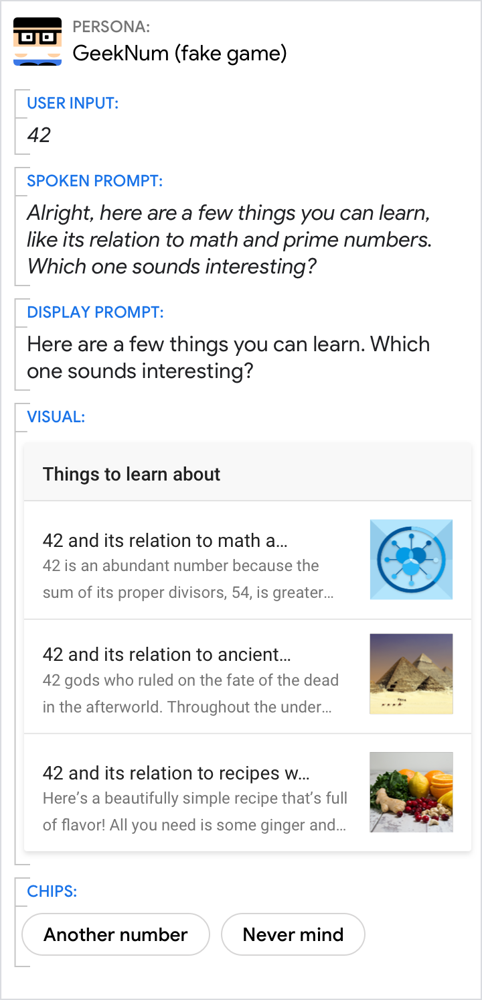
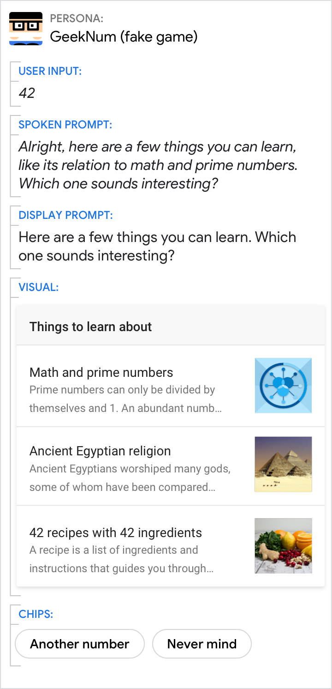
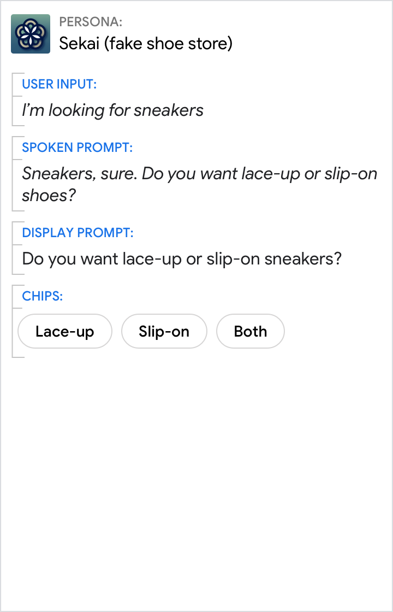
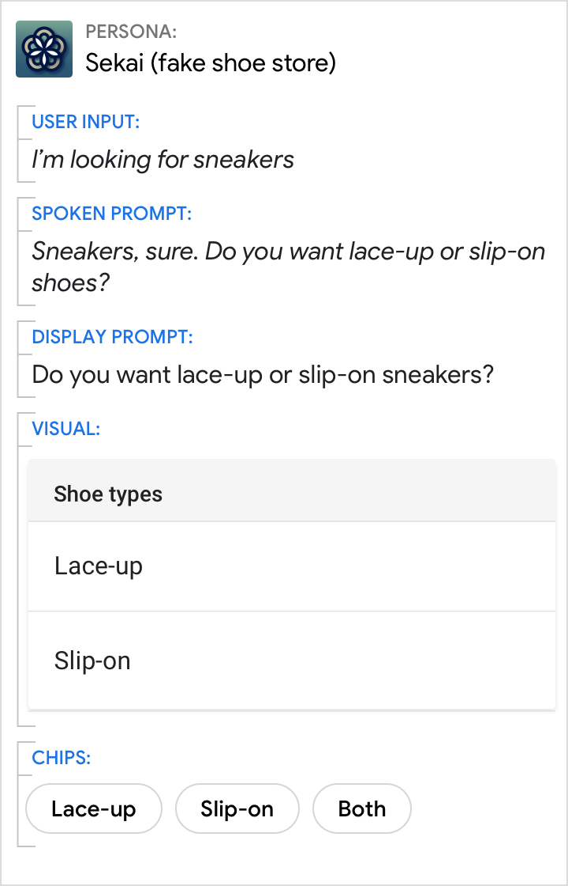
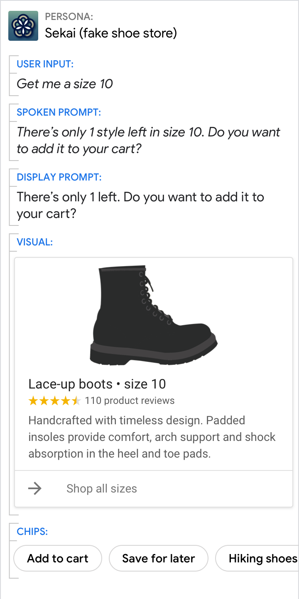
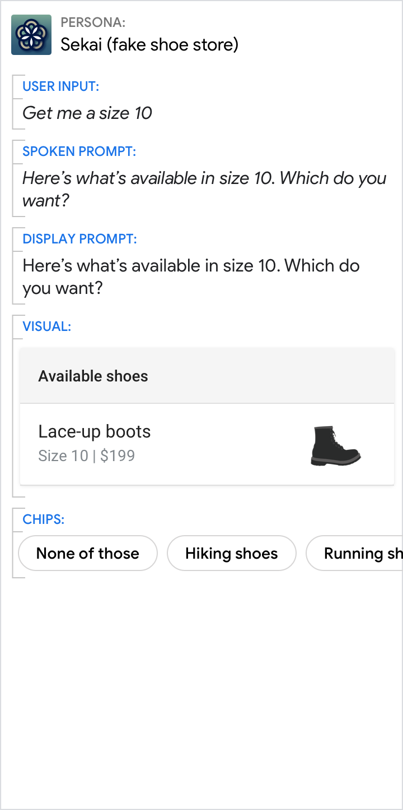

# List

Lists are optimized for allowing users to select one of many items when those
items are most easily differentiated by their title. Users can select an item by
either saying its title or tapping it.

## Example

Here's an example of what a list looks like when all required and optional
fields are completed.

{ width="600" }

!!! note
    For code examples, see the
    [Actions on Google](https://developers.google.com/assistant/df-asdk/responses#basic_card)
    developer documentation.

## Requirements

This visual component currently supports [customization](customization.md).

Field name | Required? | Restrictions / Customizations
---|---|---
**List title** | No | <ul><li>Customizable font family and color.</li><li>Max 1 line recommended.</li><li>The card height collapses if no title is specified.</li></ul>
**Primary text** | Yes | <ul><li>Each item's title must be unique (to support voice selection).</li><li>Plain text. Fixed font and size.</li><li>Max 1 line. Additional characters will be truncated with an ellipsis.</li></ul>
**Secondary text**  Also called body or formatted text. | No | <ul><li>Plain text. Fixed font and size.</li><li>Max 2 lines. Additional characters will be truncated with an ellipsis.</li></ul>
**Item image** | No | <ul><li>Images appear along the right.</li><li>Customizable image shape (angled or rounded corners).</li></ul>

### Number of items

- Minimum: 2
- Maximum: 10

### Consistency

All items in a carousel must include the same fields — e.g., if one item
includes an image, then all items in the carousel must include images.

### Interactivity

- Swipe: Slide the carousel to reveal different cards.
- Tap: When users tap an item, the item's title is accepted as the user input, starting the next turn in the dialog.
- Voice/Keyboard: Replying with the card title is the same as selecting that item.

## Guidance

Lists are mostly used for browsing and selecting among titles. Though you can
have as few as 2 and as many as 30 list items, we recommend that you use between
2 and 10.

Use lists to help the user select from content that:

- can be most meaningfully browsed via scanning short titles or descriptions (e.g., song titles, contact names, event names, session topics)
- the user may have to scan and compare while browsing (e.g. stock prices)

### Use titles that are unique and conversation friendly

Users will be able to say the item's title to select it, so make sure they're
easy to say, and uniquely identify each item.

Do | Don't
---|---
{ width="300" } | { width="300" }
Each item title should be as short as possible while staying distinct from the other items. | Don't repeat words or phrases across titles, e.g., "42 and its relation to...". They don't help uniquely identify the item, and the title will be too long to fit on the screen.

### Keep descriptions concise by only including helpful, relevant information

Space is limited, so front-load the information by giving users the most
important information first.

Do | Don't
---|---
{ width="300" } | { width="300" }
List item descriptions should only contain information that differentiates them from each other and is relevant within the context of the user's request of your Action. | Avoid presenting irrelevant information in your list item descriptions; this takes valuable space away from information the user actually needs to make a choice.

### If your list only has 2 items, consider whether a simple either/or question is sufficient to help the user make their decision

It takes users time to visually scan everything on the screen, so make sure the
content adds value.

Do | Don't
---|---
{ width="300" } | { width="300" }
If you're only presenting two options, simply asking the question may be the best way to help the user make a decision. | In this case, visuals aren't necessary to present the important information. Chips will help the user respond if they need suggestions.

### Avoid lists of 1 item

If there's only 1 option, then there's no need to present a list for the user to
choose from. Actions on Google only allows lists of 2 items or more.

Do | Don't
---|---
{ width="300" } | { width="300" }
Instead of a 1-item list, present the user with more information on the 1 option that's available to them. | Don't make the user choose when there's only 1 option.
