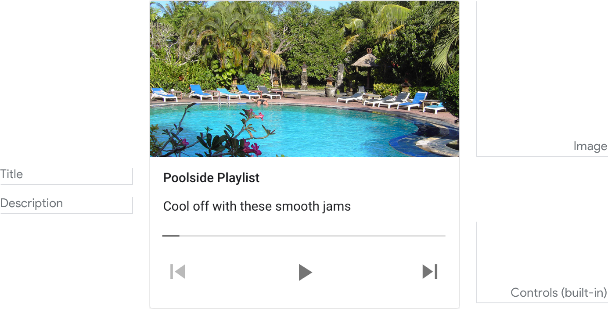
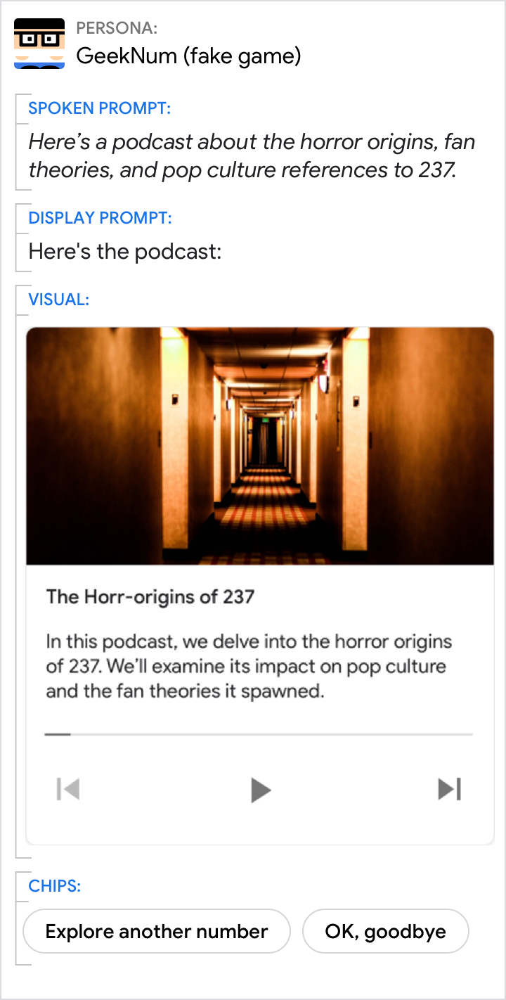
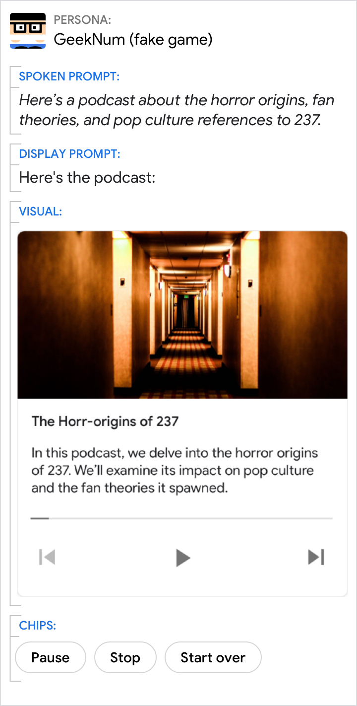

# Media response

A media response is used to play and control the playback of audio content like
music, news, or podcasts.

## Example

Here’s an example of what a media response looks like.

{ width="600" }

!!! note
    For code examples, see the
    [Actions on Google](https://developers.google.com/assistant/df-asdk/responses#basic_card)
    developer documentation.

## Requirements

This visual component currently supports [customization](customization.md).

Field name | Required? | Restrictions / Customizations
---|---|---
**Image** | No | There are 2 image options: 1) a small square thumbnail on the right, or 2) a large image on top (which spans the full width of the card).  Small<ul><li>Image container is 36 x 36 dp. Larger images are resized to fit in a 36 x 36 bounding box.</li><li>Image source is a URL. If the image link is broken, then a placeholder image is used instead.</li><li>Alt text is required for accessibility.</li></ul>Large<ul><li>Image container is 192 dp tall. Width varies by screen. If the image's aspect ratio is different than the screen, the image is centered with bars along the top or sides.</li><li>Image source is a URL. If the image link is broken, then a placeholder image is used instead.</li><li>Motion GIFs are allowed.</li><li>Alt text is required for accessibility.</li></ul>
**Title** | Yes | <ul><li>Plain text. Fixed font and size.</li><li>Max 2 lines. Additional characters will be truncated with an ellipses.</li></ul>
**Description**  Also called body or formatted text or sub-text. | No | <ul><li>Plain text. Fixed font and size.</li><li>Max 2 lines. Additional characters will be truncated with an ellipses.</li></ul>
**Media file** | Yes | <ul><li>Audio for playback must be in a correctly formatted .mp3 file. Live streaming is not supported. For more detailed requirements, see the [developer documentation](https://developers.google.com/assistant/df-asdk/responses#media_responses).</li></ul>

### Interactivity

Tap card:

- Play/Pause button
- Restart button
- Forward 30 seconds button
- Back 10 seconds button

Voice/Keyboard:

- Play
- Pause
- Stop
- Start over

Status

- Elapsed time is shown on the left side, format HH:MM:SS with the hour field
  dropped any time it is 0
- Total time is shown on the right side, format HH:MM:SS
- Progress bar

## Guidance

The media response is used to give visibility to an audio track. For example,
the track's name, length, optional associated image, and Play/Pause control.
This card is used to present a single piece of audio to the user.

Best practices:

- For song playlists, the Title should be song name and Description is the
  artist’s name.
- Branding images should use the small image, not the large image.

Introduce the media briefly, and let the user pivot to something else.

Do | Don't
---|---
{ width="300" } | { width="300" }
When playing audio, always include chips for the user to pivot to some other action or progress the flow. | Don’t include media controls as chips.
