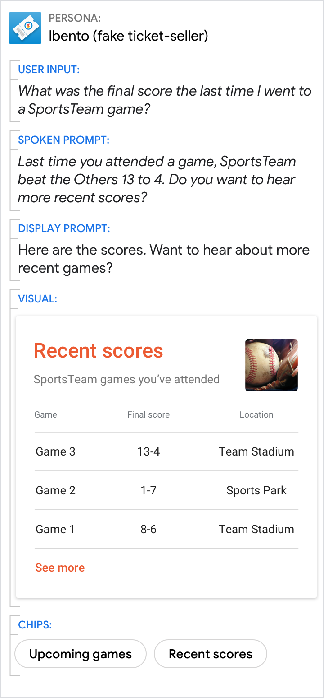

# Table

Use a table to display static data to users in an easily scannable format.

Note that users can only view (not interact with) the information in a table. If
you want users to interact, consider using a [list](list.md) instead.

## Example

Here's an example of what a table looks like.

{ width="600" }

!!! note
    For code examples, see the
    [Actions on Google](https://developers.google.com/assistant/df-asdk/responses#basic_card)
    developer documentation.

## Requirements

This visual component currently supports [customization](customization.md).

Field name | Required? | Restrictions / Customizations
---|---|---
**Table title** | No | <ul><li>Customizable font family and color.</li><li>Max 1 line (additional characters will be cut off).</li><li>The card height collapses if no title is specified.</li></ul>
**Subtitle** | No | <ul><li>Plain text. Fixed font, color, and size.</li><li>Max 1 line (additional characters will be cut off).</li><li>Will not display without title.</li><li>The card height collapses if no subtitle is specified.</li></ul>
**Foreground image** | No | <ul><li>Customizable image shape (angled or rounded corners).</li></ul>
**Card background** | No | <ul><li>Customizable image or color.</li></ul>
**Column header** | Yes | <ul><li>Plain text. Fixed font, color, and size.</li><li>Customizable text alignment for header and content (left, right, or center).</li><li>Customizable column prioritization (first 3 guaranteed to display).</li><li>No character limit, but smaller surfaces may truncate rather than wrapping.</li></ul>
**Row content** | Yes | <ul><li>Plain text. Fixed font, color, and size.</li><li>Customizable row prioritization (first 3 guaranteed to display).</li><li>Max 20 characters (additional characters will be cut off).</li></ul>
**Action link** | No | <ul><li>1 link allowed.</li><li>Customizable link color.</li></ul>

### Interactivity

- The table card has no interaction without an action link—it only presents information.
- With an action link added, users can tap it to view web content or advance the dialog.

## Guidance

Tables are optimized to display tabular data (for example, sports standings,
election results, or flights). Aim for three to five columns and rows; depending
on screen size, at least three will be displayed. So prioritize your most
relevant information in the first three columns and rows.

Use tables to convey static information that doesn't need much explanation. This
information should be clean and easily glanceable, avoiding the appearance of a
busy spreadsheet. So be sure that your data is labeled clearly and concisely.
The goal should be to provide information, not to help users make a selection
(for that, use a [list](list.md)).

### Data should be brief, essential, and easy to understand

Striking the right balance between detail and concision is key. Offer enough
detail for your user to distinguish between table items, but not so much as to
be overwhelming.

Do | Don't
---|---
{ width="300" } | { width="300" }
To improve scannability, only include useful information in your table. If you have additional columns with nice-to-know details, prioritize your most important information so that it will display on all surfaces. | The lack of detail in this table makes it hard to tell which team won each game, and non-essential information (the game number) is placed at the front, hiding helpful details like the Win/Loss column and the opposing teams' names.

### Keep the core of the message in the prompts

Even when the visuals provide the best answer, make sure the prompts still
directly address the user's request and move the conversation forward.

Do | Don't
---|---
{ width="300" } | { width="300" }
The prompts should both 1) answer the user's question and 2) propel the conversation with a question. | Don't assume that the user has immediate access to the screen; the prompts should always provide the direct answer to the user's question. Also, without a question, the prompts here fail to push the interaction forward.
