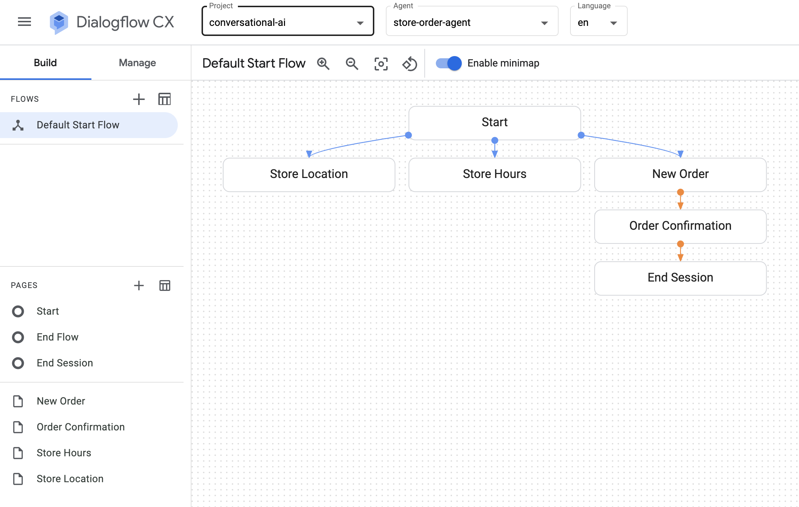
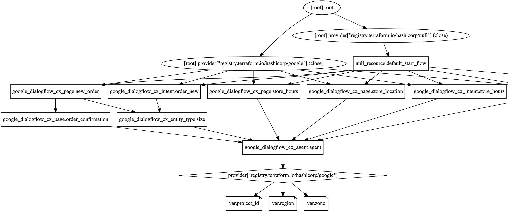

<!--
Copyright 2023 Google LLC

Licensed under the Apache License, Version 2.0 (the "License");
you may not use this file except in compliance with the License.
You may obtain a copy of the License at

     http://www.apache.org/licenses/LICENSE-2.0

Unless required by applicable law or agreed to in writing, software
distributed under the License is distributed on an "AS IS" BASIS,
WITHOUT WARRANTIES OR CONDITIONS OF ANY KIND, either express or implied.
See the License for the specific language governing permissions and
limitations under the License.
-->

# Shirt Order Agent - Using Terraform with Dialogflow CX

Use Terraform to provision a Dialogflow CX agent in Google Cloud based on
[Create a Dialogflow CX
agent](https://cloud.google.com/dialogflow/cx/docs/quick/build-agent)
quickstart.

## Prerequisites

* Register for a Google Cloud account (<https://cloud.google.com/docs/get-started>)
* Enable the Dialogflow API (<https://cloud.google.com/dialogflow/cx/docs/quick/setup>)
* Install and initialize the Google Cloud `gcloud` command-line tool (<https://cloud.google.com/sdk/docs/install>)
* Install Terraform (<https://developer.hashicorp.com/terraform/downloads>)

## Usage

1. Clone this repository and `cd` into this directory at `dialogflow-cx/shirt-order-agent`
1. Edit the values in `variables.tf`
1. Run `terraform init`
1. Run `terraform apply`

