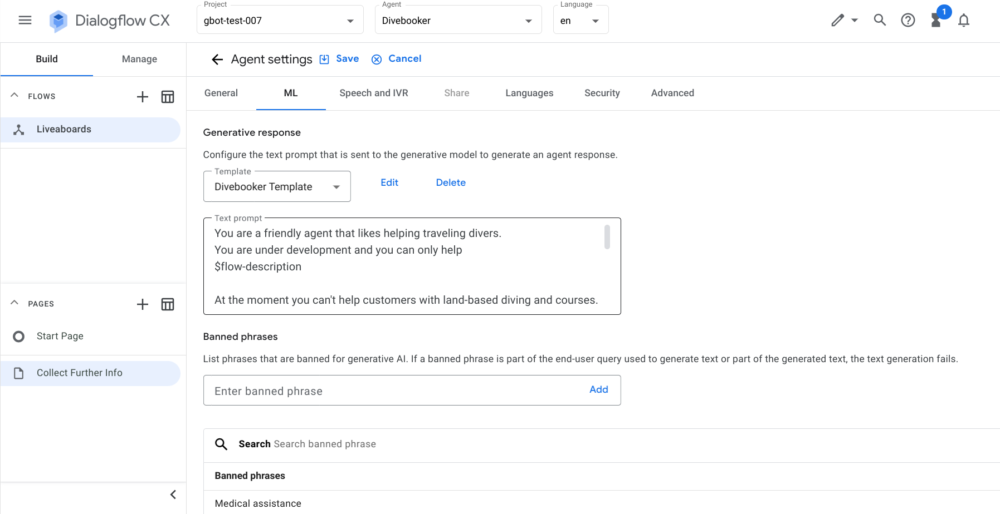
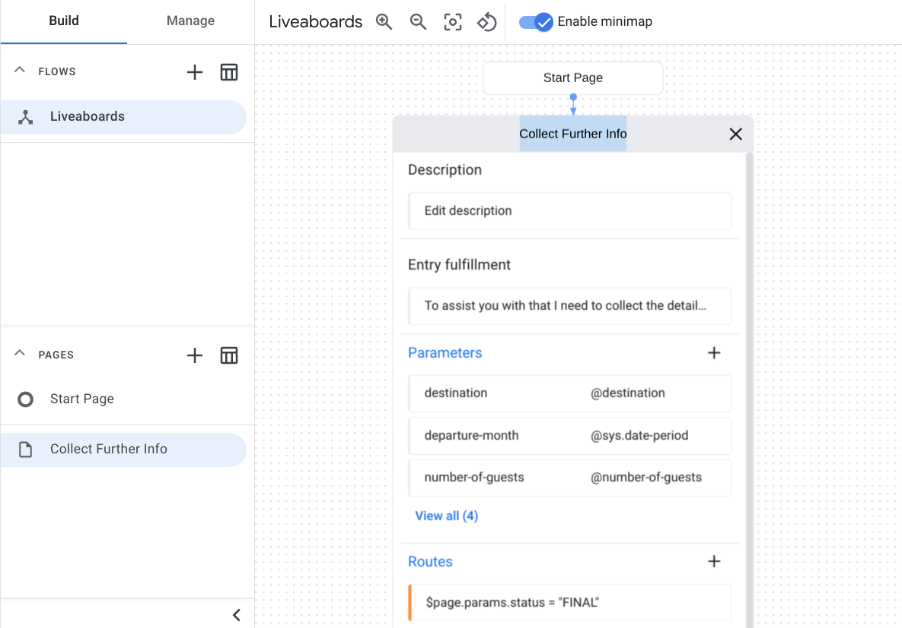

<!--
Copyright 2023 Google LLC

Licensed under the Apache License, Version 2.0 (the "License");
you may not use this file except in compliance with the License.
You may obtain a copy of the License at

     http://www.apache.org/licenses/LICENSE-2.0

Unless required by applicable law or agreed to in writing, software
distributed under the License is distributed on an "AS IS" BASIS,
WITHOUT WARRANTIES OR CONDITIONS OF ANY KIND, either express or implied.
See the License for the specific language governing permissions and
limitations under the License.
-->

# Divebooker Agent - Increase intent coverage and handle errors gracefully \
  with generative response

In this codelab you'll build, deploy and configure a simple virtual agent in
Dialogflow CX to assist traveling scuba divers with group bookings and private
charters. The virtual agent will use Generative AI and Google's latest
generative large language models (LLMs) to generate virtual agent responses.

## Prerequisites

* Register for a Google Cloud account (<https://cloud.google.com/docs/get-started>)
* Enable the Dialogflow API (<https://cloud.google.com/dialogflow/cx/docs/quick/setup>)

## Usage

1. Clone this repository and `cd` into this directory at `dialogflow-cx/divebooker-agent`

