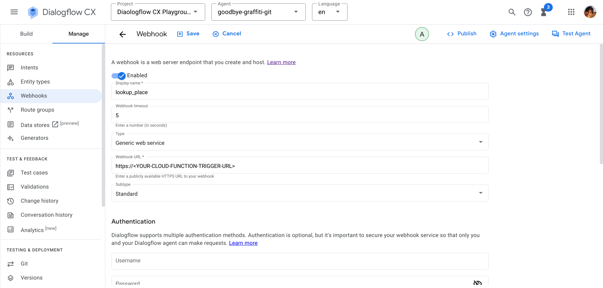

# goodbye-graffiti-agent

## Overview

“Goodbye Graffiti” is a demo built on Dialogflow CX inspired by a number of online forms created by city councils and local governments to report graffiti vandalism. 

The demo features:
1. [Generative Fallback](https://cloud.google.com/dialogflow/cx/docs/concept/generative-fallback) to generate virtual agent responses when end-user input does not match an intent or parameter for form filling. 
1. [Generators](https://cloud.google.com/dialogflow/cx/docs/concept/generators) to greet the user and provide a summary of the report. 
1. [Google Maps Geocoding API](https://developers.google.com/maps/documentation/geocoding/requests-geocoding) to lookup latitude/longitude and formatted address of the graffiti location 
1. The [address collection prebuilt component](https://cloud.google.com/dialogflow/cx/docs/concept/prebuilt-component/address-collection) to assist the user with a step-by-step address collection process in case the request to the Geocode APIs returns zero results or the returned address is incorrect.  
1. [Maps Static API](https://developers.google.com/maps/documentation/maps-static/overview) to visualize the location of the graffiti on the map
1. [Dialogflow CX Phone Gateway and Call Companion](https://cloud.google.com/dialogflow/cx/docs/concept/integration/phone-gateway) to provide a telephone interface to the agent and a a multi-modal (voice + visual) customer experience
1. [Cloud Functions](https://cloud.google.com/functions/docs/configuring) to run the webhook service required to integrate the agent with Google Maps APIs. 

## Setup your Google Cloud Project
1. Setup your [Google Cloud Project](https://cloud.google.com/dialogflow/cx/docs/quick/setup) 
1. To use Google Maps Platform you must enable the [Geocoding API](https://console.cloud.google.com/apis/library/geocoding-backend.googleapis.com?utm_source=Docs_EnableAPIs&utm_content=Docs_geocoding-backend&_gl=1*1syfwbs*_ga*MTMxNzQwMTEyNS4xNjkyMDE1OTQ1*_ga_NRWSTWS78N*MTY5MjAxNTk0Ni4xLjEuMTY5MjAxNjk4Ni4wLjAuMA..) and [Maps Static API](https://console.cloud.google.com/apis/library/static-maps-backend.googleapis.com?utm_source=Docs_EnableAPIs&utm_content=Docs_static-maps-backend&_gl=1*13fpvaq*_ga*MTMxNzQwMTEyNS4xNjkyMDE1OTQ1*_ga_NRWSTWS78N*MTY5MjAxNTk0Ni4xLjEuMTY5MjAxNjk4Ni4wLjAuMA..). 
1. You must have at least one API key associated with your project. Go to the Google Maps Platform > Credentials [page](https://console.cloud.google.com/project/_/google/maps-apis/credentials?utm_source=Docs_CreateAPIKey&utm_content=Docs_static-maps-backend&_gl=1*8gesr0*_ga*MTMxNzQwMTEyNS4xNjkyMDE1OTQ1*_ga_NRWSTWS78N*MTY5MjAxNTk0Ni4xLjEuMTY5MjAxNzI2MS4wLjAuMA..) and create an [API key](https://developers.google.com/maps/documentation/maps-static/get-api-key#creating-api-keys).  
1. Open file `index.js` located under `maps-function` folder. You must include your API key with both the Geocoding API and Maps Static API requests. Replace `YOUR_API_KEY` with your API key. 
1. Enable the Cloud Functions, Cloud Build, Artifact Registry, Cloud Run, Dialogflow API and Cloud Logging APIs
1. Install and initialize the [gcloud CLI](https://cloud.google.com/sdk/docs/install).

## Deploy the Cloud Function
To deploy the function, run the `gcloud functions deploy` command in the `maps-function` directory:
```
gcloud functions deploy lookupPlace --runtime=nodejs20 --region=REGION --source=. --entry-point=lookupPlace --trigger-http --allow-unauthenticated
```

Replace `REGION` with the name of the Google Cloud region where you want to deploy your function (for example, `us-west1`).
The optional `--allow-unauthenticated` flag lets you reach your function without authentication.

After the function deploys, note the url property from the output of the gcloud functions deploy command, or retrieve it with the command `gcloud functions describe lookupPlace --region REGION`. Replace REGION with the name of the Google Cloud region where you deployed your function. You will need the url when configuring the webhook in Dialogflow CX. 

## Create the agent and configure the webhook
1. In your browser, navigate to the [Dialogflow CX console](https://dialogflow.cloud.google.com/cx/projects)
1. Create a new agent (select the option **Build your own agent**). You must create the agent in the **global** region as this is the only region where the Phone Gateway integration is currently supported. You cannot change region once the agent is deployed. 
1. [Restore](https://cloud.google.com/dialogflow/cx/docs/concept/agent#export) the Goodbye Graffiti agent exported in the JSON package file format (agent.zip) 
1. Once you have successfully restored the agent, under the **Manage** tab open the definition of the **lookup-place** webhook
1. Enter your function URL as the webhook URL and click Save.



## Configure the phone gateway

1. Navigate to **Integrations** and click **Manage** on the CX Phone Gateway panel.
1. Setup the [phone gateway](https://cloud.google.com/dialogflow/cx/docs/concept/integration/phone-gateway#setup) integration. 
1. Select a phone number, then click **Show more settings** to enable the call companion feature .  
1. Copy the phone number.

## Test the agent

In your browser using Google Voice or directly from your phone, call the number. You will receive a message with the Cloud Companion URL. Click the link to open the UI and test the agent.    


Congratulations, you've successfully deployed the Goodbye Graffiti demo!

